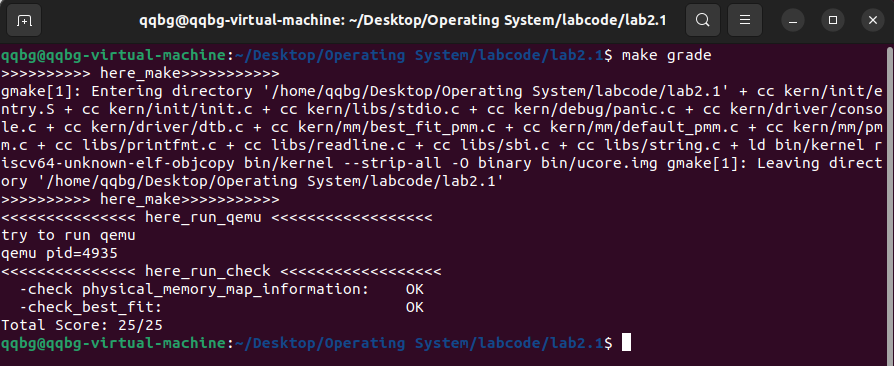

# <center>lab2:物理内存和页表

小组成员：

吴禹骞-2311272

谢小珂-2310422

杜泽琦-2313508

[TOC]

## 前期准备

[实验二指导](http://oslab.mobisys.cc/lab2025/_book/lab2/lab2.html)

我学习了vscode的连接虚拟机，[教程链接](https://blog.csdn.net/qq_45223683/article/details/141140237)

[注意，Ubuntu系统可能默认启动了防火墙，需要在防火墙中打开SSH服务的端口，或者关闭防火墙。](https://blog.csdn.net/fenst/article/details/137374375?spm=1001.2101.3001.6661.1&utm_medium=distribute.pc_relevant_t0.none-task-blog-2%7Edefault%7EBlogCommendFromBaidu%7EPaidSort-1-137374375-blog-141140237.235%5Ev43%5Epc_blog_bottom_relevance_base8&depth_1-utm_source=distribute.pc_relevant_t0.none-task-blog-2%7Edefault%7EBlogCommendFromBaidu%7EPaidSort-1-137374375-blog-141140237.235%5Ev43%5Epc_blog_bottom_relevance_base8&utm_relevant_index=1)

本次`make qemu`


```cmd
root@dzq-VMware-Virtual-Platform:/home/dzq/opt/riscv/labcode/lab2# make qemu
+ cc kern/init/entry.S
+ cc kern/init/init.c
+ cc kern/libs/stdio.c
+ cc kern/debug/panic.c
+ cc kern/driver/console.c
+ cc kern/driver/dtb.c
+ cc kern/mm/best_fit_pmm.c
+ cc kern/mm/default_pmm.c
+ cc kern/mm/pmm.c
+ cc libs/printfmt.c
+ cc libs/readline.c
+ cc libs/sbi.c
+ cc libs/string.c
+ ld bin/kernel
riscv64-unknown-elf-objcopy bin/kernel --strip-all -O binary bin/ucore.img

OpenSBI v0.4 (Jul  2 2019 11:53:53)
   ____                    _____ ____ _____
  / __ \                  / ____|  _ \_   _|
 | |  | |_ __   ___ _ __ | (___ | |_) || |
 | |  | | '_ \ / _ \ '_ \ \___ \|  _ < | |
 | |__| | |_) |  __/ | | |____) | |_) || |_
  \____/| .__/ \___|_| |_|_____/|____/_____|
        | |
        |_|

Platform Name          : QEMU Virt Machine
Platform HART Features : RV64ACDFIMSU
Platform Max HARTs     : 8
Current Hart           : 0
Firmware Base          : 0x80000000
Firmware Size          : 112 KB
Runtime SBI Version    : 0.1

PMP0: 0x0000000080000000-0x000000008001ffff (A)
PMP1: 0x0000000000000000-0xffffffffffffffff (A,R,W,X)
DTB Init
HartID: 0
DTB Address: 0x82200000
Physical Memory from DTB:
  Base: 0x0000000080000000
  Size: 0x0000000008000000 (128 MB)
  End:  0x0000000087ffffff
DTB init completed
(THU.CST) os is loading ...
Special kernel symbols:
  entry  0xffffffffc02000d8 (virtual)
  etext  0xffffffffc020172e (virtual)
  edata  0xffffffffc0206018 (virtual)
  end    0xffffffffc0206078 (virtual)
Kernel executable memory footprint: 24KB
memory management: default_pmm_manager
physcial memory map:
  memory: 0x0000000008000000, [0x0000000080000000, 0x0000000087ffffff].
check_alloc_page() succeeded!
satp virtual address: 0xffffffffc0205000
satp physical address: 0x0000000080205000
QEMU: Terminated
```

## 实验目的

- 理解页表的建立和使用方法
- 理解物理内存的管理方法
- 理解页面分配算法

## 实验内容

实验一过后大家做出来了一个可以启动的系统，实验二主要涉及操作系统的物理内存管理。操作系统为了使用内存，还需高效地管理内存资源。本次实验我们会了解**如何发现系统中的物理内存**，然后学习**如何建立对物理内存的初步管理，即了解连续物理内存管理**，最后掌握**页表相关的操作，即如何建立页表来实现虚拟内存到物理内存之间的映射**，帮助我们对段页式内存管理机制有一个比较全面的了解。本次的实验主要是**在实验一的基础上完成物理内存管理，并建立一个最简单的页表映射。**

## 老师实验视频知识点

`dzq/opt/riscv/labcode/lab2/kern/init/entry.S`系统的入口代码

`dzq/opt/riscv/labcode/lab2/tools/kernel.ld`这是一个链接脚本，这个链接脚本用来指导内核的编译过程当中如何摆放内核得到的那一片连续的地址空间。[理解代码]

​	一个程序不管它是内核还是普通的应用程序，它的地址空间的布局是在它被编译和链接的时候，就已然由链接器和编译器给你确定好，然后我们只需要把指令填到那里面去，填到那个对应的空间布局上就好了

​	c 语言在运行之前有一个默认的假设条件是栈已然是就绪的，我们能看到在这个位置上有一条指令，这条指令是把 SP 寄存器给它设置了一个值，也就是这条指令是让栈寄存器指向一块可以用的内存空间。所以这样之后我们再调用 c 语言的代码就没有问题了，压栈和退栈都有的内存可以用了。

​	`dzq/opt/riscv/labcode/lab2/kern/mm/best_fit_pmm.c`


## 练习

对实验报告的要求：

- 基于markdown格式来完成，以文本方式为主

- 填写各个基本练习中要求完成的报告内容

- 列出你认为本实验中重要的知识点，以及与对应的OS原理中的知识点，并简要说明你对二者的含义，关系，差异等方面的理解（也可能出现实验中的知识点没有对应的原理知识点）

- 列出你认为OS原理中很重要，但在实验中没有对应上的知识点

- 从oslab网站上取得实验代码后，进入目录labcodes/lab2，完成实验要求的各个练习。在实验报告中回答所有练习中提出的问题。在目录labcodes/lab2下存放实验报告，推荐用**markdown**格式。每个小组建一个gitee或者github仓库，对于lab2中编程任务，完成编写之后，再通过git push命令把代码和报告上传到仓库。最后请一定提前或按时提交到git网站。

  注意有“LAB2”的注释，代码中所有需要完成的地方（challenge除外）都有“LAB2”和“YOUR CODE”的注释，请在提交时特别注意保持注释，并将“YOUR CODE”替换为自己的学号，并且将所有标有对应注释的部分填上正确的代码。
  
  Challenges是选做，完成Challenge并回答了助教问题的小组可获得本次实验的加分。

### 练习1：理解first-fit 连续物理内存分配算法（思考题）

first-fit 连续物理内存分配算法作为物理内存分配一个很基础的方法，需要同学们理解它的实现过程。请大家仔细阅读实验手册的教程并结合`kern/mm/default_pmm.c`中的相关代码，认真分析default_init，default_init_memmap，default_alloc_pages， default_free_pages等相关函数，并描述程序在进行物理内存分配的过程以及各个函数的作用。 请在实验报告中简要说明你的设计实现过程。请回答如下问题：

- 你的first fit算法是否有进一步的改进空间？

#### 前置知识点

物理内存管理应当为虚拟内存管理提供这样的接口：

- 检查当前还有多少空闲的物理页，返回空闲的物理页数目
- 给出n，尝试分配n个物理页，可以返回一个起始地址和连续的物理页数目，也可能分配一些零散的物理页，返回一个连起来的链表。
- 给出起始地址和n，释放n个连续的物理页

##### 物理内存探测

##### 页面分配算法

##### first-fit算法

当需要分配或释放内存时：

- **分配**：从链表头开始，找到第一个满足大小要求的空闲块；
- **释放**：将页块按地址顺序重新插入链表，并合并前后相邻的空闲块；
- **统计**：通过全局变量 `nr_free` 记录当前空闲页总数。

#### 代码分析

**详细代码讲解我已放入文件中，这里只做核心讲解，关键点我已加粗，这部分主要是代码阅读，所以主要看检查**

##### default_init

```c
static void
default_init(void) {
    list_init(&free_list);  // 初始化空闲链表为空
	nr_free = 0;            // 当前系统空闲页数清零
}
```

​	这里首先我们要做的就是初始化内存分配器，`free_list` 是一个**双向循环链表**，用于记录系统中所有“空闲页块”；每个空闲块在链表中用一个 `Page` 节点表示；实验刚开始时，还没有任何可分配内存页，所以 `nr_free` = 0。

##### default_init_memmap

**对一段连续的物理页（从 `base` 开始，共 `n` 页）进行初始化，使其成为系统可管理的空闲内存块。**函数首先遍历这段页区间，将每个页的标志位和引用计数清零，确保这些页处于“空闲”状态；然后将第一个页（即块首页）的 `property` 字段设为块的页数 `n`，并标记该页为空闲块的起始页；接着把这段空闲块的页数累加到全局变量 `nr_free` 中，更新系统的空闲页统计；最后，函数将该空闲块按物理地址顺序插入到全局空闲链表 `free_list` 中，以保证链表中所有空闲块的顺序性，从而方便后续的页面分配与合并操作。总体而言，它完成了从“未初始化的物理页”到“可管理的空闲块”的转换，是物理内存管理建立阶段的关键步骤。

##### default_alloc_pages

**函数的作用是实现 First-Fit页面分配算法，用于从系统空闲页链表中找到一块能够满足请求页数 `n` 的连续物理页，并将其分配出去。**函数首先检查请求页数是否合法以及当前空闲页是否充足；然后从空闲页链表头开始按顺序遍历，找到第一个 `property` 值大于或等于 `n` 的空闲块（即第一个足够大的连续空闲页段）；若找到合适块，则将其从链表中移除，并在块过大的情况下对其进行**分裂**——前 `n` 页分配出去，剩余部分重新标记为空闲块并插回链表。最后更新全局空闲页计数 `nr_free`，清除被分配块的空闲标志并返回起始页地址。整体上，这个函数完成了“在空闲块链表中查找、分割并分配物理页”的全过程，是物理内存管理中最核心的分配逻辑。

##### default_free_pages

将释放的 n 个连续页重新加入空闲链表，并在必要时**合并相邻空闲块**，避免碎片。这段代码的功能是将一段连续的物理页释放回系统空闲页池。首先，它遍历释放的页，将每页的标志和引用计数清零，**确保不是保留页且不是已有空闲块起点**；然后，将释放块的起始页设置为该块大小并标记为空闲块起点，同时更新总空闲页数；最后，将释放块按照物理地址从低到高的顺序插入空闲链表，以便后续分配连续页时可以高效查找并支持相邻空闲块的合并。如果释放块与前后块在物理地址上连续，则将它们合并为更大的空闲块。释放成功后`nr_free` 增加释放的页数。

##### default_nr_free_pages

返回当前空闲页总数

##### basic_check

验证物理内存分配器是否正确工作的核心自检函数，测试了**分配正确性，引用计数正确性，地址合法性，空闲列表逻辑，释放与再分配，状态恢复。**

##### default_check

对First Fit内存页分配算法的正确性进行全面验证。它首先遍历空闲页链表，统计空闲块数量与总页数，并与系统记录的空闲页数比对，确保链表状态一致；然后调用 `basic_check()` 进行基础功能测试；接着通过一系列分配与释放操作，验证首次适应算法在不同场景下的行为是否正确，如部分释放、连续分配、块合并、无法分配时返回 `NULL` 等；最后恢复空闲链表与计数状态，并再次检查页数统计是否准确。整体而言，该函数用于自动检测内存分配器在“首次适应”策略下的页管理逻辑、链表维护及内存块合并功能是否实现正确。

##### const struct pmm_manager default_pmm_manager

定义默认的物理内存管理器，包含初始化、内存块初始化、页分配、页释放、空闲页计数和检查函数的实现

#### 优化改进

是的可以优化，我从以下方向入手思考，其实下面的那些算法就相当于优化了，甚至我这两天学懂了才想起来软件安全里有讲过这个知识点，就简单提一下优化思路方向

1.减少碎片化内存，比如First-Fit 会优先使用低地址的小块以及default_alloc_pages块过大的情况下对其进行**分裂**，我想到可以就是每次遍历找到满足要求最小的内存块进行处理，但这会加大时间复杂度，那么就可以再来一个链表，记录从小到大块的位置。

### 练习2：实现 Best-Fit 连续物理内存分配算法（需要编程）

在完成练习一后，参考kern/mm/default_pmm.c对First Fit算法的实现，编程实现Best Fit页面分配算法，算法的时空复杂度不做要求，能通过测试即可。 请在实验报告中简要说明你的设计实现过程，阐述代码是如何对物理内存进行分配和释放，并回答如下问题：

- 你的 Best-Fit 算法是否有进一步的改进空间？

在完成练习一后，参考kern/mm/default_pmm.c对First Fit算法的实现，编程实现Best Fit页面分配算法，算法的时空复杂度不做要求，能通过测试即可。 请在实验报告中简要说明你的设计实现过程，阐述代码是如何对物理内存进行分配和释放，并回答如下问题：

- 你的 Best-Fit 算法是否有进一步的改进空间？

#### Best-Fit 算法核心思想

> **将分区按小大顺序组织,找到的第一个适应分区是大小与要求相差最小的空闲分区**

也就是说，在所有可用的空闲内存块中，找到“刚好够大”的那一块来满足请求，即剩余空间最小的空闲块。其目标是最大限度地减少“内碎片”（内部未使用空间），尽可能让每次分配都更加精确。因此，与 First-Fit（首次适应法）相比，Best-Fit 在分配时需要遍历整个空闲链表，寻找最佳匹配，而不是遇到第一个足够大的块就立即分配。

#### 主要修改的代码部分

Best-Fit 算法是在 `best_fit_pmm.c` 中实现的，它与 `default_pmm.c`（First-Fit）基本框架相同，关键修改集中在页面分配函数：

##### ① 修改点 1：`best_fit_alloc_pages()` 查找最优块

**First-Fit 原逻辑：**

```
while ((le = list_next(le)) != &free_list) {
    struct Page *p = le2page(le, page_link);
    if (p->property >= n) {
        page = p;
        break;     // 找到第一个够大的块就分配
    }
}
```

**Best-Fit 改进逻辑：**

```
size_t min_diff = (size_t)-1;
struct Page* best = NULL;

while ((le = list_next(le)) != &free_list) {
    struct Page* p = le2page(le, page_link);
    if (p->property >= n && (p->property - n) < min_diff) {
        min_diff = p->property - n;
        best = p;  // 记录当前最接近需求的块
    }
}
page = best;       // 使用最优块进行分配
```

 **区别：**

- First-Fit：遇到第一个满足条件的块立即停止；
- Best-Fit：遍历完整个链表，找出最“贴合”的块；
- 分配后若块大于需求，还会执行同样的分裂逻辑。

##### ② 修改点 2：注册管理器类型

在 `pmm.c` 文件中：

```
// 原 First-Fit
// pmm_manager = &default_pmm_manager;

// 修改为 Best-Fit
pmm_manager = &best_fit_pmm_manager;
```

这使得系统初始化时自动加载 Best-Fit 分配器。

如同，make grade后成功通过测试：



#### 进一步的改进空间

尽管 Best-Fit 能较好地减少单次分配的内部碎片，但整体上仍存在查找效率低、易形成外部碎片等问题。未来可在算法层面引入平衡树结构以加快搜索，在策略层面采用分级空闲链表与动态切换机制，在实现层面改进合并与碎片整理逻辑，从而在**性能与内存利用率之间实现更优平衡**。

### 扩展练习Challenge：buddy system（伙伴系统）分配算法（需要编程）

Buddy System算法把系统中的可用存储空间划分为存储块(Block)来进行管理, 每个存储块的大小必须是2的n次幂(Pow(2, n)), 即1, 2, 4, 8, 16, 32, 64, 128...

- 参考[伙伴分配器的一个极简实现](http://coolshell.cn/articles/10427.html)， 在ucore中实现buddy system分配算法，要求有比较充分的测试用例说明实现的正确性，需要有设计文档。

#### 1. 核心思想 

Buddy System (伙伴系统) 是一种动态内存分配算法，它将整个空闲内存块按照 $2^n$ 的大小进行划分和管理。

- 分配时：如果需要的块大小 $N$ 不等于 $2^n$ 的空闲块 $M$，则将 $M$ 分裂成两个大小为 $M/2$ 的“伙伴”块，直到得到一个大小为 $2^k \ge N$ 的最小块，并将多余的伙伴块放入对应的空闲列表中。
- 释放时：系统尝试将释放的块与其相邻的空闲伙伴块合并，形成一个更大的块，直到无法合并或达到最大块大小。

#### 2. 数据结构

|          结构/宏          |                             描述                             |
| :-----------------------: | :----------------------------------------------------------: |
|        `MAX_ORDER`        | 最大阶数。设置为15(后续有解释)。 |
|       `BUDDY_AREA`        |              包含 Buddy System 的核心数据结构。              |
|  `free_area[MAX_ORDER]`   | 空闲列表数组。`free_area[i]`管理大小为 $2^i$ 页的空闲块链表。 |
|      `buddy_nr_free`      |             整个Buddy System中所有空闲页的总数。             |
| `struct` `Page::property` |     在Buddy System中将记录块的阶数 $i$（即 $2^i$ 页）。      |

#### 3. 算法实现概述

|            函数             |                             描述                             |
| :-------------------------: | :----------------------------------------------------------: |
|       `buddy_init()`        | 初始化`BUDDY_AREA`结构：清零`buddy_nr_free`，并初始化所有</br>`free_area[i].free_list`链表头。 |
| `buddy_init_memmap(base,n)` | 初始化内存映射。它将一个大小为 $n$ 页的连续空闲块进行分解。首先将 $n$ 拆分成 $2^n$ 形式的块 (例如 $1025 = 1024 + 1$ 页)，然后将这些块插入到对应的`free_area[i]`链表中。 |
|   `buddy_alloc_pages(n)`    | **分配**。首先计算所需的最小阶数 $k = \lceil \log_2 n \rceil$。从`free_area[k]`开始向上搜索，找到最小的 $m \ge k$ 的空闲块。如果 $m > k$，则执行**分裂**操作。 |
| `buddy_free_pages(base,n)`  | **释放和合并**。确定释放块的阶数 $k = \log_2 n$。尝试与伙伴块进行合并，如果伙伴块空闲且阶数相同，则合并为 $k+1$ 阶的块，并递归向上合并。 |
|       `get_order(n)`        |                计算 n 页需要内存块的最小阶数                 |
|  `get_buddy_page(p,order)`  |                  计算页块 p 的伙伴页块地址                   |
|       `buddy_show()`        |               可视化 buddy system 内存链表数组               |

#### 4. 主要代码

##### 准备工作

首先参考原来的空闲链表的结构体，设计了一个数据结构来存放内存块：

```C
typedef struct {
    free_area_t free_area[MAX_ORDER+1];  // 0 到 MAX_ORDER 阶的空闲链表
    unsigned int nr_free;              // 总空闲页数
} buddy_area_t;
```

通过测试（主体代码完成后的测试）我们可知可分配内存一共有31929页（pmm.c中计算得到），14阶空闲链表就可满足，总空闲内存的起始 PPN 为 0x80347，并没有对其页数：

```
-------------------------------Check Begin-----------------------------------
Total Free Pages: 31929
  阶数 0(1 页): 空闲 1 块, 总空闲 1 页. 内存块起始PPN:
    [ 0x87fff(O0)  ]
  阶数 1(2 页): EMPTY
  阶数 2(4 页): EMPTY
  阶数 3(8 页): 空闲 1 块, 总空闲 8 页. 内存块起始PPN:
    [ 0x87ff7(O3)  ]
  阶数 4(16 页): 空闲 1 块, 总空闲 16 页. 内存块起始PPN:
    [ 0x87fe7(O4)  ]
  阶数 5(32 页): 空闲 1 块, 总空闲 32 页. 内存块起始PPN:
    [ 0x87fc7(O5)  ]
  阶数 6(64 页): EMPTY
  阶数 7(128 页): 空闲 1 块, 总空闲 128 页. 内存块起始PPN:
    [ 0x87f47(O7)  ]
  阶数 8(256 页): EMPTY
  阶数 9(512 页): EMPTY
  阶数 10(1024 页): 空闲 1 块, 总空闲 1024 页. 内存块起始PPN:
    [ 0x87b47(O10)  ]
  阶数 11(2048 页): 空闲 1 块, 总空闲 2048 页. 内存块起始PPN:
    [ 0x87347(O11)  ]
  阶数 12(4096 页): 空闲 1 块, 总空闲 4096 页. 内存块起始PPN:
    [ 0x86347(O12)  ]
  阶数 13(8192 页): 空闲 1 块, 总空闲 8192 页. 内存块起始PPN:
    [ 0x84347(O13)  ]
  阶数 14(16384 页): 空闲 1 块, 总空闲 16384 页. 内存块起始PPN:
    [ 0x80347(O14)  ]
```

由于 Buddy System 必须严格满足页地址和大小对齐来确保伙伴页块合并正确，所以我们找到第一个能被 16384 整除的 PPN，并从那里开始 Buddy System 的管理，放弃前面的页。修改 pmm.c 文件：

```C
#define MAX_ORDER_PAGES (1UL << 14)
...
void page_init(void) {
    // ... 原有代码 (计算 pages 数组，设置保留位等) ...
    // 计算当前起始 PPN
    size_t start_ppn = PPN(mem_begin);
    // 找到第一个满足 16384 页对齐的 PPN
    size_t aligned_ppn = ROUNDUP(start_ppn, MAX_ORDER_PAGES);
    // 计算新的 Buddy System 起始物理地址
    uintptr_t new_mem_begin = aligned_ppn << PGSHIFT;
    // 更新 mem_begin，以新的对齐地址作为 Buddy System 的起点
    mem_begin = new_mem_begin;
    
    if (mem_begin < mem_end) {
        init_memmap(pa2page(mem_begin), (mem_end - mem_begin) / PGSIZE);
    }
}
```

这样Buddy System 将从 PPN 0x84000（可以被 16384 整除）开始管理内存，放弃了从 0x80347000 到 0x84000000 之间的 15545 个页，将这些页保留给内核，不参与 Buddy System 的分配。

##### 寻找伙伴页块

```C
// p:页块的起始Page结构体指针    order:页块的阶数(2^order页)
static struct Page *get_buddy_page(struct Page *p, size_t order){
    size_t page_num = page2ppn(p); // 获取页块物理起始地址
    size_t buddy_page_num = page_num ^ (1 << order); // 计算伙伴页块物理起始地址
    return pa2page(buddy_page_num << PGSHIFT); // 将伙伴页块物理起始地址转为其Page结构体指针
}
```

在 Buddy System 中，任何一个大小为 $2^k$ 页的块，都有一个唯一的“伙伴”块，它与原块大小相同、地址相邻。这两个块如果都空闲，就可以合并成一个大小为 $2^{k+1}$ 页的块。
因为 Buddy System 中所有块都必须严格满足 $2^k$ 页的地址和大小对齐要求，所以一个大小为 $2^k$ 页的内存块 $P$，其起始物理页号（PPN）最低 $k$ 位必须全部为 0；而与伙伴块合并后形成的 $2^{k+1}$ 页的更大的块 $M$ 的起始 PPN 最低 $k+1$ 位必须全部为 0。因此，两个 $2^k$  的伙伴块$P$ 和 $P^{'}$的起始 PPN ，它们在合并后形成的 $M$ 块的起始 PPN 最低 $k+1$ 位中，只有第 $k$ 位（从 0 开始计数）是不同的，我们只需翻转 $P$ 块起始 PPN 的第 $k$ 位，即起始 PPN 异或 $2^k$，就可得到伙伴块 $P^{'}$的起始 PPN。

##### 分配分裂页块

```C
// 分配n个连续页
static struct Page *buddy_alloc_pages(size_t n){
    assert(n > 0);
    if(n > buddy_nr_free) return NULL; // 空闲页不足
    // 计算所需的最小阶数 k
    size_t min_order = get_order(n);
    if(min_order >= MAX_ORDER) return NULL; // 太大
    // 从第k层向上找空闲块
    size_t order = min_order;
    while(order <= MAX_ORDER){
        // order阶的空闲链表是否为空，如果为空则继续向上找，反之则找到空闲块
        if(list_empty(&(buddy_free_area[order].free_list))){
            order++;
        }else{
            break;
        }
    }
    if(order == MAX_ORDER+1) return NULL; // 空闲块不足
    // 从列表中取出找到的空闲块
    list_entry_t *target = list_next(&(buddy_free_area[order].free_list));
    struct Page *page = le2page(target, page_link);
    list_del(target);
    // 更新buddy system 信息
    size_t size = 1 << order;
    buddy_free_area[order].nr_free -= size;
    buddy_nr_free -= size;
    // 如果阶数大于所需阶数，则分裂
    while(order > min_order){
        order--;
        size >>= 1;
        // 将后半块放入对应阶数的空闲列表
        struct Page *back = page + size;
        SetPageProperty(back);
        back->property = order;
        
        list_add(&(buddy_free_area[order].free_list), &(back->page_link));
        buddy_free_area[order].nr_free += size;
        buddy_nr_free += size;
    } 
    ClearPageProperty(page); // 分配后清除头部标记
    page->property = 0;      // 分配后清除阶数信息
    return page;
}
```

##### 释放合并页块

```C
// 释放n个连续页
static void buddy_free_pages(struct Page *base, size_t n){
    assert(n > 0);
    // 确定释放块的阶数
    size_t order = get_order(n);
    assert(order <= MAX_ORDER);
    // 设置要释放块的属性
    struct Page *p = base;
    for (; p != base + n; p ++) {
        assert(!PageReserved(p) && !PageProperty(p));
        p->flags = 0; // 清除所有标志
        set_page_ref(p, 0); // 将页块设置为空闲，可以被分配
    }
    // 向上合并
    struct Page *curr_page = base;
    while(order < MAX_ORDER){
        struct Page *buddy = get_buddy_page(curr_page, order);
        // 检查伙伴块是否空闲且具有相同的阶数
        if (PageProperty(buddy) && buddy->property == order) {
            // 从空闲链表中移除伙伴块
            list_del(&(buddy->page_link));
            buddy_free_area[order].nr_free -= (1 << order);
            buddy_nr_free -= (1 << order);
            // 确定合并后的新块起始页 (始终是地址较低的一个)
            if (buddy < curr_page) {
                curr_page = buddy;
            }
            order++;
        }else{
            break;
        }
    }
    // 将最终合并后的块插入到对应的空闲列表
    curr_page->property = order;
    SetPageProperty(curr_page);
    
    size_t size = 1 << order;
    list_add_before(&(buddy_free_area[order].free_list), &(curr_page->page_link));
    buddy_free_area[order].nr_free += size;
    buddy_nr_free += size;
}    
```

#### 5. 测试

测试函数如下：

```C
static void buddy_check(void) {
    // 基础检查
    cprintf("-------------------------------Check Begin-----------------------------------\n");
    
    struct Page *p0, *p1, *p2, *p3;
    size_t total_free_pages = buddy_nr_free_pages();
    buddy_show();
    cprintf("\n-----------Test 1:分配最小块(1)-----------\n");
    
    // 1. 分配最小块 (1页)
    assert((p0 = buddy_alloc_pages(1)) != NULL);
    assert((p1 = buddy_alloc_pages(1)) != NULL);
    assert((p2 = buddy_alloc_pages(1)) != NULL);
    assert(buddy_nr_free_pages() == total_free_pages - 3);
    cprintf("分配3个最小块后...");
    buddy_show();
    
    // 2. 释放最小块
    cprintf("\n-----------Test 2:释放最小块(1页)-----------\n");
    buddy_free_pages(p0, 1);
    buddy_free_pages(p1, 1);
    buddy_free_pages(p2, 1);
    assert(buddy_nr_free_pages() == total_free_pages);
    cprintf("释放3个最小块后...");
    buddy_show();
    
    // 3. 检查大块分配和分裂 
    size_t large_size = 50; 
    
    // 分配 50 页 
    cprintf("\n-----------Test 1:大块分配和分裂-----------\n");
    p0 = buddy_alloc_pages(large_size);
    assert(p0 != NULL);
    assert(buddy_nr_free_pages() == total_free_pages - 64);
    cprintf("分配p0 50页后...");
    buddy_show();
    
    // 分配另一个 50 页块
    p1 = buddy_alloc_pages(large_size);
    assert(p1 != NULL);
    assert(buddy_nr_free_pages() == total_free_pages - 2 * 64);
    cprintf("分配p1 50页后...");
    buddy_show();
    
    // 分配 25 页块
    p2 = buddy_alloc_pages(25);
    assert(p2 != NULL);
    assert(buddy_nr_free_pages() == total_free_pages - 2 * 64 - 32);
    cprintf("分配p2 25页后...");
    buddy_show();
    
    // 4. 检查合并 
    buddy_free_pages(p2, 32);
    cprintf("释放p2后...");
    buddy_show();
    
    buddy_free_pages(p0, 64);
    cprintf("释放p0后...");
    buddy_show();
    
    buddy_free_pages(p1, 64);
    cprintf("释放p1后...");
    buddy_show();

    cprintf("\n-----------Test 5:最大单元操作-----------\n");
    p0 = buddy_alloc_pages(16384);
    cprintf("分配p0 16384页后...");
    buddy_show();
    
    buddy_free_pages(p0, 16384);
    cprintf("释放p0后...");
    buddy_show();
    
    cprintf("buddy_check() succeeded!\n");
}
```

结果可视化示例如图：


由于测试结果较多，我们使用文本方式呈现测试结果，使用起始 PPN 代指某空闲块。

##### 初始化测试

```
-------------------------------Check Begin-----------------------------------
Total Free Pages: 16384
  阶数 0(1 页): EMPTY
  阶数 1(2 页): EMPTY
  阶数 2(4 页): EMPTY
  阶数 3(8 页): EMPTY
  阶数 4(16 页): EMPTY
  阶数 5(32 页): EMPTY
  阶数 6(64 页): EMPTY
  阶数 7(128 页): EMPTY
  阶数 8(256 页): EMPTY
  阶数 9(512 页): EMPTY
  阶数 10(1024 页): EMPTY
  阶数 11(2048 页): EMPTY
  阶数 12(4096 页): EMPTY
  阶数 13(8192 页): EMPTY
  阶数 14(16384 页): 空闲 1 块, 总空闲 16384 页. 内存块起始PPN:
    [ 0x84000(O14)  ]
----------------------------------
```

可以看到初始化后检测结果正确，所有页块加起来与总页数相等。

##### 分配释放最小块测试

```
-----------Test 1:分配最小块(1)-----------
分配3个最小块后...Total Free Pages: 16381
  阶数 0(1 页): 空闲 1 块, 总空闲 1 页. 内存块起始PPN:
    [ 0x84003(O0)  ]
  阶数 1(2 页): EMPTY
  阶数 2(4 页): 空闲 1 块, 总空闲 4 页. 内存块起始PPN:
    [ 0x84004(O2)  ]
  阶数 3(8 页): 空闲 1 块, 总空闲 8 页. 内存块起始PPN:
    [ 0x84008(O3)  ]
  阶数 4(16 页): 空闲 1 块, 总空闲 16 页. 内存块起始PPN:
    [ 0x84010(O4)  ]
  阶数 5(32 页): 空闲 1 块, 总空闲 32 页. 内存块起始PPN:
    [ 0x84020(O5)  ]
  阶数 6(64 页): 空闲 1 块, 总空闲 64 页. 内存块起始PPN:
    [ 0x84040(O6)  ]
  阶数 7(128 页): 空闲 1 块, 总空闲 128 页. 内存块起始PPN:
    [ 0x84080(O7)  ]
  阶数 8(256 页): 空闲 1 块, 总空闲 256 页. 内存块起始PPN:
    [ 0x84100(O8)  ]
  阶数 9(512 页): 空闲 1 块, 总空闲 512 页. 内存块起始PPN:
    [ 0x84200(O9)  ]
  阶数 10(1024 页): 空闲 1 块, 总空闲 1024 页. 内存块起始PPN:
    [ 0x84400(O10)  ]
  阶数 11(2048 页): 空闲 1 块, 总空闲 2048 页. 内存块起始PPN:
    [ 0x84800(O11)  ]
  阶数 12(4096 页): 空闲 1 块, 总空闲 4096 页. 内存块起始PPN:
    [ 0x85000(O12)  ]
  阶数 13(8192 页): 空闲 1 块, 总空闲 8192 页. 内存块起始PPN:
    [ 0x86000(O13)  ]
  阶数 14(16384 页): EMPTY
```

分配3个最小块结果正确，由于只有一个14阶空闲块，则将其一步一步向下分裂，首先分裂为两个13阶空闲块（0x84000 和 0x86000），前一个接着分裂为两个12阶空闲块（0x84000 和 0x85000），以此类推递归分裂，最后分裂为1阶的两块空闲块（0x84000 和 0x84002）都分裂为0阶空闲块，将前三块分配走，剩下 0x84003 块。

```
-----------Test 2:释放最小块(1页)-----------
释放3个最小块后...Total Free Pages: 16384
  阶数 0(1 页): EMPTY
  阶数 1(2 页): EMPTY
  阶数 2(4 页): EMPTY
  阶数 3(8 页): EMPTY
  阶数 4(16 页): EMPTY
  阶数 5(32 页): EMPTY
  阶数 6(64 页): EMPTY
  阶数 7(128 页): EMPTY
  阶数 8(256 页): EMPTY
  阶数 9(512 页): EMPTY
  阶数 10(1024 页): EMPTY
  阶数 11(2048 页): EMPTY
  阶数 12(4096 页): EMPTY
  阶数 13(8192 页): EMPTY
  阶数 14(16384 页): 空闲 1 块, 总空闲 16384 页. 内存块起始PPN:
    [ 0x84000(O14)  ]
----------------------------------
```

释放3个最小块后结果正确，重新合并成一大块14阶空闲块。

##### 复杂内存分配和释放测试

```
-----------Test 3:大块分配和分裂-----------
分配p0 50页后...Total Free Pages: 16320
  阶数 0(1 页): EMPTY
  阶数 1(2 页): EMPTY
  阶数 2(4 页): EMPTY
  阶数 3(8 页): EMPTY
  阶数 4(16 页): EMPTY
  阶数 5(32 页): EMPTY
  阶数 6(64 页): 空闲 1 块, 总空闲 64 页. 内存块起始PPN:
    [ 0x84040(O6)  ]
  阶数 7(128 页): 空闲 1 块, 总空闲 128 页. 内存块起始PPN:
    [ 0x84080(O7)  ]
  阶数 8(256 页): 空闲 1 块, 总空闲 256 页. 内存块起始PPN:
    [ 0x84100(O8)  ]
  阶数 9(512 页): 空闲 1 块, 总空闲 512 页. 内存块起始PPN:
    [ 0x84200(O9)  ]
  阶数 10(1024 页): 空闲 1 块, 总空闲 1024 页. 内存块起始PPN:
    [ 0x84400(O10)  ]
  阶数 11(2048 页): 空闲 1 块, 总空闲 2048 页. 内存块起始PPN:
    [ 0x84800(O11)  ]
  阶数 12(4096 页): 空闲 1 块, 总空闲 4096 页. 内存块起始PPN:
    [ 0x85000(O12)  ]
  阶数 13(8192 页): 空闲 1 块, 总空闲 8192 页. 内存块起始PPN:
    [ 0x86000(O13)  ]
  阶数 14(16384 页): EMPTY
```

分配 p0 50页后，Buddy System 实际上是分配给 p0 64 页，过程跟 Test1 类似，不再赘述，结果正确。

```
分配p1 50页后...Total Free Pages: 16256
  阶数 0(1 页): EMPTY
  阶数 1(2 页): EMPTY
  阶数 2(4 页): EMPTY
  阶数 3(8 页): EMPTY
  阶数 4(16 页): EMPTY
  阶数 5(32 页): EMPTY
  阶数 6(64 页): EMPTY
  阶数 7(128 页): 空闲 1 块, 总空闲 128 页. 内存块起始PPN:
    [ 0x84080(O7)  ]
  阶数 8(256 页): 空闲 1 块, 总空闲 256 页. 内存块起始PPN:
    [ 0x84100(O8)  ]
  阶数 9(512 页): 空闲 1 块, 总空闲 512 页. 内存块起始PPN:
    [ 0x84200(O9)  ]
  阶数 10(1024 页): 空闲 1 块, 总空闲 1024 页. 内存块起始PPN:
    [ 0x84400(O10)  ]
  阶数 11(2048 页): 空闲 1 块, 总空闲 2048 页. 内存块起始PPN:
    [ 0x84800(O11)  ]
  阶数 12(4096 页): 空闲 1 块, 总空闲 4096 页. 内存块起始PPN:
    [ 0x85000(O12)  ]
  阶数 13(8192 页): 空闲 1 块, 总空闲 8192 页. 内存块起始PPN:
    [ 0x86000(O13)  ]
  阶数 14(16384 页): EMPTY
```

再分配 p1 50 页后，将6阶空闲链表中的剩下那一块取走，结果正确。

```
分配p2 25页后...Total Free Pages: 16224
  阶数 0(1 页): EMPTY
  阶数 1(2 页): EMPTY
  阶数 2(4 页): EMPTY
  阶数 3(8 页): EMPTY
  阶数 4(16 页): EMPTY
  阶数 5(32 页): 空闲 1 块, 总空闲 32 页. 内存块起始PPN:
    [ 0x840a0(O5)  ]
  阶数 6(64 页): 空闲 1 块, 总空闲 64 页. 内存块起始PPN:
    [ 0x840c0(O6)  ]
  阶数 7(128 页): EMPTY
  阶数 8(256 页): 空闲 1 块, 总空闲 256 页. 内存块起始PPN:
    [ 0x84100(O8)  ]
  阶数 9(512 页): 空闲 1 块, 总空闲 512 页. 内存块起始PPN:
    [ 0x84200(O9)  ]
  阶数 10(1024 页): 空闲 1 块, 总空闲 1024 页. 内存块起始PPN:
    [ 0x84400(O10)  ]
  阶数 11(2048 页): 空闲 1 块, 总空闲 2048 页. 内存块起始PPN:
    [ 0x84800(O11)  ]
  阶数 12(4096 页): 空闲 1 块, 总空闲 4096 页. 内存块起始PPN:
    [ 0x85000(O12)  ]
  阶数 13(8192 页): 空闲 1 块, 总空闲 8192 页. 内存块起始PPN:
    [ 0x86000(O13)  ]
  阶数 14(16384 页): EMPTY
```

接着分配 p2 25页，实际是分配 32 页，继续分裂之后分配，取走分裂出来的前一块。

```
-----------Test 4:大块释放和合并-----------
释放p0后...Total Free Pages: 16288
  阶数 0(1 页): EMPTY
  阶数 1(2 页): EMPTY
  阶数 2(4 页): EMPTY
  阶数 3(8 页): EMPTY
  阶数 4(16 页): EMPTY
  阶数 5(32 页): 空闲 1 块, 总空闲 32 页. 内存块起始PPN:
    [ 0x840a0(O5)  ]
  阶数 6(64 页): 空闲 2 块, 总空闲 128 页. 内存块起始PPN:
    [ 0x840c0(O6) 0x84000(O6)  ]
  阶数 7(128 页): EMPTY
  阶数 8(256 页): 空闲 1 块, 总空闲 256 页. 内存块起始PPN:
    [ 0x84100(O8)  ]
  阶数 9(512 页): 空闲 1 块, 总空闲 512 页. 内存块起始PPN:
    [ 0x84200(O9)  ]
  阶数 10(1024 页): 空闲 1 块, 总空闲 1024 页. 内存块起始PPN:
    [ 0x84400(O10)  ]
  阶数 11(2048 页): 空闲 1 块, 总空闲 2048 页. 内存块起始PPN:
    [ 0x84800(O11)  ]
  阶数 12(4096 页): 空闲 1 块, 总空闲 4096 页. 内存块起始PPN:
    [ 0x85000(O12)  ]
  阶数 13(8192 页): 空闲 1 块, 总空闲 8192 页. 内存块起始PPN:
    [ 0x86000(O13)  ]
  阶数 14(16384 页): EMPTY
```

释放 p0 后，将分配给 p0 的页块（0x84000）重新插入对应阶数（6阶）的空闲链表中，此时6阶空闲链表中有两块空闲块，但它们并不相邻，所以不执行合并。

```
释放p1后...Total Free Pages: 16352
  阶数 0(1 页): EMPTY
  阶数 1(2 页): EMPTY
  阶数 2(4 页): EMPTY
  阶数 3(8 页): EMPTY
  阶数 4(16 页): EMPTY
  阶数 5(32 页): 空闲 1 块, 总空闲 32 页. 内存块起始PPN:
    [ 0x840a0(O5)  ]
  阶数 6(64 页): 空闲 1 块, 总空闲 64 页. 内存块起始PPN:
    [ 0x840c0(O6)  ]
  阶数 7(128 页): 空闲 1 块, 总空闲 128 页. 内存块起始PPN:
    [ 0x84000(O7)  ]
  阶数 8(256 页): 空闲 1 块, 总空闲 256 页. 内存块起始PPN:
    [ 0x84100(O8)  ]
  阶数 9(512 页): 空闲 1 块, 总空闲 512 页. 内存块起始PPN:
    [ 0x84200(O9)  ]
  阶数 10(1024 页): 空闲 1 块, 总空闲 1024 页. 内存块起始PPN:
    [ 0x84400(O10)  ]
  阶数 11(2048 页): 空闲 1 块, 总空闲 2048 页. 内存块起始PPN:
    [ 0x84800(O11)  ]
  阶数 12(4096 页): 空闲 1 块, 总空闲 4096 页. 内存块起始PPN:
    [ 0x85000(O12)  ]
  阶数 13(8192 页): 空闲 1 块, 总空闲 8192 页. 内存块起始PPN:
    [ 0x86000(O13)  ]
  阶数 14(16384 页): EMPTY
```

释放 p1 后，将分配给 p1 的页块（0x84040）重新插入对应阶数（6阶）的空闲链表中，此时6阶空闲链表中有两块相邻的页块，执行合并操作，合并为一块7阶空闲块（0x84000）。

```
释放p2后...Total Free Pages: 16384
  阶数 0(1 页): EMPTY
  阶数 1(2 页): EMPTY
  阶数 2(4 页): EMPTY
  阶数 3(8 页): EMPTY
  阶数 4(16 页): EMPTY
  阶数 5(32 页): EMPTY
  阶数 6(64 页): EMPTY
  阶数 7(128 页): EMPTY
  阶数 8(256 页): EMPTY
  阶数 9(512 页): EMPTY
  阶数 10(1024 页): EMPTY
  阶数 11(2048 页): EMPTY
  阶数 12(4096 页): EMPTY
  阶数 13(8192 页): EMPTY
  阶数 14(16384 页): 空闲 1 块, 总空闲 16384 页. 内存块起始PPN:
    [ 0x84000(O14)  ]
```

最后释放 p2，依次执行合并操作，最终恢复为一块14阶空闲块。

##### 分配释放最大块测试

```
-----------Test 5:最大单元操作-----------
分配p0 16384页后...Total Free Pages: 0
  阶数 0(1 页): EMPTY
  阶数 1(2 页): EMPTY
  阶数 2(4 页): EMPTY
  阶数 3(8 页): EMPTY
  阶数 4(16 页): EMPTY
  阶数 5(32 页): EMPTY
  阶数 6(64 页): EMPTY
  阶数 7(128 页): EMPTY
  阶数 8(256 页): EMPTY
  阶数 9(512 页): EMPTY
  阶数 10(1024 页): EMPTY
  阶数 11(2048 页): EMPTY
  阶数 12(4096 页): EMPTY
  阶数 13(8192 页): EMPTY
  阶数 14(16384 页): EMPTY
----------------------------------
释放p0后...Total Free Pages: 16384
  ...（此处省略）
  阶数 14(16384 页): 空闲 1 块, 总空闲 16384 页. 内存块起始PPN:
    [ 0x84000(O14)  ]

```

最大块分配与释放结果也都正确。

### 扩展练习Challenge：任意大小的内存单元slub分配算法（需要编程）

slub算法，实现两层架构的高效内存单元分配，第一层是基于页大小的内存分配，第二层是在第一层基础上实现基于任意大小的内存分配。可简化实现，能够体现其主体思想即可。

- 参考[linux的slub分配算法/](https://github.com/torvalds/linux/blob/master/mm/slub.c)，在ucore中实现slub分配算法。要求有比较充分的测试用例说明实现的正确性，需要有设计文档。

#### SLUB 分配算法的核心思想

SLUB（The SLAB allocator）是一种面向小对象的内存分配算法。它的核心思想是：

> 在传统页分配算法（如 First-Fit）的基础上，构建一层“对象缓存（Cache）”机制。每个页被划分为多个固定大小的对象，从而让小对象的分配与释放更加快速、减少碎片、增强缓存局部性，并且在多核环境下减少锁竞争。

非常好，这一版代码的设计逻辑已经完全符合 SLUB 算法的核心思想和实验要求，可以直接作为实验报告中“**Challenge2：任意大小内存单元的 SLUB 分配算法实现**”的分析对象。下面是结合操作系统原理与代码的详细分析说明。

#### 总体思路 ####

该实现遵循 **两层内存管理架构**：

1. **页级层（Page Level）**
   底层仍依赖 uCore 的页分配器（如 default_pmm_manager 或 best_fit_pmm_manager），负责分配整页。
2. **对象层（Object Level）**
   在页级基础上实现小对象分配器 SLUB。每个页被划分为多个固定大小的对象（object），由 slab 管理。
   这样在频繁分配小对象（如内核结构体）时，可避免内存碎片和频繁页分配带来的性能损耗。

#### 数据结构设计 ####

##### 1. Slab 结构体 #####

```c
typedef struct Slab {
    struct Page* page;             
    unsigned char bitmap[OBJ_PER_SLAB];  
    int free_cnt;                  
    list_entry_t slab_link;        
} Slab;
```

- 每个 slab 对应一页物理内存。
- `bitmap` 记录对象是否被占用（1 表示已分配）。
- `free_cnt` 表示剩余空闲对象数量。
- `slab_link` 用于将多个 slab 连接入 cache 的链表。

------

##### 2. Cache 结构体 #####

```c
typedef struct Cache {
    size_t obj_size;               
    list_entry_t slabs_full;       
    list_entry_t slabs_partial;    
    list_entry_t slabs_free;       
} Cache;
```

每个 cache 管理一种固定大小对象的所有 slab，并通过三个链表分类：

- **slabs_free**：全空闲；
- **slabs_partial**：部分占用；
- **slabs_full**：已满。

这种三态管理模型直接继承自 Linux 内核的 SLUB 思想，使查找和回收更高效。

------

#### 核心函数逻辑分析 ####

##### 1. Cache 初始化 #####

```c
static void cache_init(Cache* cache, size_t obj_size) {
    cache->obj_size = obj_size;
    list_init(&cache->slabs_full);
    list_init(&cache->slabs_partial);
    list_init(&cache->slabs_free);
}
```

完成 cache 的基础结构初始化，并为后续 slab 管理做好链表准备。

------

##### 2. 创建 Slab #####

```c
static Slab* slab_create(void) {
    struct Page* page = alloc_page();
    if (page == NULL) return NULL;

    Slab* slab = (Slab*)page2kva(page);
    memset(slab->bitmap, 0, sizeof(slab->bitmap));
    slab->page = page;
    slab->free_cnt = OBJ_PER_SLAB;

    list_add(&kmem_cache.slabs_free, &(slab->slab_link));
    return slab;
}
```

- 通过底层页分配器获得物理页；
- 在页内初始化 Slab 控制结构与位图；
- 链接入 `slabs_free` 列表。

这一步相当于 “预热内存池”，为后续对象分配提供资源基础。

------

##### 3.对象分配 #####

```c
static void* cache_alloc(Cache* cache) {
    Slab* slab = NULL;
    if (!list_empty(&cache->slabs_partial)) {
        slab = le2slab(list_next(&cache->slabs_partial), slab_link);
    } else if (!list_empty(&cache->slabs_free)) {
        slab = le2slab(list_next(&cache->slabs_free), slab_link);
        list_del(&(slab->slab_link));
        list_add(&cache->slabs_partial, &(slab->slab_link));
    } else {
        slab = slab_create();
        list_add(&cache->slabs_partial, &(slab->slab_link));
    }
    ...
}
```

- 优先在 **部分占用 slab** 中寻找空位；
- 若无部分占用 slab，则从 **空 slab** 提取；
- 若仍无空 slab，则创建新 slab；
- 分配对象后，若该 slab 被占满，则迁移至 `slabs_full`。

这种逻辑兼顾了时间效率（避免遍历所有 slab）与空间利用率。

------

##### 4. 对象释放 #####

```c
static void cache_free(Cache* cache, void* obj) {
    // 遍历 FULL / PARTIAL 两类列表
    ...
    if (slab->free_cnt == OBJ_PER_SLAB) {
        list_del(&(slab->slab_link));
        list_add(&cache->slabs_free, &(slab->slab_link));
    }
}
```

- 找到对象所在 slab；
- 清空 bitmap 对应位置；
- 若 slab 完全空闲，则转入 `slabs_free`；
- 若释放无效对象，系统打印警告。

#### 检查函数与验证流程 ####

以上就是我们根据Slub的主要思想设计的相应算法，下面是测试的流程。`slub_check()` 模拟真实使用场景，对算法正确性进行验证：

```c
static void slub_check(void) {
    void* objs[100];
    ...
    // ① 批量分配对象
    // ② 部分释放（1/3）
    // ③ 再次分配以测试复用
    // ④ 全部释放
    // ⑤ 异常释放检测
}
```

输出如下结构：

```
[Check1] Allocated 50 objects successfully.
[Check2] Released 1/3 objects, testing partial reuse...
[Check3] Additional allocations complete.
[Check4] All objects freed, slabs recycled correctly.
[Check5] Exception handling verified.
========== SLUB Check PASSED ==========
```

验证内容包括：

- 内存是否复用；
- 是否正确回收；
- 是否能检测非法释放；
- 各阶段对象数量是否匹配预期。

测试结果如图：


说明成功通过测试。

#### 实验结果分析 ####

- 所有分配/释放操作均输出 `[SLUB]` 调试信息；
- 检查函数完整通过；
- 系统未发生断言错误；
- 物理内存状态与虚拟页映射保持一致。

说明该 SLUB 算法实现逻辑正确、行为稳定。

#### 可改进方向 ####

1. **多 Cache 支持**：
   支持多种对象大小（如 32B、64B、128B）缓存，提高通用性。
2. **跨页 Slab**：
   允许 slab 跨越多页，用于分配较大对象。
3. **NUMA 感知优化**：
   实现多 CPU 结构下的本地 cache，加快访问速度。
4. **延迟释放策略**：
   结合 LRU 队列，减少频繁的页释放与分配。

### 扩展练习Challenge：硬件的可用物理内存范围的获取方法（思考题）

- 如果 OS 无法提前知道当前硬件的可用物理内存范围，请问你有何办法让 OS 获取可用物理内存范围？

#### 1. 逐块物理探测法（Memory Probing）

一种直接但有效的方式是——**从低地址开始逐页访问物理内存**，验证哪些地址可读写。实现上可以按照如下逻辑：

```c
for (addr = 0x100000; addr < MAX_MEM; addr += PAGE_SIZE) {
    volatile uint64_t *ptr = (uint64_t *)addr;
    uint64_t old = *ptr;
    *ptr = 0xAA55AA55AA55AA55;
    if (*ptr != 0xAA55AA55AA55AA55)
        break;  // 访问失败，说明超出物理内存范围
    *ptr = old; // 恢复原数据
}
```

当访问无效内存时，CPU 会产生 **总线错误（Bus Error）** 或 **页错误（Page Fault）**，内核捕获该异常，即可推断最大可访问物理地址。

**优点：** 不依赖外部描述信息；实现简单，适合嵌入式或裸机环境。
 **缺点：** 访问越界风险高，需结合异常处理机制以防系统崩溃；部分内存区域可能被设备映射，导致误判。

------

#### 2. DMA 间接探测法（Using DMA Controller）

通过配置 **DMA 控制器** 让外设尝试将数据写入不同的物理地址区间。如果 DMA 传输在某个地址失败（例如返回超时或错误码），则说明该地址并未映射到有效内存。

该方法具有两大特点：

- 不依赖 CPU 直接访问内存；
- 能避免 CPU 触发保护异常。

典型流程如下：

1. 选择安全的 DMA 设备（如网卡或磁盘控制器）；
2. 从低地址开始逐段设置 DMA 目标地址；
3. 检测 DMA 完成状态寄存器，判断该段是否有效。

**优点：** 安全性高，不会触发 CPU 级异常。
 **缺点：** 实现复杂，需硬件层支持；探测精度受设备 DMA 步长限制。

------

#### 3. 利用固件接口（Firmware Table）

在现代系统中，更常见的是通过固件提供的接口自动获取内存布局信息。例如：

- **BIOS 模式：** 调用中断 `INT 0x15, EAX=0xE820` 获取内存映射表；
- **UEFI 模式：** 调用 `GetMemoryMap()` 接口；
- **RISC-V / ARM 平台：** 解析设备树（`.dtb` 文件）中 `/memory` 节点。

该方法由固件在引导时提供精确的内存段描述，包括：

- 可用（RAM）；
- 保留（reserved）；
- 设备内存（device memory）；
- ACPI 或 MMIO 区域。

内核只需解析这些结构即可完成物理内存探测。
 例如 uCore 中常见的 `dtb.c` 文件中就通过 `dtb_scan_memory()` 函数解析 `/memory` 节点，从而得到 `mem_start` 与 `mem_end`。

**优点：** 安全、准确、通用性强；不依赖试探操作。
 **缺点：** 需要系统固件支持，在极简或裸机系统中可能不可行。

------

#### 4. 启发式混合探测法（Hybrid Approach）

在某些轻量系统中，可以将**逐页探测**与**固件描述**相结合：

1. 优先读取设备树/BIOS 提供的初始范围；
2. 若信息缺失，则采用逐块测试扩展边界；
3. 最后利用 DMA 或 I/O 设备验证可访问性。

这种方法既可提升安全性，又能保证通用性。例如在嵌入式 RISC-V SoC 中，Bootloader 可能只报告部分 DRAM 区域，而剩余部分可通过探测法进一步确认。

### 综合比较

| 方法         | 精度 | 安全性           | 实现复杂度 | 适用场景           |
| ------------ | ---- | ---------------- | ---------- | ------------------ |
| 逐块物理探测 | 中   | 低（需异常保护） | 简单       | 裸机 / 无固件系统  |
| DMA 间接探测 | 中   | 高               | 较复杂     | 嵌入式系统         |
| 固件接口解析 | 高   | 高               | 简单       | 通用现代硬件       |
| 混合探测法   | 高   | 高               | 中         | 异构或自研硬件平台 |

------

### 总结

若 OS 无法提前获知硬件的物理内存范围，可通过**多层机制协同探测**实现自适应内存识别：

1. **优先解析固件/设备树**提供的内存表；
2. **必要时启用主动探测机制**，逐页写读或 DMA 验证；
3. **结合异常捕获机制**确保系统安全；
4. **最终在内核页分配初始化（如 `pmm_init`）阶段**形成 `memmap` 表，用于后续物理页管理。

