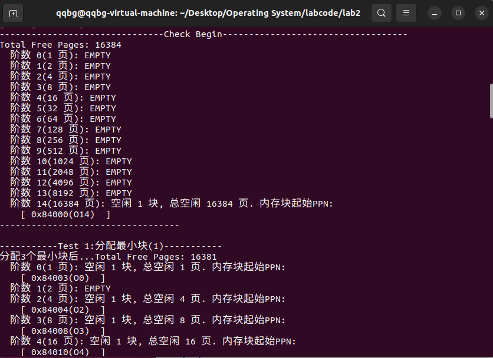

## Challenge1：buddy system（伙伴系统）分配算法

### 1. 核心思想 
Buddy System (伙伴系统) 是一种动态内存分配算法，它将整个空闲内存块按照 $2^n$ 的大小进行划分和管理。
- 分配时：如果需要的块大小 $N$ 不等于 $2^n$ 的空闲块 $M$，则将 $M$ 分裂成两个大小为 $M/2$ 的“伙伴”块，直到得到一个大小为 $2^k \ge N$ 的最小块，并将多余的伙伴块放入对应的空闲列表中。
- 释放时：系统尝试将释放的块与其相邻的空闲伙伴块合并，形成一个更大的块，直到无法合并或达到最大块大小。
  
### 2. 数据结构
| 结构/宏 | 描述  |
|:---------:|:-------:|
| `MAX_ORDER` | 最大阶数。设置为15(后续有解释)。 | 
| `BUDDY_AREA` | 包含 Buddy System 的核心数据结构。 | 
| `free_area[MAX_ORDER]` | 空闲列表数组。`free_area[i]`管理大小为 $2^i$ 页的空闲块链表。 |
| `buddy_nr_free` | 整个Buddy System中所有空闲页的总数。 |
| `struct` `Page::property` | 在Buddy System中将记录块的阶数 $i$（即 $2^i$ 页）。 |

### 3. 算法实现概述
| 函数 | 描述 |
|:---------:|:-------:|
| `buddy_init()` | 初始化`BUDDY_AREA`结构：清零`buddy_nr_free`，并初始化所有</br>`free_area[i].free_list`链表头。 | 
| `buddy_init_memmap(base,n)` | 初始化内存映射。它将一个大小为 $n$ 页的连续空闲块进行分解。首先将 $n$ 拆分成 $2^n$ 形式的块 (例如 $1025 = 1024 + 1$ 页)，然后将这些块插入到对应的`free_area[i]`链表中。 | 
| `buddy_alloc_pages(n)` | **分配**。首先计算所需的最小阶数 $k = \lceil \log_2 n \rceil$。从`free_area[k]`开始向上搜索，找到最小的 $m \ge k$ 的空闲块。如果 $m > k$，则执行**分裂**操作。 |
| `buddy_free_pages(base,n)` | **释放和合并**。确定释放块的阶数 $k = \log_2 n$。尝试与伙伴块进行合并，如果伙伴块空闲且阶数相同，则合并为 $k+1$ 阶的块，并递归向上合并。 |
| `get_order(n)` | 计算 n 页需要内存块的最小阶数 |
| `get_buddy_page(p,order)` | 计算页块 p 的伙伴页块地址 |
| `buddy_show()` | 可视化 buddy system 内存链表数组 |

### 4. 主要代码
#### 准备工作
首先参考原来的空闲链表的结构体，设计了一个数据结构来存放内存块：
```C
typedef struct {
    free_area_t free_area[MAX_ORDER+1];  // 0 到 MAX_ORDER 阶的空闲链表
    unsigned int nr_free;              // 总空闲页数
} buddy_area_t;
```
通过测试（主体代码完成后的测试）我们可知可分配内存一共有31929页（pmm.c中计算得到），14阶空闲链表就可满足，总空闲内存的起始 PPN 为 0x80347，并没有对其页数：
```
-------------------------------Check Begin-----------------------------------
Total Free Pages: 31929
  阶数 0(1 页): 空闲 1 块, 总空闲 1 页. 内存块起始PPN:
    [ 0x87fff(O0)  ]
  阶数 1(2 页): EMPTY
  阶数 2(4 页): EMPTY
  阶数 3(8 页): 空闲 1 块, 总空闲 8 页. 内存块起始PPN:
    [ 0x87ff7(O3)  ]
  阶数 4(16 页): 空闲 1 块, 总空闲 16 页. 内存块起始PPN:
    [ 0x87fe7(O4)  ]
  阶数 5(32 页): 空闲 1 块, 总空闲 32 页. 内存块起始PPN:
    [ 0x87fc7(O5)  ]
  阶数 6(64 页): EMPTY
  阶数 7(128 页): 空闲 1 块, 总空闲 128 页. 内存块起始PPN:
    [ 0x87f47(O7)  ]
  阶数 8(256 页): EMPTY
  阶数 9(512 页): EMPTY
  阶数 10(1024 页): 空闲 1 块, 总空闲 1024 页. 内存块起始PPN:
    [ 0x87b47(O10)  ]
  阶数 11(2048 页): 空闲 1 块, 总空闲 2048 页. 内存块起始PPN:
    [ 0x87347(O11)  ]
  阶数 12(4096 页): 空闲 1 块, 总空闲 4096 页. 内存块起始PPN:
    [ 0x86347(O12)  ]
  阶数 13(8192 页): 空闲 1 块, 总空闲 8192 页. 内存块起始PPN:
    [ 0x84347(O13)  ]
  阶数 14(16384 页): 空闲 1 块, 总空闲 16384 页. 内存块起始PPN:
    [ 0x80347(O14)  ]
```

由于 Buddy System 必须严格满足页地址和大小对齐来确保伙伴页块合并正确，所以我们找到第一个能被 16384 整除的 PPN，并从那里开始 Buddy System 的管理，放弃前面的页。修改 pmm.c 文件：
```C
#define MAX_ORDER_PAGES (1UL << 14)
...
void page_init(void) {
    // ... 原有代码 (计算 pages 数组，设置保留位等) ...
    // 计算当前起始 PPN
    size_t start_ppn = PPN(mem_begin);
    // 找到第一个满足 16384 页对齐的 PPN
    size_t aligned_ppn = ROUNDUP(start_ppn, MAX_ORDER_PAGES);
    // 计算新的 Buddy System 起始物理地址
    uintptr_t new_mem_begin = aligned_ppn << PGSHIFT;
    // 更新 mem_begin，以新的对齐地址作为 Buddy System 的起点
    mem_begin = new_mem_begin;
    
    if (mem_begin < mem_end) {
        init_memmap(pa2page(mem_begin), (mem_end - mem_begin) / PGSIZE);
    }
}
```
这样Buddy System 将从 PPN 0x84000（可以被 16384 整除）开始管理内存，放弃了从 0x80347000 到 0x84000000 之间的 15545 个页，将这些页保留给内核，不参与 Buddy System 的分配。

#### 寻找伙伴页块
```C
// p:页块的起始Page结构体指针    order:页块的阶数(2^order页)
static struct Page *get_buddy_page(struct Page *p, size_t order){
    size_t page_num = page2ppn(p); // 获取页块物理起始地址
    size_t buddy_page_num = page_num ^ (1 << order); // 计算伙伴页块物理起始地址
    return pa2page(buddy_page_num << PGSHIFT); // 将伙伴页块物理起始地址转为其Page结构体指针
}
```
在 Buddy System 中，任何一个大小为 $2^k$ 页的块，都有一个唯一的“伙伴”块，它与原块大小相同、地址相邻。这两个块如果都空闲，就可以合并成一个大小为 $2^{k+1}$ 页的块。
因为 Buddy System 中所有块都必须严格满足 $2^k$ 页的地址和大小对齐要求，所以一个大小为 $2^k$ 页的内存块 $P$，其起始物理页号（PPN）最低 $k$ 位必须全部为 0；而与伙伴块合并后形成的 $2^{k+1}$ 页的更大的块 $M$ 的起始 PPN 最低 $k+1$ 位必须全部为 0。因此，两个 $2^k$  的伙伴块$P$ 和 $P^{'}$的起始 PPN ，它们在合并后形成的 $M$ 块的起始 PPN 最低 $k+1$ 位中，只有第 $k$ 位（从 0 开始计数）是不同的，我们只需翻转 $P$ 块起始 PPN 的第 $k$ 位，即起始 PPN 异或 $2^k$，就可得到伙伴块 $P^{'}$的起始 PPN。

#### 分配分裂页块
```C
// 分配n个连续页
static struct Page *buddy_alloc_pages(size_t n){
    assert(n > 0);
    if(n > buddy_nr_free) return NULL; // 空闲页不足
    // 计算所需的最小阶数 k
    size_t min_order = get_order(n);
    if(min_order >= MAX_ORDER) return NULL; // 太大
    // 从第k层向上找空闲块
    size_t order = min_order;
    while(order <= MAX_ORDER){
        // order阶的空闲链表是否为空，如果为空则继续向上找，反之则找到空闲块
        if(list_empty(&(buddy_free_area[order].free_list))){
            order++;
        }else{
            break;
        }
    }
    if(order == MAX_ORDER+1) return NULL; // 空闲块不足
    // 从列表中取出找到的空闲块
    list_entry_t *target = list_next(&(buddy_free_area[order].free_list));
    struct Page *page = le2page(target, page_link);
    list_del(target);
    // 更新buddy system 信息
    size_t size = 1 << order;
    buddy_free_area[order].nr_free -= size;
    buddy_nr_free -= size;
    // 如果阶数大于所需阶数，则分裂
    while(order > min_order){
        order--;
        size >>= 1;
        // 将后半块放入对应阶数的空闲列表
        struct Page *back = page + size;
        SetPageProperty(back);
        back->property = order;
        
        list_add(&(buddy_free_area[order].free_list), &(back->page_link));
        buddy_free_area[order].nr_free += size;
        buddy_nr_free += size;
    } 
    ClearPageProperty(page); // 分配后清除头部标记
    page->property = 0;      // 分配后清除阶数信息
    return page;
}
```
#### 释放合并页块
```C
// 释放n个连续页
static void buddy_free_pages(struct Page *base, size_t n){
    assert(n > 0);
    // 确定释放块的阶数
    size_t order = get_order(n);
    assert(order <= MAX_ORDER);
    // 设置要释放块的属性
    struct Page *p = base;
    for (; p != base + n; p ++) {
        assert(!PageReserved(p) && !PageProperty(p));
        p->flags = 0; // 清除所有标志
        set_page_ref(p, 0); // 将页块设置为空闲，可以被分配
    }
    // 向上合并
    struct Page *curr_page = base;
    while(order < MAX_ORDER){
        struct Page *buddy = get_buddy_page(curr_page, order);
        // 检查伙伴块是否空闲且具有相同的阶数
        if (PageProperty(buddy) && buddy->property == order) {
            // 从空闲链表中移除伙伴块
            list_del(&(buddy->page_link));
            buddy_free_area[order].nr_free -= (1 << order);
            buddy_nr_free -= (1 << order);
            // 确定合并后的新块起始页 (始终是地址较低的一个)
            if (buddy < curr_page) {
                curr_page = buddy;
            }
            order++;
        }else{
            break;
        }
    }
    // 将最终合并后的块插入到对应的空闲列表
    curr_page->property = order;
    SetPageProperty(curr_page);
    
    size_t size = 1 << order;
    list_add_before(&(buddy_free_area[order].free_list), &(curr_page->page_link));
    buddy_free_area[order].nr_free += size;
    buddy_nr_free += size;
}    
```

### 5. 测试
测试函数如下：
```C
static void buddy_check(void) {
    // 基础检查
    cprintf("-------------------------------Check Begin-----------------------------------\n");
    
    struct Page *p0, *p1, *p2, *p3;
    size_t total_free_pages = buddy_nr_free_pages();
    buddy_show();
    cprintf("\n-----------Test 1:分配最小块(1)-----------\n");
    
    // 1. 分配最小块 (1页)
    assert((p0 = buddy_alloc_pages(1)) != NULL);
    assert((p1 = buddy_alloc_pages(1)) != NULL);
    assert((p2 = buddy_alloc_pages(1)) != NULL);
    assert(buddy_nr_free_pages() == total_free_pages - 3);
    cprintf("分配3个最小块后...");
    buddy_show();
    
    // 2. 释放最小块
    cprintf("\n-----------Test 2:释放最小块(1页)-----------\n");
    buddy_free_pages(p0, 1);
    buddy_free_pages(p1, 1);
    buddy_free_pages(p2, 1);
    assert(buddy_nr_free_pages() == total_free_pages);
    cprintf("释放3个最小块后...");
    buddy_show();
    
    // 3. 检查大块分配和分裂 
    size_t large_size = 50; 
    
    // 分配 50 页 
    cprintf("\n-----------Test 1:大块分配和分裂-----------\n");
    p0 = buddy_alloc_pages(large_size);
    assert(p0 != NULL);
    assert(buddy_nr_free_pages() == total_free_pages - 64);
    cprintf("分配p0 50页后...");
    buddy_show();
    
    // 分配另一个 50 页块
    p1 = buddy_alloc_pages(large_size);
    assert(p1 != NULL);
    assert(buddy_nr_free_pages() == total_free_pages - 2 * 64);
    cprintf("分配p1 50页后...");
    buddy_show();
    
    // 分配 25 页块
    p2 = buddy_alloc_pages(25);
    assert(p2 != NULL);
    assert(buddy_nr_free_pages() == total_free_pages - 2 * 64 - 32);
    cprintf("分配p2 25页后...");
    buddy_show();
    
    // 4. 检查合并 
    buddy_free_pages(p2, 32);
    cprintf("释放p2后...");
    buddy_show();
    
    buddy_free_pages(p0, 64);
    cprintf("释放p0后...");
    buddy_show();
    
    buddy_free_pages(p1, 64);
    cprintf("释放p1后...");
    buddy_show();

    cprintf("\n-----------Test 5:最大单元操作-----------\n");
    p0 = buddy_alloc_pages(16384);
    cprintf("分配p0 16384页后...");
    buddy_show();
    
    buddy_free_pages(p0, 16384);
    cprintf("释放p0后...");
    buddy_show();
    
    cprintf("buddy_check() succeeded!\n");
}
```
结果可视化示例如图：



由于测试结果较多，我们使用文本方式呈现测试结果，使用起始 PPN 代指某空闲块。
#### 初始化测试
```
-------------------------------Check Begin-----------------------------------
Total Free Pages: 16384
  阶数 0(1 页): EMPTY
  阶数 1(2 页): EMPTY
  阶数 2(4 页): EMPTY
  阶数 3(8 页): EMPTY
  阶数 4(16 页): EMPTY
  阶数 5(32 页): EMPTY
  阶数 6(64 页): EMPTY
  阶数 7(128 页): EMPTY
  阶数 8(256 页): EMPTY
  阶数 9(512 页): EMPTY
  阶数 10(1024 页): EMPTY
  阶数 11(2048 页): EMPTY
  阶数 12(4096 页): EMPTY
  阶数 13(8192 页): EMPTY
  阶数 14(16384 页): 空闲 1 块, 总空闲 16384 页. 内存块起始PPN:
    [ 0x84000(O14)  ]
----------------------------------
```
可以看到初始化后检测结果正确，所有页块加起来与总页数相等。
#### 分配释放最小块测试
```
-----------Test 1:分配最小块(1)-----------
分配3个最小块后...Total Free Pages: 16381
  阶数 0(1 页): 空闲 1 块, 总空闲 1 页. 内存块起始PPN:
    [ 0x84003(O0)  ]
  阶数 1(2 页): EMPTY
  阶数 2(4 页): 空闲 1 块, 总空闲 4 页. 内存块起始PPN:
    [ 0x84004(O2)  ]
  阶数 3(8 页): 空闲 1 块, 总空闲 8 页. 内存块起始PPN:
    [ 0x84008(O3)  ]
  阶数 4(16 页): 空闲 1 块, 总空闲 16 页. 内存块起始PPN:
    [ 0x84010(O4)  ]
  阶数 5(32 页): 空闲 1 块, 总空闲 32 页. 内存块起始PPN:
    [ 0x84020(O5)  ]
  阶数 6(64 页): 空闲 1 块, 总空闲 64 页. 内存块起始PPN:
    [ 0x84040(O6)  ]
  阶数 7(128 页): 空闲 1 块, 总空闲 128 页. 内存块起始PPN:
    [ 0x84080(O7)  ]
  阶数 8(256 页): 空闲 1 块, 总空闲 256 页. 内存块起始PPN:
    [ 0x84100(O8)  ]
  阶数 9(512 页): 空闲 1 块, 总空闲 512 页. 内存块起始PPN:
    [ 0x84200(O9)  ]
  阶数 10(1024 页): 空闲 1 块, 总空闲 1024 页. 内存块起始PPN:
    [ 0x84400(O10)  ]
  阶数 11(2048 页): 空闲 1 块, 总空闲 2048 页. 内存块起始PPN:
    [ 0x84800(O11)  ]
  阶数 12(4096 页): 空闲 1 块, 总空闲 4096 页. 内存块起始PPN:
    [ 0x85000(O12)  ]
  阶数 13(8192 页): 空闲 1 块, 总空闲 8192 页. 内存块起始PPN:
    [ 0x86000(O13)  ]
  阶数 14(16384 页): EMPTY
```
分配3个最小块结果正确，由于只有一个14阶空闲块，则将其一步一步向下分裂，首先分裂为两个13阶空闲块（0x84000 和 0x86000），前一个接着分裂为两个12阶空闲块（0x84000 和 0x85000），以此类推递归分裂，最后分裂为1阶的两块空闲块（0x84000 和 0x84002）都分裂为0阶空闲块，将前三块分配走，剩下 0x84003 块。

```
-----------Test 2:释放最小块(1页)-----------
释放3个最小块后...Total Free Pages: 16384
  阶数 0(1 页): EMPTY
  阶数 1(2 页): EMPTY
  阶数 2(4 页): EMPTY
  阶数 3(8 页): EMPTY
  阶数 4(16 页): EMPTY
  阶数 5(32 页): EMPTY
  阶数 6(64 页): EMPTY
  阶数 7(128 页): EMPTY
  阶数 8(256 页): EMPTY
  阶数 9(512 页): EMPTY
  阶数 10(1024 页): EMPTY
  阶数 11(2048 页): EMPTY
  阶数 12(4096 页): EMPTY
  阶数 13(8192 页): EMPTY
  阶数 14(16384 页): 空闲 1 块, 总空闲 16384 页. 内存块起始PPN:
    [ 0x84000(O14)  ]
----------------------------------
```
释放3个最小块后结果正确，重新合并成一大块14阶空闲块。
#### 复杂内存分配和释放测试
```
-----------Test 3:大块分配和分裂-----------
分配p0 50页后...Total Free Pages: 16320
  阶数 0(1 页): EMPTY
  阶数 1(2 页): EMPTY
  阶数 2(4 页): EMPTY
  阶数 3(8 页): EMPTY
  阶数 4(16 页): EMPTY
  阶数 5(32 页): EMPTY
  阶数 6(64 页): 空闲 1 块, 总空闲 64 页. 内存块起始PPN:
    [ 0x84040(O6)  ]
  阶数 7(128 页): 空闲 1 块, 总空闲 128 页. 内存块起始PPN:
    [ 0x84080(O7)  ]
  阶数 8(256 页): 空闲 1 块, 总空闲 256 页. 内存块起始PPN:
    [ 0x84100(O8)  ]
  阶数 9(512 页): 空闲 1 块, 总空闲 512 页. 内存块起始PPN:
    [ 0x84200(O9)  ]
  阶数 10(1024 页): 空闲 1 块, 总空闲 1024 页. 内存块起始PPN:
    [ 0x84400(O10)  ]
  阶数 11(2048 页): 空闲 1 块, 总空闲 2048 页. 内存块起始PPN:
    [ 0x84800(O11)  ]
  阶数 12(4096 页): 空闲 1 块, 总空闲 4096 页. 内存块起始PPN:
    [ 0x85000(O12)  ]
  阶数 13(8192 页): 空闲 1 块, 总空闲 8192 页. 内存块起始PPN:
    [ 0x86000(O13)  ]
  阶数 14(16384 页): EMPTY
```
分配 p0 50页后，Buddy System 实际上是分配给 p0 64 页，过程跟 Test1 类似，不再赘述，结果正确。
```
分配p1 50页后...Total Free Pages: 16256
  阶数 0(1 页): EMPTY
  阶数 1(2 页): EMPTY
  阶数 2(4 页): EMPTY
  阶数 3(8 页): EMPTY
  阶数 4(16 页): EMPTY
  阶数 5(32 页): EMPTY
  阶数 6(64 页): EMPTY
  阶数 7(128 页): 空闲 1 块, 总空闲 128 页. 内存块起始PPN:
    [ 0x84080(O7)  ]
  阶数 8(256 页): 空闲 1 块, 总空闲 256 页. 内存块起始PPN:
    [ 0x84100(O8)  ]
  阶数 9(512 页): 空闲 1 块, 总空闲 512 页. 内存块起始PPN:
    [ 0x84200(O9)  ]
  阶数 10(1024 页): 空闲 1 块, 总空闲 1024 页. 内存块起始PPN:
    [ 0x84400(O10)  ]
  阶数 11(2048 页): 空闲 1 块, 总空闲 2048 页. 内存块起始PPN:
    [ 0x84800(O11)  ]
  阶数 12(4096 页): 空闲 1 块, 总空闲 4096 页. 内存块起始PPN:
    [ 0x85000(O12)  ]
  阶数 13(8192 页): 空闲 1 块, 总空闲 8192 页. 内存块起始PPN:
    [ 0x86000(O13)  ]
  阶数 14(16384 页): EMPTY
```
再分配 p1 50 页后，将6阶空闲链表中的剩下那一块取走，结果正确。
```
分配p2 25页后...Total Free Pages: 16224
  阶数 0(1 页): EMPTY
  阶数 1(2 页): EMPTY
  阶数 2(4 页): EMPTY
  阶数 3(8 页): EMPTY
  阶数 4(16 页): EMPTY
  阶数 5(32 页): 空闲 1 块, 总空闲 32 页. 内存块起始PPN:
    [ 0x840a0(O5)  ]
  阶数 6(64 页): 空闲 1 块, 总空闲 64 页. 内存块起始PPN:
    [ 0x840c0(O6)  ]
  阶数 7(128 页): EMPTY
  阶数 8(256 页): 空闲 1 块, 总空闲 256 页. 内存块起始PPN:
    [ 0x84100(O8)  ]
  阶数 9(512 页): 空闲 1 块, 总空闲 512 页. 内存块起始PPN:
    [ 0x84200(O9)  ]
  阶数 10(1024 页): 空闲 1 块, 总空闲 1024 页. 内存块起始PPN:
    [ 0x84400(O10)  ]
  阶数 11(2048 页): 空闲 1 块, 总空闲 2048 页. 内存块起始PPN:
    [ 0x84800(O11)  ]
  阶数 12(4096 页): 空闲 1 块, 总空闲 4096 页. 内存块起始PPN:
    [ 0x85000(O12)  ]
  阶数 13(8192 页): 空闲 1 块, 总空闲 8192 页. 内存块起始PPN:
    [ 0x86000(O13)  ]
  阶数 14(16384 页): EMPTY
```
接着分配 p2 25页，实际是分配 32 页，继续分裂之后分配，取走分裂出来的前一块。
```
-----------Test 4:大块释放和合并-----------
释放p0后...Total Free Pages: 16288
  阶数 0(1 页): EMPTY
  阶数 1(2 页): EMPTY
  阶数 2(4 页): EMPTY
  阶数 3(8 页): EMPTY
  阶数 4(16 页): EMPTY
  阶数 5(32 页): 空闲 1 块, 总空闲 32 页. 内存块起始PPN:
    [ 0x840a0(O5)  ]
  阶数 6(64 页): 空闲 2 块, 总空闲 128 页. 内存块起始PPN:
    [ 0x840c0(O6) 0x84000(O6)  ]
  阶数 7(128 页): EMPTY
  阶数 8(256 页): 空闲 1 块, 总空闲 256 页. 内存块起始PPN:
    [ 0x84100(O8)  ]
  阶数 9(512 页): 空闲 1 块, 总空闲 512 页. 内存块起始PPN:
    [ 0x84200(O9)  ]
  阶数 10(1024 页): 空闲 1 块, 总空闲 1024 页. 内存块起始PPN:
    [ 0x84400(O10)  ]
  阶数 11(2048 页): 空闲 1 块, 总空闲 2048 页. 内存块起始PPN:
    [ 0x84800(O11)  ]
  阶数 12(4096 页): 空闲 1 块, 总空闲 4096 页. 内存块起始PPN:
    [ 0x85000(O12)  ]
  阶数 13(8192 页): 空闲 1 块, 总空闲 8192 页. 内存块起始PPN:
    [ 0x86000(O13)  ]
  阶数 14(16384 页): EMPTY
```
释放 p0 后，将分配给 p0 的页块（0x84000）重新插入对应阶数（6阶）的空闲链表中，此时6阶空闲链表中有两块空闲块，但它们并不相邻，所以不执行合并。
```
释放p1后...Total Free Pages: 16352
  阶数 0(1 页): EMPTY
  阶数 1(2 页): EMPTY
  阶数 2(4 页): EMPTY
  阶数 3(8 页): EMPTY
  阶数 4(16 页): EMPTY
  阶数 5(32 页): 空闲 1 块, 总空闲 32 页. 内存块起始PPN:
    [ 0x840a0(O5)  ]
  阶数 6(64 页): 空闲 1 块, 总空闲 64 页. 内存块起始PPN:
    [ 0x840c0(O6)  ]
  阶数 7(128 页): 空闲 1 块, 总空闲 128 页. 内存块起始PPN:
    [ 0x84000(O7)  ]
  阶数 8(256 页): 空闲 1 块, 总空闲 256 页. 内存块起始PPN:
    [ 0x84100(O8)  ]
  阶数 9(512 页): 空闲 1 块, 总空闲 512 页. 内存块起始PPN:
    [ 0x84200(O9)  ]
  阶数 10(1024 页): 空闲 1 块, 总空闲 1024 页. 内存块起始PPN:
    [ 0x84400(O10)  ]
  阶数 11(2048 页): 空闲 1 块, 总空闲 2048 页. 内存块起始PPN:
    [ 0x84800(O11)  ]
  阶数 12(4096 页): 空闲 1 块, 总空闲 4096 页. 内存块起始PPN:
    [ 0x85000(O12)  ]
  阶数 13(8192 页): 空闲 1 块, 总空闲 8192 页. 内存块起始PPN:
    [ 0x86000(O13)  ]
  阶数 14(16384 页): EMPTY
```
释放 p1 后，将分配给 p1 的页块（0x84040）重新插入对应阶数（6阶）的空闲链表中，此时6阶空闲链表中有两块相邻的页块，执行合并操作，合并为一块7阶空闲块（0x84000）。
```
释放p2后...Total Free Pages: 16384
  阶数 0(1 页): EMPTY
  阶数 1(2 页): EMPTY
  阶数 2(4 页): EMPTY
  阶数 3(8 页): EMPTY
  阶数 4(16 页): EMPTY
  阶数 5(32 页): EMPTY
  阶数 6(64 页): EMPTY
  阶数 7(128 页): EMPTY
  阶数 8(256 页): EMPTY
  阶数 9(512 页): EMPTY
  阶数 10(1024 页): EMPTY
  阶数 11(2048 页): EMPTY
  阶数 12(4096 页): EMPTY
  阶数 13(8192 页): EMPTY
  阶数 14(16384 页): 空闲 1 块, 总空闲 16384 页. 内存块起始PPN:
    [ 0x84000(O14)  ]
```
最后释放 p2，依次执行合并操作，最终恢复为一块14阶空闲块。
#### 分配释放最大块测试
```
-----------Test 5:最大单元操作-----------
分配p0 16384页后...Total Free Pages: 0
  阶数 0(1 页): EMPTY
  阶数 1(2 页): EMPTY
  阶数 2(4 页): EMPTY
  阶数 3(8 页): EMPTY
  阶数 4(16 页): EMPTY
  阶数 5(32 页): EMPTY
  阶数 6(64 页): EMPTY
  阶数 7(128 页): EMPTY
  阶数 8(256 页): EMPTY
  阶数 9(512 页): EMPTY
  阶数 10(1024 页): EMPTY
  阶数 11(2048 页): EMPTY
  阶数 12(4096 页): EMPTY
  阶数 13(8192 页): EMPTY
  阶数 14(16384 页): EMPTY
----------------------------------
释放p0后...Total Free Pages: 16384
  ...（此处省略）
  阶数 14(16384 页): 空闲 1 块, 总空闲 16384 页. 内存块起始PPN:
    [ 0x84000(O14)  ]

```

最大块分配与释放结果也都正确。

