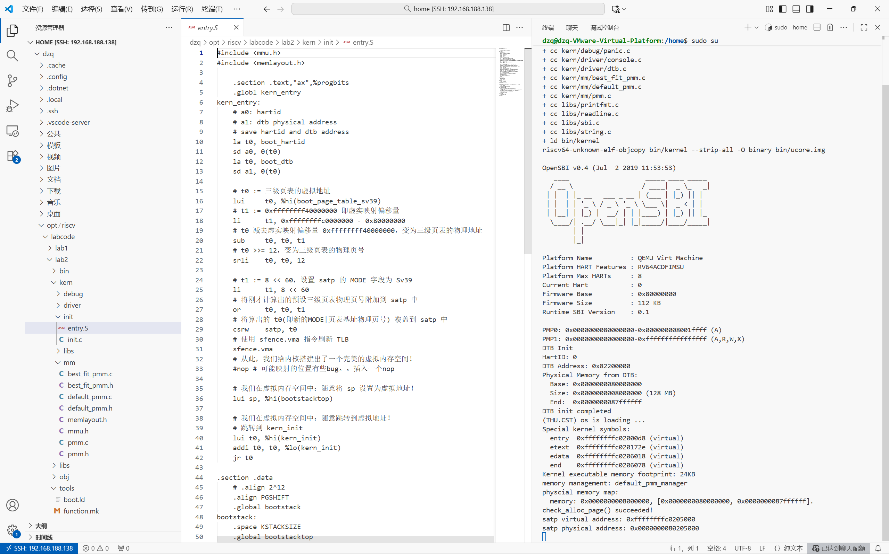
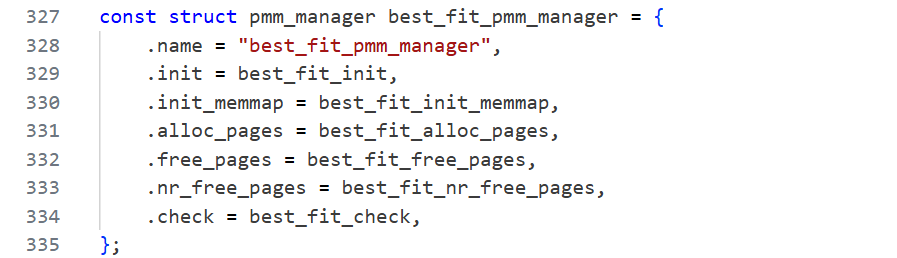

# <center>lab2:物理内存和页表

[实验二指导](http://oslab.mobisys.cc/lab2025/_book/lab2/lab2.html)

[TOC]

## 前期准备

我学习了vscode的连接虚拟机，[教程链接](https://blog.csdn.net/qq_45223683/article/details/141140237)

[注意，Ubuntu系统可能默认启动了防火墙，需要在防火墙中打开SSH服务的端口，或者关闭防火墙。](https://blog.csdn.net/fenst/article/details/137374375?spm=1001.2101.3001.6661.1&utm_medium=distribute.pc_relevant_t0.none-task-blog-2%7Edefault%7EBlogCommendFromBaidu%7EPaidSort-1-137374375-blog-141140237.235%5Ev43%5Epc_blog_bottom_relevance_base8&depth_1-utm_source=distribute.pc_relevant_t0.none-task-blog-2%7Edefault%7EBlogCommendFromBaidu%7EPaidSort-1-137374375-blog-141140237.235%5Ev43%5Epc_blog_bottom_relevance_base8&utm_relevant_index=1)

本次`make qemu`



```cmd
root@dzq-VMware-Virtual-Platform:/home/dzq/opt/riscv/labcode/lab2# make qemu
+ cc kern/init/entry.S
+ cc kern/init/init.c
+ cc kern/libs/stdio.c
+ cc kern/debug/panic.c
+ cc kern/driver/console.c
+ cc kern/driver/dtb.c
+ cc kern/mm/best_fit_pmm.c
+ cc kern/mm/default_pmm.c
+ cc kern/mm/pmm.c
+ cc libs/printfmt.c
+ cc libs/readline.c
+ cc libs/sbi.c
+ cc libs/string.c
+ ld bin/kernel
riscv64-unknown-elf-objcopy bin/kernel --strip-all -O binary bin/ucore.img

OpenSBI v0.4 (Jul  2 2019 11:53:53)
   ____                    _____ ____ _____
  / __ \                  / ____|  _ \_   _|
 | |  | |_ __   ___ _ __ | (___ | |_) || |
 | |  | | '_ \ / _ \ '_ \ \___ \|  _ < | |
 | |__| | |_) |  __/ | | |____) | |_) || |_
  \____/| .__/ \___|_| |_|_____/|____/_____|
        | |
        |_|

Platform Name          : QEMU Virt Machine
Platform HART Features : RV64ACDFIMSU
Platform Max HARTs     : 8
Current Hart           : 0
Firmware Base          : 0x80000000
Firmware Size          : 112 KB
Runtime SBI Version    : 0.1

PMP0: 0x0000000080000000-0x000000008001ffff (A)
PMP1: 0x0000000000000000-0xffffffffffffffff (A,R,W,X)
DTB Init
HartID: 0
DTB Address: 0x82200000
Physical Memory from DTB:
  Base: 0x0000000080000000
  Size: 0x0000000008000000 (128 MB)
  End:  0x0000000087ffffff
DTB init completed
(THU.CST) os is loading ...
Special kernel symbols:
  entry  0xffffffffc02000d8 (virtual)
  etext  0xffffffffc020172e (virtual)
  edata  0xffffffffc0206018 (virtual)
  end    0xffffffffc0206078 (virtual)
Kernel executable memory footprint: 24KB
memory management: default_pmm_manager
physcial memory map:
  memory: 0x0000000008000000, [0x0000000080000000, 0x0000000087ffffff].
check_alloc_page() succeeded!
satp virtual address: 0xffffffffc0205000
satp physical address: 0x0000000080205000
QEMU: Terminated
```

## 实验目的

- 理解页表的建立和使用方法
- 理解物理内存的管理方法
- 理解页面分配算法

## 实验内容

实验一过后大家做出来了一个可以启动的系统，实验二主要涉及操作系统的物理内存管理。操作系统为了使用内存，还需高效地管理内存资源。本次实验我们会了解**如何发现系统中的物理内存**，然后学习**如何建立对物理内存的初步管理，即了解连续物理内存管理**，最后掌握**页表相关的操作，即如何建立页表来实现虚拟内存到物理内存之间的映射**，帮助我们对段页式内存管理机制有一个比较全面的了解。本次的实验主要是**在实验一的基础上完成物理内存管理，并建立一个最简单的页表映射。**

## 老师实验视频知识点

`dzq/opt/riscv/labcode/lab2/kern/init/entry.S`系统的入口代码

`dzq/opt/riscv/labcode/lab2/tools/kernel.ld`这是一个链接脚本，这个链接脚本用来指导内核的编译过程当中如何摆放内核得到的那一片连续的地址空间。[理解代码]

​	一个程序不管它是内核还是普通的应用程序，它的地址空间的布局是在它被编译和链接的时候，就已然由链接器和编译器给你确定好，然后我们只需要把指令填到那里面去，填到那个对应的空间布局上就好了

​	c 语言在运行之前有一个默认的假设条件是栈已然是就绪的，我们能看到在这个位置上有一条指令，这条指令是把 SP 寄存器给它设置了一个值，也就是这条指令是让栈寄存器指向一块可以用的内存空间。所以这样之后我们再调用 c 语言的代码就没有问题了，压栈和退栈都有的内存可以用了。

​	`dzq/opt/riscv/labcode/lab2/kern/mm/best_fit_pmm.c`



## 练习

对实验报告的要求：

- 基于markdown格式来完成，以文本方式为主

- 填写各个基本练习中要求完成的报告内容

- 列出你认为本实验中重要的知识点，以及与对应的OS原理中的知识点，并简要说明你对二者的含义，关系，差异等方面的理解（也可能出现实验中的知识点没有对应的原理知识点）

- 列出你认为OS原理中很重要，但在实验中没有对应上的知识点

- 从oslab网站上取得实验代码后，进入目录labcodes/lab2，完成实验要求的各个练习。在实验报告中回答所有练习中提出的问题。在目录labcodes/lab2下存放实验报告，推荐用**markdown**格式。每个小组建一个gitee或者github仓库，对于lab2中编程任务，完成编写之后，再通过git push命令把代码和报告上传到仓库。最后请一定提前或按时提交到git网站。

  注意有“LAB2”的注释，代码中所有需要完成的地方（challenge除外）都有“LAB2”和“YOUR CODE”的注释，请在提交时特别注意保持注释，并将“YOUR CODE”替换为自己的学号，并且将所有标有对应注释的部分填上正确的代码。
  
  Challenges是选做，完成Challenge并回答了助教问题的小组可获得本次实验的加分。

### 练习1：理解first-fit 连续物理内存分配算法（思考题）

first-fit 连续物理内存分配算法作为物理内存分配一个很基础的方法，需要同学们理解它的实现过程。请大家仔细阅读实验手册的教程并结合`kern/mm/default_pmm.c`中的相关代码，认真分析default_init，default_init_memmap，default_alloc_pages， default_free_pages等相关函数，并描述程序在进行物理内存分配的过程以及各个函数的作用。 请在实验报告中简要说明你的设计实现过程。请回答如下问题：

- 你的first fit算法是否有进一步的改进空间？

#### 前置知识点

物理内存管理应当为虚拟内存管理提供这样的接口：

- 检查当前还有多少空闲的物理页，返回空闲的物理页数目
- 给出n，尝试分配n个物理页，可以返回一个起始地址和连续的物理页数目，也可能分配一些零散的物理页，返回一个连起来的链表。
- 给出起始地址和n，释放n个连续的物理页

##### 物理内存探测

##### 页面分配算法

##### first-fit算法

当需要分配或释放内存时：

- **分配**：从链表头开始，找到第一个满足大小要求的空闲块；
- **释放**：将页块按地址顺序重新插入链表，并合并前后相邻的空闲块；
- **统计**：通过全局变量 `nr_free` 记录当前空闲页总数。

#### 代码分析

**详细代码讲解我已放入文件中，这里只做核心讲解，关键点我已加粗，这部分主要是代码阅读，所以主要看检查**

##### default_init

```c
static void
default_init(void) {
    list_init(&free_list);  // 初始化空闲链表为空
	nr_free = 0;            // 当前系统空闲页数清零
}
```

​	这里首先我们要做的就是初始化内存分配器，`free_list` 是一个**双向循环链表**，用于记录系统中所有“空闲页块”；每个空闲块在链表中用一个 `Page` 节点表示；实验刚开始时，还没有任何可分配内存页，所以 `nr_free` = 0。

##### default_init_memmap

**对一段连续的物理页（从 `base` 开始，共 `n` 页）进行初始化，使其成为系统可管理的空闲内存块。**函数首先遍历这段页区间，将每个页的标志位和引用计数清零，确保这些页处于“空闲”状态；然后将第一个页（即块首页）的 `property` 字段设为块的页数 `n`，并标记该页为空闲块的起始页；接着把这段空闲块的页数累加到全局变量 `nr_free` 中，更新系统的空闲页统计；最后，函数将该空闲块按物理地址顺序插入到全局空闲链表 `free_list` 中，以保证链表中所有空闲块的顺序性，从而方便后续的页面分配与合并操作。总体而言，它完成了从“未初始化的物理页”到“可管理的空闲块”的转换，是物理内存管理建立阶段的关键步骤。

##### default_alloc_pages

**函数的作用是实现 First-Fit页面分配算法，用于从系统空闲页链表中找到一块能够满足请求页数 `n` 的连续物理页，并将其分配出去。**函数首先检查请求页数是否合法以及当前空闲页是否充足；然后从空闲页链表头开始按顺序遍历，找到第一个 `property` 值大于或等于 `n` 的空闲块（即第一个足够大的连续空闲页段）；若找到合适块，则将其从链表中移除，并在块过大的情况下对其进行**分裂**——前 `n` 页分配出去，剩余部分重新标记为空闲块并插回链表。最后更新全局空闲页计数 `nr_free`，清除被分配块的空闲标志并返回起始页地址。整体上，这个函数完成了“在空闲块链表中查找、分割并分配物理页”的全过程，是物理内存管理中最核心的分配逻辑。

##### default_free_pages

将释放的 n 个连续页重新加入空闲链表，并在必要时**合并相邻空闲块**，避免碎片。这段代码的功能是将一段连续的物理页释放回系统空闲页池。首先，它遍历释放的页，将每页的标志和引用计数清零，**确保不是保留页且不是已有空闲块起点**；然后，将释放块的起始页设置为该块大小并标记为空闲块起点，同时更新总空闲页数；最后，将释放块按照物理地址从低到高的顺序插入空闲链表，以便后续分配连续页时可以高效查找并支持相邻空闲块的合并。如果释放块与前后块在物理地址上连续，则将它们合并为更大的空闲块。释放成功后`nr_free` 增加释放的页数。

##### default_nr_free_pages

返回当前空闲页总数

##### basic_check

验证物理内存分配器是否正确工作的核心自检函数，测试了**分配正确性，引用计数正确性，地址合法性，空闲列表逻辑，释放与再分配，状态恢复。**

##### default_check

对First Fit内存页分配算法的正确性进行全面验证。它首先遍历空闲页链表，统计空闲块数量与总页数，并与系统记录的空闲页数比对，确保链表状态一致；然后调用 `basic_check()` 进行基础功能测试；接着通过一系列分配与释放操作，验证首次适应算法在不同场景下的行为是否正确，如部分释放、连续分配、块合并、无法分配时返回 `NULL` 等；最后恢复空闲链表与计数状态，并再次检查页数统计是否准确。整体而言，该函数用于自动检测内存分配器在“首次适应”策略下的页管理逻辑、链表维护及内存块合并功能是否实现正确。

##### const struct pmm_manager default_pmm_manager

定义默认的物理内存管理器，包含初始化、内存块初始化、页分配、页释放、空闲页计数和检查函数的实现

#### 优化改进

是的可以优化，我从以下方向入手思考，其实下面的那些算法就相当于优化了，甚至我这两天学懂了才想起来软件安全里有讲过这个知识点，就简单提一下优化思路方向  

1.减少碎片化内存，比如First-Fit 会优先使用低地址的小块以及default_alloc_pages块过大的情况下对其进行**分裂**，我想到可以就是每次遍历找到满足要求最小的内存块进行处理，但这会加大时间复杂度，那么就可以再来一个链表，记录从小到大块的位置。

### 练习2：实现 Best-Fit 连续物理内存分配算法（需要编程）

在完成练习一后，参考kern/mm/default_pmm.c对First Fit算法的实现，编程实现Best Fit页面分配算法，算法的时空复杂度不做要求，能通过测试即可。 请在实验报告中简要说明你的设计实现过程，阐述代码是如何对物理内存进行分配和释放，并回答如下问题：

- 你的 Best-Fit 算法是否有进一步的改进空间？

### 扩展练习Challenge：buddy system（伙伴系统）分配算法（需要编程）

Buddy System算法把系统中的可用存储空间划分为存储块(Block)来进行管理, 每个存储块的大小必须是2的n次幂(Pow(2, n)), 即1, 2, 4, 8, 16, 32, 64, 128...

- 参考[伙伴分配器的一个极简实现](http://coolshell.cn/articles/10427.html)， 在ucore中实现buddy system分配算法，要求有比较充分的测试用例说明实现的正确性，需要有设计文档。

### 扩展练习Challenge：任意大小的内存单元slub分配算法（需要编程）

slub算法，实现两层架构的高效内存单元分配，第一层是基于页大小的内存分配，第二层是在第一层基础上实现基于任意大小的内存分配。可简化实现，能够体现其主体思想即可。

- 参考[linux的slub分配算法/](https://github.com/torvalds/linux/blob/master/mm/slub.c)，在ucore中实现slub分配算法。要求有比较充分的测试用例说明实现的正确性，需要有设计文档。

### 扩展练习Challenge：硬件的可用物理内存范围的获取方法（思考题）

- 如果 OS 无法提前知道当前硬件的可用物理内存范围，请问你有何办法让 OS 获取可用物理内存范围？


