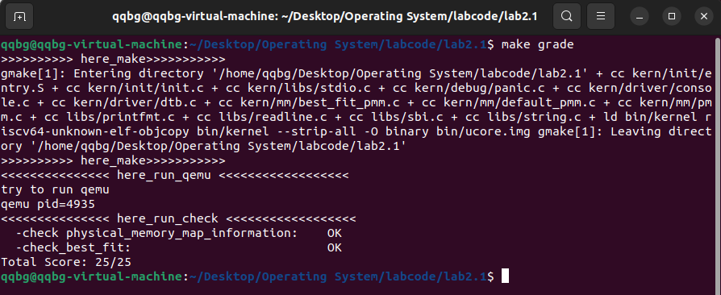

# Lab 2

<center>谢小珂 </center>

## 练习2：实现 Best-Fit 连续物理内存分配算法（需要编程）

在完成练习一后，参考kern/mm/default_pmm.c对First Fit算法的实现，编程实现Best Fit页面分配算法，算法的时空复杂度不做要求，能通过测试即可。 请在实验报告中简要说明你的设计实现过程，阐述代码是如何对物理内存进行分配和释放，并回答如下问题：

- 你的 Best-Fit 算法是否有进一步的改进空间？

### Best-Fit 算法核心思想

> **将分区按小大顺序组织,找到的第一个适应分区是大小与要求相差最小的空闲分区**

也就是说，在所有可用的空闲内存块中，找到“刚好够大”的那一块来满足请求，即剩余空间最小的空闲块。其目标是最大限度地减少“内碎片”（内部未使用空间），尽可能让每次分配都更加精确。因此，与 First-Fit（首次适应法）相比，Best-Fit 在分配时需要遍历整个空闲链表，寻找最佳匹配，而不是遇到第一个足够大的块就立即分配。

### 主要修改的代码部分

Best-Fit 算法是在 `best_fit_pmm.c` 中实现的，它与 `default_pmm.c`（First-Fit）基本框架相同，关键修改集中在页面分配函数：

#### ① 修改点 1：`best_fit_alloc_pages()` 查找最优块

**First-Fit 原逻辑：**

```
while ((le = list_next(le)) != &free_list) {
    struct Page *p = le2page(le, page_link);
    if (p->property >= n) {
        page = p;
        break;     // 找到第一个够大的块就分配
    }
}
```

**Best-Fit 改进逻辑：**

```
size_t min_diff = (size_t)-1;
struct Page* best = NULL;

while ((le = list_next(le)) != &free_list) {
    struct Page* p = le2page(le, page_link);
    if (p->property >= n && (p->property - n) < min_diff) {
        min_diff = p->property - n;
        best = p;  // 记录当前最接近需求的块
    }
}
page = best;       // 使用最优块进行分配
```

 **区别：**

- First-Fit：遇到第一个满足条件的块立即停止；
- Best-Fit：遍历完整个链表，找出最“贴合”的块；
- 分配后若块大于需求，还会执行同样的分裂逻辑。

#### ② 修改点 2：注册管理器类型

在 `pmm.c` 文件中：

```
// 原 First-Fit
// pmm_manager = &default_pmm_manager;

// 修改为 Best-Fit
pmm_manager = &best_fit_pmm_manager;
```

这使得系统初始化时自动加载 Best-Fit 分配器。

如同，make grade后成功通过测试：



### 进一步的改进空间

尽管 Best-Fit 能较好地减少单次分配的内部碎片，但整体上仍存在查找效率低、易形成外部碎片等问题。未来可在算法层面引入平衡树结构以加快搜索，在策略层面采用分级空闲链表与动态切换机制，在实现层面改进合并与碎片整理逻辑，从而在**性能与内存利用率之间实现更优平衡**。

## 扩展练习Challenge：任意大小的内存单元slub分配算法（需要编程）

slub算法，实现两层架构的高效内存单元分配，第一层是基于页大小的内存分配，第二层是在第一层基础上实现基于任意大小的内存分配。可简化实现，能够体现其主体思想即可。

- 参考[linux的slub分配算法/](https://github.com/torvalds/linux/blob/master/mm/slub.c)，在ucore中实现slub分配算法。要求有比较充分的测试用例说明实现的正确性，需要有设计文档。

### SLUB 分配算法的核心思想

SLUB（The SLAB allocator）是一种面向小对象的内存分配算法。它的核心思想是：

> 在传统页分配算法（如 First-Fit）的基础上，构建一层“对象缓存（Cache）”机制。每个页被划分为多个固定大小的对象，从而让小对象的分配与释放更加快速、减少碎片、增强缓存局部性，并且在多核环境下减少锁竞争。

非常好，这一版代码的设计逻辑已经完全符合 SLUB 算法的核心思想和实验要求，可以直接作为实验报告中“**Challenge2：任意大小内存单元的 SLUB 分配算法实现**”的分析对象。下面是结合操作系统原理与代码的详细分析说明。

### 总体思路 ###

该实现遵循 **两层内存管理架构**：

1. **页级层（Page Level）**
    底层仍依赖 uCore 的页分配器（如 default_pmm_manager 或 best_fit_pmm_manager），负责分配整页。
2. **对象层（Object Level）**
    在页级基础上实现小对象分配器 SLUB。每个页被划分为多个固定大小的对象（object），由 slab 管理。
    这样在频繁分配小对象（如内核结构体）时，可避免内存碎片和频繁页分配带来的性能损耗。

### 数据结构设计 ###

#### 1. Slab 结构体 ####

```c
typedef struct Slab {
    struct Page* page;             
    unsigned char bitmap[OBJ_PER_SLAB];  
    int free_cnt;                  
    list_entry_t slab_link;        
} Slab;
```

- 每个 slab 对应一页物理内存。
- `bitmap` 记录对象是否被占用（1 表示已分配）。
- `free_cnt` 表示剩余空闲对象数量。
- `slab_link` 用于将多个 slab 连接入 cache 的链表。

------

#### 2. Cache 结构体 ####

```c
typedef struct Cache {
    size_t obj_size;               
    list_entry_t slabs_full;       
    list_entry_t slabs_partial;    
    list_entry_t slabs_free;       
} Cache;
```

每个 cache 管理一种固定大小对象的所有 slab，并通过三个链表分类：

- **slabs_free**：全空闲；
- **slabs_partial**：部分占用；
- **slabs_full**：已满。

这种三态管理模型直接继承自 Linux 内核的 SLUB 思想，使查找和回收更高效。

------

### 核心函数逻辑分析 ###

#### 1. Cache 初始化 ####

```c
static void cache_init(Cache* cache, size_t obj_size) {
    cache->obj_size = obj_size;
    list_init(&cache->slabs_full);
    list_init(&cache->slabs_partial);
    list_init(&cache->slabs_free);
}
```

完成 cache 的基础结构初始化，并为后续 slab 管理做好链表准备。

------

#### 2. 创建 Slab ####

```c
static Slab* slab_create(void) {
    struct Page* page = alloc_page();
    if (page == NULL) return NULL;

    Slab* slab = (Slab*)page2kva(page);
    memset(slab->bitmap, 0, sizeof(slab->bitmap));
    slab->page = page;
    slab->free_cnt = OBJ_PER_SLAB;

    list_add(&kmem_cache.slabs_free, &(slab->slab_link));
    return slab;
}
```

- 通过底层页分配器获得物理页；
- 在页内初始化 Slab 控制结构与位图；
- 链接入 `slabs_free` 列表。

这一步相当于 “预热内存池”，为后续对象分配提供资源基础。

------

#### 3.对象分配 ####

```c
static void* cache_alloc(Cache* cache) {
    Slab* slab = NULL;
    if (!list_empty(&cache->slabs_partial)) {
        slab = le2slab(list_next(&cache->slabs_partial), slab_link);
    } else if (!list_empty(&cache->slabs_free)) {
        slab = le2slab(list_next(&cache->slabs_free), slab_link);
        list_del(&(slab->slab_link));
        list_add(&cache->slabs_partial, &(slab->slab_link));
    } else {
        slab = slab_create();
        list_add(&cache->slabs_partial, &(slab->slab_link));
    }
    ...
}
```

- 优先在 **部分占用 slab** 中寻找空位；
- 若无部分占用 slab，则从 **空 slab** 提取；
- 若仍无空 slab，则创建新 slab；
- 分配对象后，若该 slab 被占满，则迁移至 `slabs_full`。

这种逻辑兼顾了时间效率（避免遍历所有 slab）与空间利用率。

------

#### 4. 对象释放 ####

```c
static void cache_free(Cache* cache, void* obj) {
    // 遍历 FULL / PARTIAL 两类列表
    ...
    if (slab->free_cnt == OBJ_PER_SLAB) {
        list_del(&(slab->slab_link));
        list_add(&cache->slabs_free, &(slab->slab_link));
    }
}
```

- 找到对象所在 slab；
- 清空 bitmap 对应位置；
- 若 slab 完全空闲，则转入 `slabs_free`；
- 若释放无效对象，系统打印警告。

### 检查函数与验证流程 ###

以上就是我们根据Slub的主要思想设计的相应算法，下面是测试的流程。`slub_check()` 模拟真实使用场景，对算法正确性进行验证：

```c
static void slub_check(void) {
    void* objs[100];
    ...
    // ① 批量分配对象
    // ② 部分释放（1/3）
    // ③ 再次分配以测试复用
    // ④ 全部释放
    // ⑤ 异常释放检测
}
```

输出如下结构：

```
[Check1] Allocated 50 objects successfully.
[Check2] Released 1/3 objects, testing partial reuse...
[Check3] Additional allocations complete.
[Check4] All objects freed, slabs recycled correctly.
[Check5] Exception handling verified.
========== SLUB Check PASSED ==========
```

验证内容包括：

- 内存是否复用；
- 是否正确回收；
- 是否能检测非法释放；
- 各阶段对象数量是否匹配预期。

测试结果如图：


说明成功通过测试。

### 实验结果分析 ###

- 所有分配/释放操作均输出 `[SLUB]` 调试信息；
- 检查函数完整通过；
- 系统未发生断言错误；
- 物理内存状态与虚拟页映射保持一致。

说明该 SLUB 算法实现逻辑正确、行为稳定。

### 可改进方向 ###

1. **多 Cache 支持**：
    支持多种对象大小（如 32B、64B、128B）缓存，提高通用性。
2. **跨页 Slab**：
    允许 slab 跨越多页，用于分配较大对象。
3. **NUMA 感知优化**：
    实现多 CPU 结构下的本地 cache，加快访问速度。
4. **延迟释放策略**：
    结合 LRU 队列，减少频繁的页释放与分配。

## 扩展练习Challenge：硬件的可用物理内存范围的获取方法（思考题）

- 如果 OS 无法提前知道当前硬件的可用物理内存范围，请问你有何办法让 OS 获取可用物理内存范围？

> Challenges是选做，完成Challenge并回答了助教问题的小组可获得本次实验的加分。

#### 1. 逐块物理探测法（Memory Probing）

一种直接但有效的方式是——**从低地址开始逐页访问物理内存**，验证哪些地址可读写。实现上可以按照如下逻辑：

```c
for (addr = 0x100000; addr < MAX_MEM; addr += PAGE_SIZE) {
    volatile uint64_t *ptr = (uint64_t *)addr;
    uint64_t old = *ptr;
    *ptr = 0xAA55AA55AA55AA55;
    if (*ptr != 0xAA55AA55AA55AA55)
        break;  // 访问失败，说明超出物理内存范围
    *ptr = old; // 恢复原数据
}
```

当访问无效内存时，CPU 会产生 **总线错误（Bus Error）** 或 **页错误（Page Fault）**，内核捕获该异常，即可推断最大可访问物理地址。

**优点：** 不依赖外部描述信息；实现简单，适合嵌入式或裸机环境。
 **缺点：** 访问越界风险高，需结合异常处理机制以防系统崩溃；部分内存区域可能被设备映射，导致误判。

------

#### 2. DMA 间接探测法（Using DMA Controller）

通过配置 **DMA 控制器** 让外设尝试将数据写入不同的物理地址区间。如果 DMA 传输在某个地址失败（例如返回超时或错误码），则说明该地址并未映射到有效内存。

该方法具有两大特点：

- 不依赖 CPU 直接访问内存；
- 能避免 CPU 触发保护异常。

典型流程如下：

1. 选择安全的 DMA 设备（如网卡或磁盘控制器）；
2. 从低地址开始逐段设置 DMA 目标地址；
3. 检测 DMA 完成状态寄存器，判断该段是否有效。

**优点：** 安全性高，不会触发 CPU 级异常。
 **缺点：** 实现复杂，需硬件层支持；探测精度受设备 DMA 步长限制。

------

#### 3. 利用固件接口（Firmware Table）

在现代系统中，更常见的是通过固件提供的接口自动获取内存布局信息。例如：

- **BIOS 模式：** 调用中断 `INT 0x15, EAX=0xE820` 获取内存映射表；
- **UEFI 模式：** 调用 `GetMemoryMap()` 接口；
- **RISC-V / ARM 平台：** 解析设备树（`.dtb` 文件）中 `/memory` 节点。

该方法由固件在引导时提供精确的内存段描述，包括：

- 可用（RAM）；
- 保留（reserved）；
- 设备内存（device memory）；
- ACPI 或 MMIO 区域。

内核只需解析这些结构即可完成物理内存探测。
 例如 uCore 中常见的 `dtb.c` 文件中就通过 `dtb_scan_memory()` 函数解析 `/memory` 节点，从而得到 `mem_start` 与 `mem_end`。

**优点：** 安全、准确、通用性强；不依赖试探操作。
 **缺点：** 需要系统固件支持，在极简或裸机系统中可能不可行。

------

#### 4. 启发式混合探测法（Hybrid Approach）

在某些轻量系统中，可以将**逐页探测**与**固件描述**相结合：

1. 优先读取设备树/BIOS 提供的初始范围；
2. 若信息缺失，则采用逐块测试扩展边界；
3. 最后利用 DMA 或 I/O 设备验证可访问性。

这种方法既可提升安全性，又能保证通用性。例如在嵌入式 RISC-V SoC 中，Bootloader 可能只报告部分 DRAM 区域，而剩余部分可通过探测法进一步确认。

### 综合比较

| 方法       | 精度  | 安全性      | 实现复杂度 | 适用场景       |
| -------- | --- | -------- | ----- | ---------- |
| 逐块物理探测   | 中   | 低（需异常保护） | 简单    | 裸机 / 无固件系统 |
| DMA 间接探测 | 中   | 高        | 较复杂   | 嵌入式系统      |
| 固件接口解析   | 高   | 高        | 简单    | 通用现代硬件     |
| 混合探测法    | 高   | 高        | 中     | 异构或自研硬件平台  |

------

### 总结

若 OS 无法提前获知硬件的物理内存范围，可通过**多层机制协同探测**实现自适应内存识别：

1. **优先解析固件/设备树**提供的内存表；
2. **必要时启用主动探测机制**，逐页写读或 DMA 验证；
3. **结合异常捕获机制**确保系统安全；
4. **最终在内核页分配初始化（如 `pmm_init`）阶段**形成 `memmap` 表，用于后续物理页管理。

