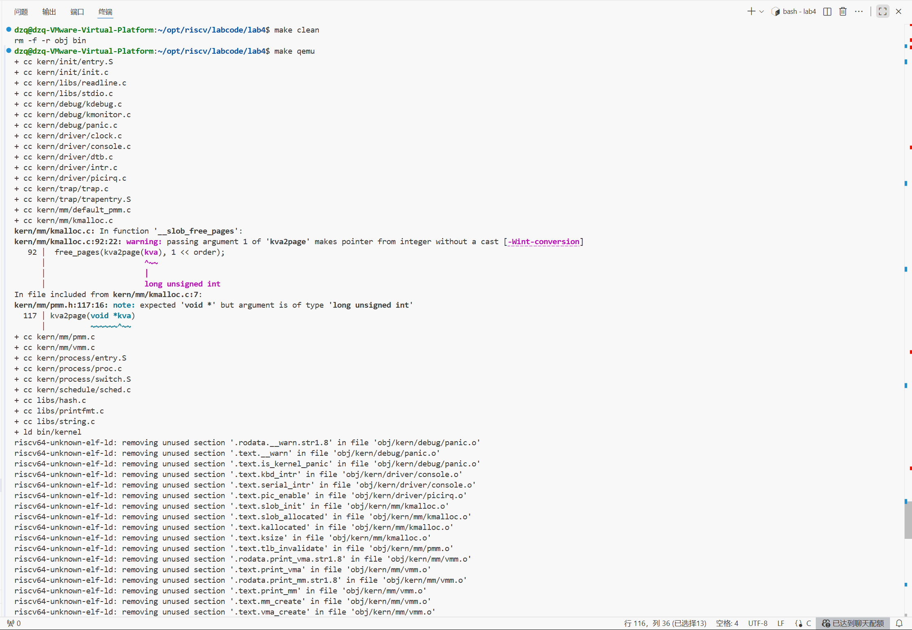
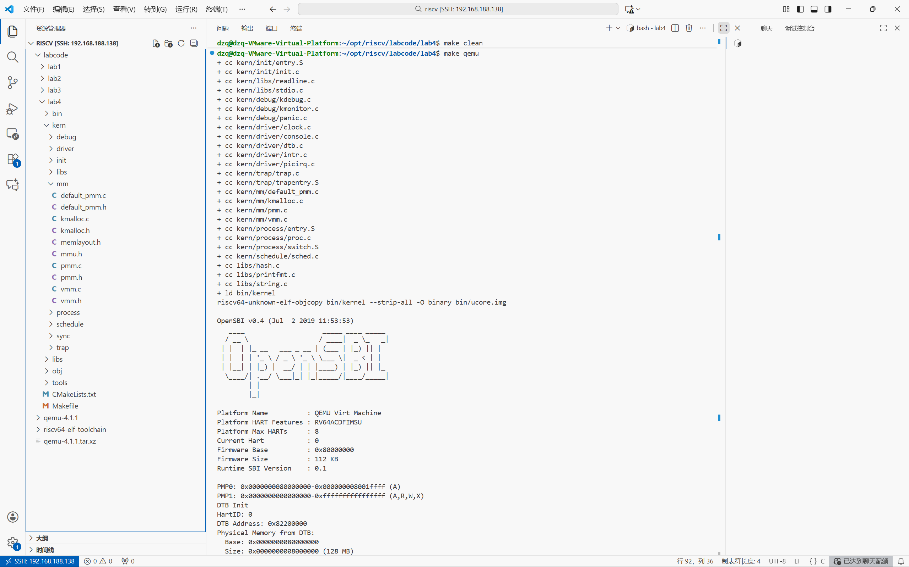

# <center>lab4:进程管理

**小组成员：**

**吴禹骞-2311272**

**谢小珂-2310422**

**杜泽琦-2313508**

[TOC]

## 前期准备

### 练习0：填写已有实验

本实验依赖实验2/3。请把你做的实验2/3的代码填入本实验中代码中有“LAB2”,“LAB3”的注释相应部分。

补充时钟中断代码

```c
#include <sbi.h>
        case IRQ_S_TIMER:
            // "All bits besides SSIP and USIP in the sip register are
            // read-only." -- privileged spec1.9.1, 4.1.4, p59
            // In fact, Call sbi_set_timer will clear STIP, or you can clear it
            // directly.
            // cprintf("Supervisor timer interrupt\n");
             /* LAB3 EXERCISE1   YOUR CODE : 2313508 */
            /*(1)设置下次时钟中断- clock_set_next_event()
             *(2)计数器（ticks）加一
             *(3)当计数器加到100的时候，我们会输出一个`100ticks`表示我们触发了100次时钟中断，同时打印次数（num）加一
            * (4)判断打印次数，当打印次数为10时，调用<sbi.h>中的关机函数关机
            */
            /* LAB3 EXERCISE1 完整实现 */
            clock_set_next_event();          // (1) 设置下一次时钟中断
            ticks++;                         // (2) 计数器 +1

            if (ticks % TICK_NUM == 0) {     // (3) 每 100 次打印一次
                print_ticks();
                print_cnt++;
                if (print_cnt >= 10) {       // (4) 打印 10 行后关机
                    cprintf("System shutdown after 10 prints.\n");
                    sbi_shutdown();
                }
            }
```

该部分不做赘述

## 实验目的

- 了解虚拟内存管理的基本结构，掌握虚拟内存的组织与管理方式
- 了解内核线程创建/执行的管理过程
- 了解内核线程的切换和基本调度过程

## 实验内容

首先，**进一步完善虚拟内存管理，实现基本的地址空间结构**。通过引入虚拟内存描述结构，管理进程或线程的虚拟地址空间布局，为每个执行实体提供逻辑上的运行空间。与后续实验中的缺页异常和页面置换不同，本实验中的虚拟内存仍采用**预映射方式**，即在建立地址空间时一次性完成所有需要的页表映射，不涉及按需分配或页面置换。

其次，**引入内核线程机制，实现多执行流并发运行能力**。内核线程是一种特殊形式的“进程”。当一个程序加载到内存中运行时，首先通过ucore OS的内存管理子系统分配合适的空间，然后就需要考虑如何分时使用CPU来“并发”执行多个程序，让每个运行的程序（这里用线程或进程表示）“感到”它们各自拥有“自己”的CPU。本实验将实现线程控制块、上下文切换和调度器等内容，从而实现多线程并发执行，使内核能够调度多个执行实体轮流使用 CPU 运行。

内核线程与用户进程的区别如下：

| 比较项   | 内核线程         | 用户进程                   |
| -------- | ---------------- | -------------------------- |
| 运行模式 | 仅在内核态运行   | 在用户态和内核态之间切换   |
| 地址空间 | 共享内核地址空间 | 拥有独立的用户虚拟地址空间 |

整个实验过程以 ucore 的总控函数 `init` 为起点。在初始化阶段，首先调用 `pmm_init` 函数完成物理内存管理初始化，建立空闲物理页管理机制，为后续页表建立和线程栈分配提供支持。接下来，执行中断和异常相关的初始化工作，此过程涉及调用 `pic_init` 和 `idt_init` 函数，用于初始化处理器中断控制器（PIC）和中断描述符表（IDT），与之前的 lab3 中断和异常初始化工作相同。随后，调用 `vmm_init` 函数进行虚拟内存管理机制的初始化。在此阶段，将建立内核的页表结构，并完成内核地址空间的虚拟地址到物理地址的静态映射。这里仅实现基础的页表映射机制，保证虚拟内存能够正常访问，并不会处理缺页异常，也**不涉及将页面换入或换出**。通过这些初始化工作，系统完成了内存的虚拟化，建立了基本的内存访问机制。

当内存的虚拟化完成后，整个控制流还是一条线串行执行，需要在此基础上进行 CPU 的虚拟化，即让 ucore 实现分时共享 CPU，使多条控制流能够并发执行。首先调用 `proc_init` 函数，完成进程管理的初始化，负责创建两个内核线程：第 0 个内核线程 `idleproc` 和第 1 个真正的内核线程 `initproc`。`idleproc` 是系统启动后的占位线程，主要任务是在没有其他可运行线程时进入空闲循环；而 `initproc` 则通过 `kernel_thread` 创建，是第一个实际执行任务的内核线程。在本实验中，它的任务是输出 “Hello World”，以验证内核线程的创建与调度机制是否正确。在完成上述初始化后，`idleproc` 会运行 `cpu_idle()`，当检测到需要调度时，系统通过`schedule()`选择可运行的线程并进行线程切换，从而让`initproc`获得 CPU 执行权并输出 “Hello World” 。

## 老师实验视频知识点

​	1.satp寄存器的格式，mode字段，PPN为根页表的物理页号（即物理地址右移十二位），一开始的时候，CPU上电的一瞬间，satp处于Bare模式（mode=0）,这是地址不经过翻译地址直接透传给物理内存。只有设置好mode（8=Sv39,9=Sv48,10=Sv57),并且把页表设置好后，MMU才开始启用，这两件事要同时干。

​	2.sfence指令既能避免程序的运行的过程当中的指令顺序被乱序地交换，又能够起到刷新 TLB 的效果

​	3.riscv/labcode/lab4/tools/kernel.ld

```
BASE_ADDRESS = 0xFFFFFFFFC0200000;
```

这个东西确定了我们接下来所有程序执行的时候的基础的虚拟地址

但是我们实际上的物理地址是有偏差的，实际上的 CPU 现在由于页表没有启用，仍然在物理地址的空间里面生活，可是我们是按照虚拟地址空间编译的代码，导致我们在代码里面对所有变量的引用，引用的都是它的虚拟地址，由于没有人做虚拟地址到物理地址的翻译，所以必须在软件层面上手动的把那个地址从虚拟地址翻译成物理地址，依靠下面这个变量来弥补偏差

​	4.riscv/labcode/lab4/kern/init/entry.S

```
boot_page_table_sv39:
    # 0xffffffff_c0000000 map to 0x80000000 (1G)
    # 前 511 个页表项均设置为 0 ，因此 V=0 ，意味着是空的(unmapped)
    .zero 8 * 511
    # 设置最后一个页表项，PPN=0x80000，标志位 VRWXAD 均为 1
    .quad (0x80000 << 10) | 0xcf # VRWXAD
```

​	5.进程

riscv/labcode/lab4/kern/init/init.c

```
vmm_init();  // init virtual memory management
```

程序的第一个正常的页表的构建，这个页表会成为接下来每一个进程的一部分，所以在接下来的过程当中，我们创建新的进程的时候，那些进程都会以这个页表为基础。继续做下面的进程创建，而且每一个进程在创建的过程当中都会复制这个被初始化的页表

```
cpu_idle(); // run idle process
```

空循环进程，随时切换给下一个正在运行的进程

riscv/labcode/lab4/kern/process/proc.c

```c
// cpu_idle - at the end of kern_init, the first kernel thread idleproc will do below works
void cpu_idle(void)
{
    while (1)
    {
        if (current->need_resched)
        {
            schedule();
        }
    }
}
```

​	6.PID进程id号

如何获取一个有效的pid?理想情况下：
pid是一个正整数
pid只增不减
每个进程的pid是永久唯一的
现实情况：
计算机世界的正整数是有上限的
递增过界之后，就会翻转为0
当pid成为进程的唯一身份标识后，如何确保pid不会被重复使用？

```c
// get_pid - alloc a unique pid for process
static int
get_pid(void)
{
    static_assert(MAX_PID > MAX_PROCESS);
    struct proc_struct *proc;
    list_entry_t *list = &proc_list, *le;
    static int next_safe = MAX_PID, last_pid = MAX_PID;
    if (++last_pid >= MAX_PID)
    {
        last_pid = 1;
        goto inside;
    }
    if (last_pid >= next_safe)
    {
    inside:
        next_safe = MAX_PID;
    repeat:
        le = list;
        while ((le = list_next(le)) != list)
        {
            proc = le2proc(le, list_link);
            if (proc->pid == last_pid)
            {
                if (++last_pid >= next_safe)
                {
                    if (last_pid >= MAX_PID)
                    {
                        last_pid = 1;
                    }
                    next_safe = MAX_PID;
                    goto repeat;
                }
            }
            else if (proc->pid > last_pid && next_safe > proc->pid)
            {
                next_safe = proc->pid;
            }
        }
    }
    return last_pid;
}
```

## 练习

对实验报告的要求：

- 基于markdown格式来完成，以文本方式为主
- 填写各个基本练习中要求完成的报告内容
- 列出你认为本实验中重要的知识点，以及与对应的OS原理中的知识点，并简要说明你对二者的含义，关系，差异等方面的理解（也可能出现实验中的知识点没有对应的原理知识点）
- 列出你认为OS原理中很重要，但在实验中没有对应上的知识点

从oslab网站上取得实验代码后，进入目录labcodes/lab4，完成实验要求的各个练习。在实验报告中回答所有练习中提出的问题。在目录labcodes/lab4下存放实验报告，推荐用**markdown**格式。每个小组建一个gitee或者github仓库，对于lab4中编程任务，完成编写之后，再通过git push命令把代码和报告上传到仓库。最后请一定提前或按时提交到git网站。

注意有“LAB4”的注释，代码中所有需要完成的地方（challenge除外）都有“LAB4”和“YOUR CODE”的注释，请在提交时特别注意保持注释，并将“YOUR CODE”替换为自己的学号，并且将所有标有对应注释的部分填上正确的代码。

### 练习1：分配并初始化一个进程控制块（需要编码）

alloc_proc函数（位于kern/process/proc.c中）负责分配并返回一个新的struct proc_struct结构，用于存储新建立的内核线程的管理信息。ucore需要对这个结构进行最基本的初始化，你需要完成这个初始化过程。

请在实验报告中简要说明你的设计实现过程。请回答如下问题：

- 请说明proc_struct中`struct context context`和`struct trapframe *tf`成员变量含义和在本实验中的作用是啥？（提示通过看代码和编程调试可以判断出来）

```c
// alloc_proc - alloc a proc_struct and init all fields of proc_struct
static struct proc_struct *
alloc_proc(void)
{
    struct proc_struct *proc = kmalloc(sizeof(struct proc_struct));
    if (proc != NULL)
    {
        // LAB4:EXERCISE1 2311272
        /*
         * below fields in proc_struct need to be initialized
         *       enum proc_state state;                      // Process state
         *       int pid;                                    // Process ID
         *       int runs;                                   // the running times of Proces
         *       uintptr_t kstack;                           // Process kernel stack
         *       volatile bool need_resched;                 // bool value: need to be rescheduled to release CPU?
         *       struct proc_struct *parent;                 // the parent process
         *       struct mm_struct *mm;                       // Process's memory management field
         *       struct context context;                     // Switch here to run process
         *       struct trapframe *tf;                       // Trap frame for current interrupt
         *       uintptr_t pgdir;                            // the base addr of Page Directroy Table(PDT)
         *       uint32_t flags;                             // Process flag
         *       char name[PROC_NAME_LEN + 1];               // Process name
         */
        proc->state = PROC_UNINIT;
        proc->pid = -1;
        proc->runs = 0;
        proc->kstack = 0;
        proc->need_resched = 0;
        proc->parent = NULL;
        proc->mm = NULL;
        memset(&(proc->context), 0, sizeof(struct context));
        proc->tf = NULL;
        proc->pgdir = boot_pgdir_pa;
        proc->flags = 0;
        memset(proc->name, 0, PROC_NAME_LEN + 1);
    }
    return proc;
}
```

`alloc_proc` 函数负责分配并初始化一个进程控制块（PCB），为创建新进程做准备。

```
static struct proc_struct *alloc_proc(void)
{
    struct proc_struct *proc = kmalloc(sizeof(struct proc_struct));
```

- 使用 `kmalloc` 动态分配内存空间给新的进程控制块
- `proc` 是指向新分配的结构体的指针

```
if (proc != NULL)
{
    // 初始化各个字段
    proc->state = PROC_UNINIT;          // 进程状态设为未初始化
    proc->pid = -1;                     // PID设为-1（无效值）
    proc->runs = 0;                     // 运行次数初始为0
    proc->kstack = 0;                   // 内核栈地址初始为0
    proc->need_resched = 0;             // 不需要重新调度
    proc->parent = NULL;                // 父进程指针为空
    proc->mm = NULL;                    // 内存管理结构为空（内核线程）
```

- **关键字段初始化**：
  - `state`: 设置为 `PROC_UNINIT`，表示进程还未准备好运行
  - `pid`: 设为-1，后续由 `get_pid()` 分配有效PID
  - `kstack`: 设为0，后续由 `setup_kstack()` 分配内核栈

```
    memset(&(proc->context), 0, sizeof(struct context));
    proc->tf = NULL;
```

- **上下文和陷阱帧初始化**：
  - `context`: 使用 `memset` 清零，确保所有寄存器值为0
  - `tf`: 设为NULL，后续在进程创建时设置

```
    proc->pgdir = boot_pgdir_pa;        // 使用内核页目录表
    proc->flags = 0;                    // 标志位清零
    memset(proc->name, 0, PROC_NAME_LEN + 1);  // 进程名清零
```

- **页表和标识初始化**：
  - `pgdir`: 使用内核的页目录表物理地址，内核线程共享内核地址空间
  - `flags`: 进程标志清零
  - `name`: 进程名称数组清零

```
    return proc;
}
```

- **返回初始化完成的进程控制块指针**

#### 问题回答

`context`中保存了进程执行的上下文，也就是几个关键的寄存器的值。这些寄存器的值用于在进程切换中还原之前进程的运行状态，其中包含了`ra`，`sp`，`s0~s11`共14个寄存器。

**在本实验中的作用**：

1. **进程切换时的状态保存**：当进程被切换出去时，当前CPU状态保存到该进程的context中
2. **进程恢复时的状态恢复**：当进程被切换回来时，从context恢复之前保存的状态
3. **实现上下文切换**：`switch_to` 函数使用context在进程间切换

`tf`里保存了进程的中断帧。当进程从用户空间跳进内核空间的时候，进程的执行状态被保存在了中断帧中（注意这里需要保存的执行状态数量不同于上下文切换）。保存了该进程的寄存器状态、栈指针、程序计数器（PC）等关键信息

**在本实验中的作用**：

在内核线程创建的过程中，kernel_thread 函数通过一个局部变量 tf 来放置保存内核线程的临时中断帧。

给中断帧分配完空间后，就需要构造新进程的中断帧，具体过程是：首先给tf进行清零初始化，随后设置设置内核线程的参数和函数指针。要特别注意对tf.status的赋值过程，其读取sstatus寄存器的值，然后根据特定的位操作，设置SPP和SPIE位，并同时清除SIE位，从而实现特权级别切换、保留中断使能状态并禁用中断的操作。

### 练习2：为新创建的内核线程分配资源（需要编码）

创建一个内核线程需要分配和设置好很多资源。kernel_thread函数通过调用**do_fork**函数完成具体内核线程的创建工作。do_kernel函数会调用alloc_proc函数来分配并初始化一个进程控制块，但alloc_proc只是找到了一小块内存用以记录进程的必要信息，并没有实际分配这些资源。ucore一般通过do_fork实际创建新的内核线程。do_fork的作用是，创建当前内核线程的一个副本，它们的执行上下文、代码、数据都一样，但是存储位置不同。因此，我们**实际需要"fork"的东西就是stack和trapframe**。在这个过程中，需要给新内核线程分配资源，并且复制原进程的状态。你需要完成在kern/process/proc.c中的do_fork函数中的处理过程。它的大致执行步骤包括：

- 调用alloc_proc，首先获得一块用户信息块。
- 为进程分配一个内核栈。
- 复制原进程的内存管理信息到新进程（但内核线程不必做此事）
- 复制原进程上下文到新进程
- 将新进程添加到进程列表
- 唤醒新进程
- 返回新进程号

请在实验报告中简要说明你的设计实现过程。请回答如下问题：

- 请说明ucore是否做到给每个新fork的线程一个唯一的id？请说明你的分析和理由。

```c
/* do_fork -     parent process for a new child process
 * @clone_flags: used to guide how to clone the child process
 * @stack:       the parent's user stack pointer. if stack==0, It means to fork a kernel thread.
 * @tf:          the trapframe info, which will be copied to child process's proc->tf
 */
int do_fork(uint32_t clone_flags, uintptr_t stack, struct trapframe *tf)
{
    int ret = -E_NO_FREE_PROC;
    struct proc_struct *proc;
    if (nr_process >= MAX_PROCESS)
    {
        goto fork_out;
    }
    ret = -E_NO_MEM;
    // LAB4:EXERCISE2 2310422
    /*
     * Some Useful MACROs, Functions and DEFINEs, you can use them in below implementation.
     * MACROs or Functions:
     *   alloc_proc:   create a proc struct and init fields (lab4:exercise1)
     *   setup_kstack: alloc pages with size KSTACKPAGE as process kernel stack
     *   copy_mm:      process "proc" duplicate OR share process "current"'s mm according clone_flags
     *                 if clone_flags & CLONE_VM, then "share" ; else "duplicate"
     *   copy_thread:  setup the trapframe on the  process's kernel stack top and
     *                 setup the kernel entry point and stack of process
     *   hash_proc:    add proc into proc hash_list
     *   get_pid:      alloc a unique pid for process
     *   wakeup_proc:  set proc->state = PROC_RUNNABLE
     * VARIABLES:
     *   proc_list:    the process set's list
     *   nr_process:   the number of process set
     */

    //    1. call alloc_proc to allocate a proc_struct
    //    2. call setup_kstack to allocate a kernel stack for child process
    //    3. call copy_mm to dup OR share mm according clone_flag
    //    4. call copy_thread to setup tf & context in proc_struct
    //    5. insert proc_struct into hash_list && proc_list
    //    6. call wakeup_proc to make the new child process RUNNABLE
    //    7. set ret vaule using child proc's pid
    if ((proc = alloc_proc()) == NULL) {
        goto fork_out;
    }

    //    2. call setup_kstack to allocate a kernel stack for child process
    if (setup_kstack(proc) != 0) {
        goto bad_fork_cleanup_proc;
    }

    //    3. call copy_mm to dup OR share mm according clone_flag
    if (copy_mm(clone_flags, proc) != 0) {
        goto bad_fork_cleanup_kstack;
    }

    //    4. call copy_thread to setup tf & context in proc_struct
    copy_thread(proc, stack, tf);

    //    5. insert proc_struct into hash_list && proc_list
    bool intr_flag;
    local_intr_save(intr_flag);
    {
        proc->pid = get_pid();
        hash_proc(proc);
        list_add(&proc_list, &(proc->list_link));
        nr_process++;
    }
    local_intr_restore(intr_flag);

    //    6. call wakeup_proc to make the new child process RUNNABLE
    wakeup_proc(proc);

    //    7. set ret vaule using child proc's pid
    ret = proc->pid;
fork_out:
    return ret;

bad_fork_cleanup_kstack:
    put_kstack(proc);
bad_fork_cleanup_proc:
    kfree(proc);
    goto fork_out;
}
```

do_fork函数主要做了以下7件事情：

1. 分配并初始化进程控制块（`alloc_proc`函数）
2. 分配并初始化内核栈（`setup_stack`函数）
3. 根据`clone_flags`决定是复制还是共享内存管理系统（`copy_mm`函数）
4. 设置进程的中断帧和上下文（`copy_thread`函数）
5. 把设置好的进程加入链表
6. 将新建的进程设为就绪态
7. 将返回值设为线程id

#### 问题回答

是的，利用get_pid(void)。`get_pid()` 算法通过维护 `last_pid`（上次分配值）和 `next_safe`（安全边界）两个静态变量来高效分配唯一PID。算法首先尝试简单递增 `last_pid`，当达到 `next_safe` 边界时，会扫描所有进程来检测冲突并重新确定安全范围：如果发现PID冲突就递增跳过，同时记录比当前PID大的最小已有PID作为新的安全边界。这种设计使得大多数情况下只需O(1)的递增操作，仅在达到边界时才进行O(n)的全表扫描

### 练习3：编写proc_run 函数（需要编码）

proc_run用于将指定的进程切换到CPU上运行。它的大致执行步骤包括：

- 检查要切换的进程是否与当前正在运行的进程相同，如果相同则不需要切换。
- 禁用中断。你可以使用`/kern/sync/sync.h`中定义好的宏`local_intr_save(x)`和`local_intr_restore(x)`来实现关、开中断。
- 切换当前进程为要运行的进程。
- 切换页表，以便使用新进程的地址空间。`/libs/riscv.h`中提供了`lsatp(unsigned int pgdir)`函数，可实现修改SATP寄存器值的功能。
- 实现上下文切换。`/kern/process`中已经预先编写好了`switch.S`，其中定义了`switch_to()`函数。可实现两个进程的context切换。
- 允许中断。

请回答如下问题：

- 在本实验的执行过程中，创建且运行了几个内核线程？

完成代码编写后，编译并运行代码：make qemu

```c
// proc_run - make process "proc" running on cpu
// NOTE: before call switch_to, should load  base addr of "proc"'s new PDT
void proc_run(struct proc_struct *proc)
{
    if (proc != current)
    {
        // LAB4:EXERCISE3 2313508
        /*
         * Some Useful MACROs, Functions and DEFINEs, you can use them in below implementation.
         * MACROs or Functions:
         *   local_intr_save():        Disable interrupts
         *   local_intr_restore():     Enable Interrupts
         *   lsatp():                   Modify the value of satp register
         *   switch_to():              Context switching between two processes
         */
        bool intr_flag;
        struct proc_struct *prev = current, *next = proc;
        
        // Disable interrupts
        local_intr_save(intr_flag);
        {
            // Switch current process to the new process
            current = proc;
            
            // Switch page table to use new process's address space
            lsatp(next->pgdir);
            
            // Switch context
            switch_to(&(prev->context), &(next->context));
        }
        // Enable interrupts
        local_intr_restore(intr_flag);
    }
}

```

**创建且运行了2个内核线程。**

#### 1. **第一个内核线程：idleproc**

- **PID**: 0
- **名称**: "idle"
- **创建位置**: 在 `proc_init()` 中直接创建
- **作用**: 系统空闲时运行的线程，当没有其他可运行进程时执行
- **特点**:
  - 是系统的第一个进程
  - 没有父进程
  - 使用内核的bootstack作为内核栈

#### 2. **第二个内核线程：initproc**

- **PID**: 1
- **名称**: "init"
- **创建位置**: 在 `proc_init()` 中通过 `kernel_thread(init_main, "Hello world!!", 0)` 创建
- **作用**: 执行 `init_main` 函数，输出信息
- **特点**:
  - 是第一个通过 `do_fork` 创建的进程
  - 父进程是 `idleproc`
  - 有独立分配的内核栈

最终运行

```cmd
make qemu
make grade
```




看到 "alloc_proc() correct!" 的输出


得分：30/30，圆满成功

### 扩展练习 Challenge：

#### 1.说明语句

`local_intr_save(intr_flag);....local_intr_restore(intr_flag);`是如何实现开关中断的？

riscv/labcode/lab3/kern/sync/sync.h

```c
#ifndef __KERN_SYNC_SYNC_H__
#define __KERN_SYNC_SYNC_H__

#include <defs.h>
#include <intr.h>
#include <riscv.h>

static inline bool __intr_save(void) {
    if (read_csr(sstatus) & SSTATUS_SIE) {
        intr_disable();
        return 1;
    }
    return 0;
}

static inline void __intr_restore(bool flag) {
    if (flag) {
        intr_enable();
    }
}

#define local_intr_save(x) \
    do {                   \
        x = __intr_save(); \
    } while (0)
#define local_intr_restore(x) __intr_restore(x);

#endif /* !__KERN_SYNC_SYNC_H__ */
```

**1. `local_intr_save(intr_flag)`：**

- 读取 `sstatus` 寄存器中的 `SIE` (Supervisor Interrupt Enable) 位
- 如果中断原本是开启的 (`SIE=1`)：
  - 调用 `intr_disable()` 关闭中断
  - 返回 `1` 并保存到 `intr_flag`
- 如果中断原本就是关闭的 (`SIE=0`)：
  - 返回 `0` 并保存到 `intr_flag`

**2. `local_intr_restore(intr_flag)`：**

- 根据保存的 `intr_flag` 值决定是否重新开启中断
- 只有当中断原本是开启状态时才重新开启

#### 2.深入理解不同分页模式的工作原理（思考题）

get_pte()函数（位于`kern/mm/pmm.c`）用于在页表中查找或创建页表项，从而实现对指定线性地址对应的物理页的访问和映射操作。这在操作系统中的分页机制下，是实现虚拟内存与物理内存之间映射关系非常重要的内容。

```c
// get_pte - get pte and return the kernel virtual address of this pte for la
//        - if the PT contians this pte didn't exist, alloc a page for PT
// parameter:
//  pgdir:  the kernel virtual base address of PDT
//  la:     the linear address need to map
//  create: a logical value to decide if alloc a page for PT
// return vaule: the kernel virtual address of this pte
pte_t *get_pte(pde_t *pgdir, uintptr_t la, bool create)
{
    pde_t *pdep1 = &pgdir[PDX1(la)];
    if (!(*pdep1 & PTE_V))
    {
        struct Page *page;
        if (!create || (page = alloc_page()) == NULL)
        {
            return NULL;
        }
        set_page_ref(page, 1);
        uintptr_t pa = page2pa(page);
        memset(KADDR(pa), 0, PGSIZE);
        *pdep1 = pte_create(page2ppn(page), PTE_U | PTE_V);
    }
    pde_t *pdep0 = &((pte_t *)KADDR(PDE_ADDR(*pdep1)))[PDX0(la)];
    if (!(*pdep0 & PTE_V))
    {
        struct Page *page;
        if (!create || (page = alloc_page()) == NULL)
        {
            return NULL;
        }
        set_page_ref(page, 1);
        uintptr_t pa = page2pa(page);
        memset(KADDR(pa), 0, PGSIZE);
        *pdep0 = pte_create(page2ppn(page), PTE_U | PTE_V);
    }
    return &((pte_t *)KADDR(PDE_ADDR(*pdep0)))[PTX(la)];
}
```

- get_pte()函数中有两段形式类似的代码， 结合sv32，sv39，sv48的异同，解释这两段代码为什么如此相像。

Sv39 采用 9-9-9-12 的地址划分，每一级都是9位索引

每一级的查找和分配逻辑完全相同：

1. 检查页表项有效性 (`PTE_V`)
2. 如果需要创建且允许创建，分配物理页
3. 初始化页表内容为0
4. 设置页表项权限

在get_pte()函数中，两段类似的代码分别处理Sv39分页模式下的第一级和第二级页表查找与分配。这种相似性源于RISC-V分页模式的对称设计：Sv39采用三级页表结构（9-9-9-12地址划分），每一级都使用9位索引，且处理逻辑完全相同——检查页表项有效性（PTE_V位）、根据需要分配物理页、初始化页面内容并设置页表项权限。这种对称性在Sv32（二级页表）和Sv48（四级页表）中同样存在，尽管级数不同，但每一级的核心操作一致，导致代码重复。

- 目前get_pte()函数将页表项的查找和页表项的分配合并在一个函数里，你认为这种写法好吗？有没有必要把两个功能拆开？

这个我觉得不好说，分开呢，纯查找逻辑可在多个场景使用，我们可以自定义页表项分配与测试查找。但是一般这些操作我们没必要去干，合并后查找分配一起完成，避免可能重复调用遍历页表项的情况，集中处理错误，我觉得就目前而言没啥必要拆开吧

### 补充修改：

框架的一些问题

#### 类型不匹配

```cmd
kern/mm/kmalloc.c: In function '__slob_free_pages':
kern/mm/kmalloc.c:92:22: warning: passing argument 1 of 'kva2page' makes pointer from integer without a cast [-Wint-conversion]
   92 |  free_pages(kva2page(kva), 1 << order);
      |                      ^~~
      |                      |
      |                      long unsigned int
In file included from kern/mm/kmalloc.c:7:
kern/mm/pmm.h:117:16: note: expected 'void *' but argument is of type 'long unsigned int'
  117 | kva2page(void *kva)
      |          ~~~~~~^~~
```

labcode/lab4/kern/mm/kmalloc.c添加显式类型转换

```c
// static inline void __slob_free_pages(unsigned long kva, int order)
// {
// 	free_pages(kva2page(kva), 1 << order);
// }

static inline void __slob_free_pages(unsigned long kva, int order)
{
    free_pages(kva2page((void *)kva), 1 << order);
}
```

#### 警告打印输出（可以不改）

```
riscv64-unknown-elf-ld: removing unused section '.rodata.__warn.str1.8' in file 'obj/kern/debug/panic.o'
riscv64-unknown-elf-ld: removing unused section '.text.__warn' in file 'obj/kern/debug/panic.o'
riscv64-unknown-elf-ld: removing unused section '.text.is_kernel_panic' in file 'obj/kern/debug/panic.o'
riscv64-unknown-elf-ld: removing unused section '.text.kbd_intr' in file 'obj/kern/driver/console.o'
riscv64-unknown-elf-ld: removing unused section '.text.serial_intr' in file 'obj/kern/driver/console.o'
riscv64-unknown-elf-ld: removing unused section '.text.pic_enable' in file 'obj/kern/driver/picirq.o'
riscv64-unknown-elf-ld: removing unused section '.text.slob_init' in file 'obj/kern/mm/kmalloc.o'
riscv64-unknown-elf-ld: removing unused section '.text.slob_allocated' in file 'obj/kern/mm/kmalloc.o'
riscv64-unknown-elf-ld: removing unused section '.text.kallocated' in file 'obj/kern/mm/kmalloc.o'
riscv64-unknown-elf-ld: removing unused section '.text.ksize' in file 'obj/kern/mm/kmalloc.o'
riscv64-unknown-elf-ld: removing unused section '.text.tlb_invalidate' in file 'obj/kern/mm/pmm.o'
riscv64-unknown-elf-ld: removing unused section '.rodata.print_vma.str1.8' in file 'obj/kern/mm/vmm.o'
riscv64-unknown-elf-ld: removing unused section '.text.print_vma' in file 'obj/kern/mm/vmm.o'
riscv64-unknown-elf-ld: removing unused section '.rodata.print_mm.str1.8' in file 'obj/kern/mm/vmm.o'
riscv64-unknown-elf-ld: removing unused section '.text.print_mm' in file 'obj/kern/mm/vmm.o'
riscv64-unknown-elf-ld: removing unused section '.text.mm_create' in file 'obj/kern/mm/vmm.o'
riscv64-unknown-elf-ld: removing unused section '.text.vma_create' in file 'obj/kern/mm/vmm.o'
riscv64-unknown-elf-ld: removing unused section '.text.mm_destroy' in file 'obj/kern/mm/vmm.o'
riscv64-unknown-elf-ld: removing unused section '.text.set_proc_name' in file 'obj/kern/process/proc.o'
riscv64-unknown-elf-ld: removing unused section '.text.get_proc_name' in file 'obj/kern/process/proc.o'
riscv64-unknown-elf-ld: removing unused section '.text.find_proc' in file 'obj/kern/process/proc.o'
riscv64-unknown-elf-ld: removing unused section '.text.sprintputch' in file 'obj/libs/printfmt.o'
riscv64-unknown-elf-ld: removing unused section '.text.snprintf' in file 'obj/libs/printfmt.o'
riscv64-unknown-elf-ld: removing unused section '.text.vsnprintf' in file 'obj/libs/printfmt.o'
riscv64-unknown-elf-ld: removing unused section '.text.strncpy' in file 'obj/libs/string.o'
riscv64-unknown-elf-ld: removing unused section '.text.strfind' in file 'obj/libs/string.o'
riscv64-unknown-elf-ld: removing unused section '.text.strtol' in file 'obj/libs/string.o'
riscv64-unknown-elf-ld: removing unused section '.text.memmove' in file 'obj/libs/string.o'
riscv64-unknown-elf-objcopy bin/kernel --strip-all -O binary bin/ucore.img
```

labcode/lab4/Makefile

```
LDFLAGS	+= -nostdlib --gc-sections --print-gc-sections
```

改为

```
LDFLAGS	+= -nostdlib --gc-sections
```

