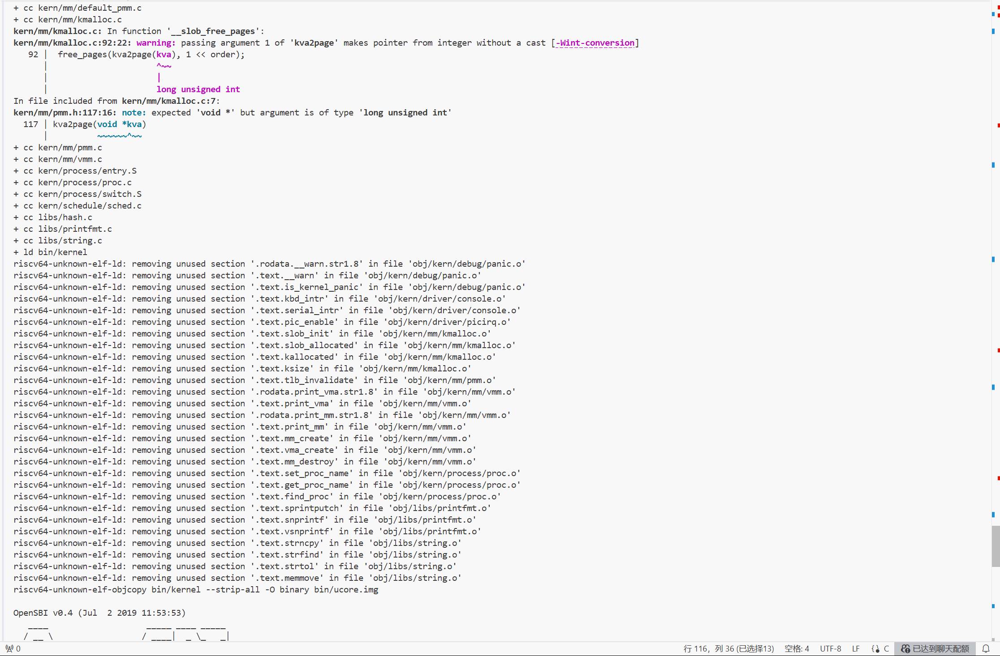
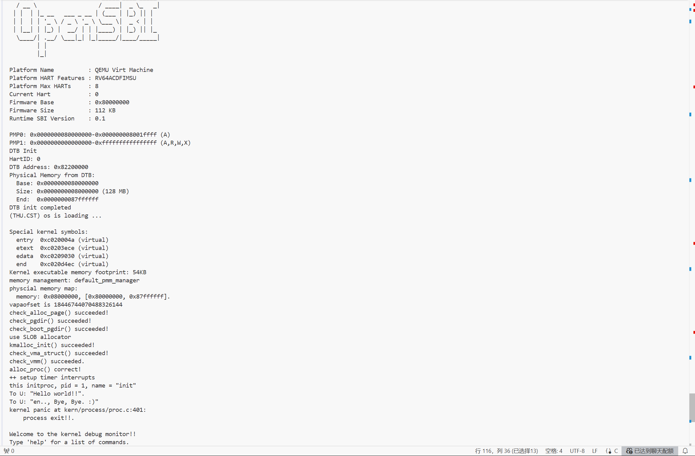
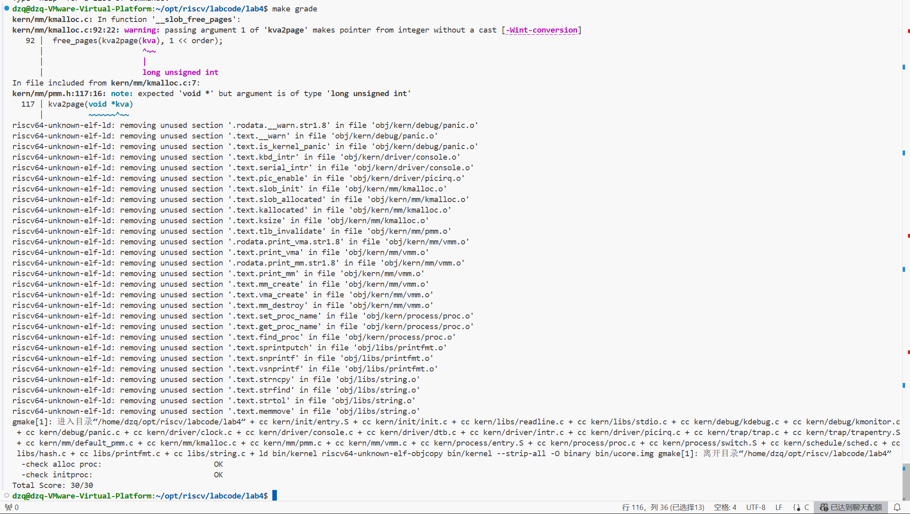

### 练习3：编写proc_run 函数（需要编码）

proc_run用于将指定的进程切换到CPU上运行。它的大致执行步骤包括：

- 检查要切换的进程是否与当前正在运行的进程相同，如果相同则不需要切换。
- 禁用中断。你可以使用`/kern/sync/sync.h`中定义好的宏`local_intr_save(x)`和`local_intr_restore(x)`来实现关、开中断。
- 切换当前进程为要运行的进程。
- 切换页表，以便使用新进程的地址空间。`/libs/riscv.h`中提供了`lsatp(unsigned int pgdir)`函数，可实现修改SATP寄存器值的功能。
- 实现上下文切换。`/kern/process`中已经预先编写好了`switch.S`，其中定义了`switch_to()`函数。可实现两个进程的context切换。
- 允许中断。

请回答如下问题：

- 在本实验的执行过程中，创建且运行了几个内核线程？

完成代码编写后，编译并运行代码：make qemu

```c
// proc_run - make process "proc" running on cpu
// NOTE: before call switch_to, should load  base addr of "proc"'s new PDT
void proc_run(struct proc_struct *proc)
{
    if (proc != current)
    {
        // LAB4:EXERCISE3 2313508
        /*
         * Some Useful MACROs, Functions and DEFINEs, you can use them in below implementation.
         * MACROs or Functions:
         *   local_intr_save():        Disable interrupts
         *   local_intr_restore():     Enable Interrupts
         *   lsatp():                   Modify the value of satp register
         *   switch_to():              Context switching between two processes
         */
        bool intr_flag;
        struct proc_struct *prev = current, *next = proc;
        
        // Disable interrupts
        local_intr_save(intr_flag);
        {
            // Switch current process to the new process
            current = proc;
            
            // Switch page table to use new process's address space
            lsatp(next->pgdir);
            
            // Switch context
            switch_to(&(prev->context), &(next->context));
        }
        // Enable interrupts
        local_intr_restore(intr_flag);
    }
}

```

**创建且运行了2个内核线程。**

#### 1. **第一个内核线程：idleproc**

- **PID**: 0
- **名称**: "idle"
- **创建位置**: 在 `proc_init()` 中直接创建
- **作用**: 系统空闲时运行的线程，当没有其他可运行进程时执行
- **特点**:
  - 是系统的第一个进程
  - 没有父进程
  - 使用内核的bootstack作为内核栈

#### 2. **第二个内核线程：initproc**

- **PID**: 1
- **名称**: "init"
- **创建位置**: 在 `proc_init()` 中通过 `kernel_thread(init_main, "Hello world!!", 0)` 创建
- **作用**: 执行 `init_main` 函数，输出信息
- **特点**:
  - 是第一个通过 `do_fork` 创建的进程
  - 父进程是 `idleproc`
  - 有独立分配的内核栈

最终运行

```cmd
make qemu
make grade
```






看到 "alloc_proc() correct!" 的输出



得分：30/30，圆满成功