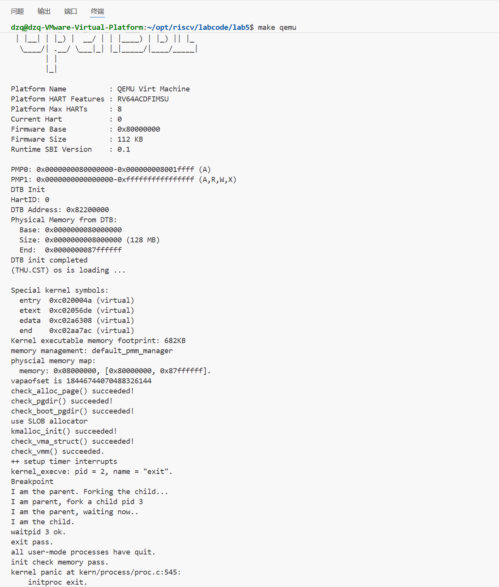
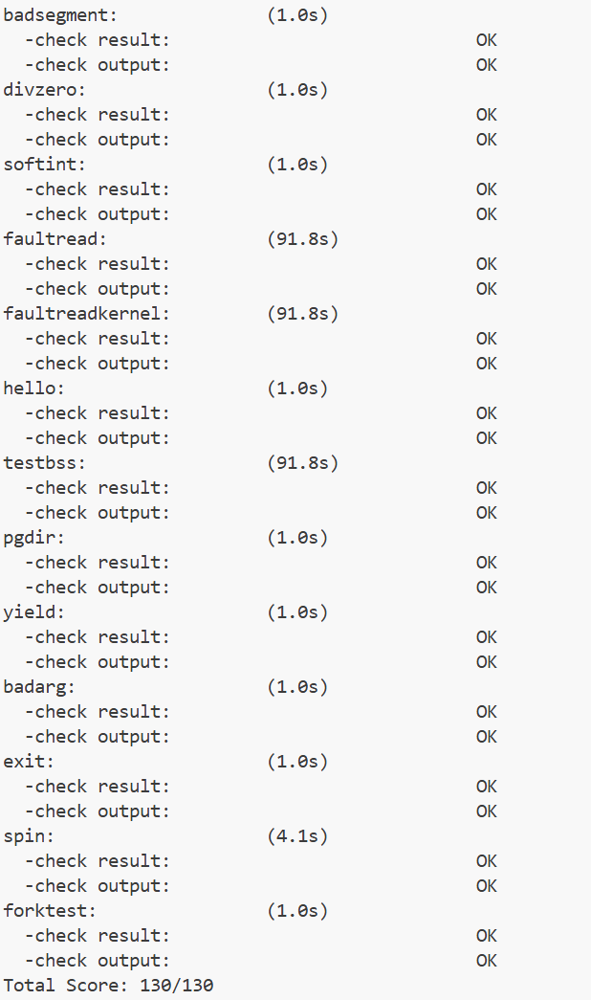
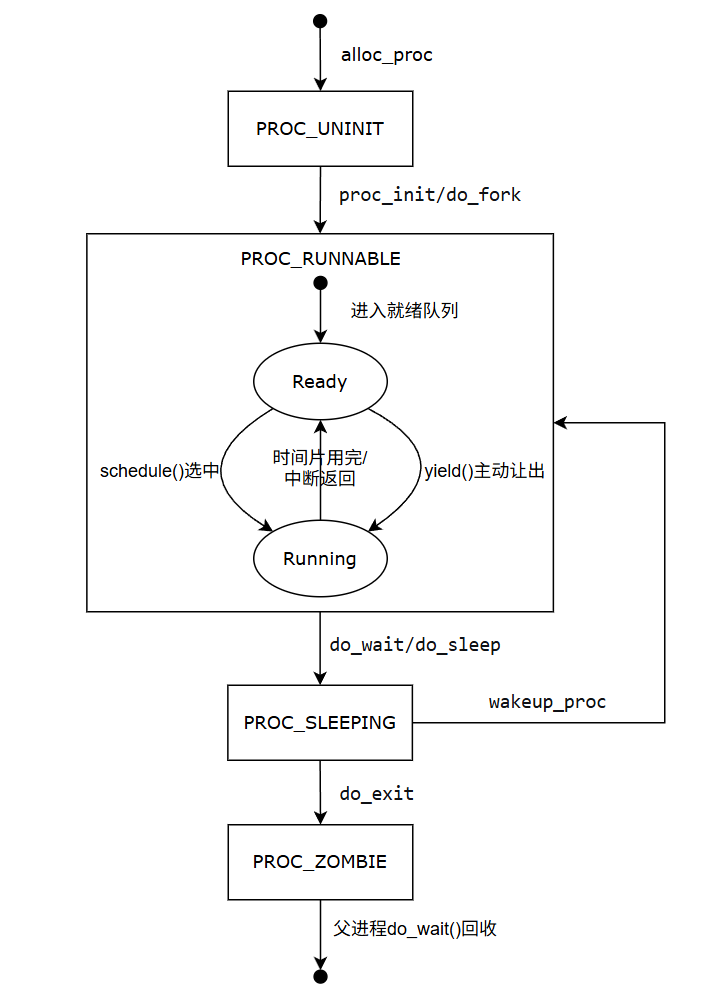

# <center>lab5:用户程序

**小组成员：**

**吴禹骞-2311272**

**谢小珂-2310422**

**杜泽琦-2313508**

[TOC]

## 前期准备

### 练习0：填写已有实验

本实验依赖实验2/3/4。请把你做的实验2/3/4的代码填入本实验中代码中有“LAB2”/“LAB3”/“LAB4”的注释相应部分。注意：为了能够正确执行lab5的测试应用程序，可能需对已完成的实验2/3/4的代码进行进一步改进。

Lab3时钟中断补充

```c++
#include <sbi.h>
#include <proc.h>
#include <pmm.h>
#include <string.h>

static uint32_t print_cnt = 0;
#define TICK_NUM 100

    case IRQ_S_TIMER:
        // "All bits besides SSIP and USIP in the sip register are
        // read-only." -- privileged spec1.9.1, 4.1.4, p59
        // In fact, Call sbi_set_timer will clear STIP, or you can clear it
        // directly.
        // cprintf("Supervisor timer interrupt\n");
        /* LAB3 EXERCISE1   YOUR CODE :  */
        /*(1)设置下次时钟中断- clock_set_next_event()
         *(2)计数器（ticks）加一
         *(3)当计数器加到100的时候，我们会输出一个`100ticks`表示我们触发了100次时钟中断，同时打印次数（num）加一
         * (4)判断打印次数，当打印次数为10时，调用<sbi.h>中的关机函数关机
         */
        clock_set_next_event();          // (1) 设置下一次时钟中断
            ticks++;                         // (2) 计数器 +1

            if (ticks % TICK_NUM == 0&&current) {     // (3) 每 100 次打印一次
                //print_ticks();
                //print_cnt++;
                //if (print_cnt >= 10) {       // (4) 打印 10 行后关机
                    //cprintf("System shutdown after 10 prints.\n");
                    //sbi_shutdown();
                //}
                current->need_resched=1;
            }
        break;


```

Lab4补充做一些修改

```c
// alloc_proc - alloc a proc_struct and init all fields of proc_struct
static struct proc_struct *
alloc_proc(void)
{
    struct proc_struct *proc = kmalloc(sizeof(struct proc_struct));
    if (proc != NULL)
    {
        // LAB4:EXERCISE1 YOUR CODE
        /*
         * below fields in proc_struct need to be initialized
         *       enum proc_state state;                      // Process state
         *       int pid;                                    // Process ID
         *       int runs;                                   // the running times of Proces
         *       uintptr_t kstack;                           // Process kernel stack
         *       volatile bool need_resched;                 // bool value: need to be rescheduled to release CPU?
         *       struct proc_struct *parent;                 // the parent process
         *       struct mm_struct *mm;                       // Process's memory management field
         *       struct context context;                     // Switch here to run process
         *       struct trapframe *tf;                       // Trap frame for current interrupt
         *       uintptr_t pgdir;                            // the base addr of Page Directroy Table(PDT)
         *       uint32_t flags;                             // Process flag
         *       char name[PROC_NAME_LEN + 1];               // Process name
         */
        proc->state = PROC_UNINIT;
        proc->pid = -1;
        proc->runs = 0;
        proc->kstack = 0;
        proc->need_resched = 0;
        proc->parent = NULL;
        proc->mm = NULL;
        memset(&(proc->context), 0, sizeof(struct context));
        proc->tf = NULL;
        proc->pgdir = 0;  // 实验5修改：改为NULL，后续为每个进程创建独立的页表
        proc->flags = 0;
        memset(proc->name, 0, PROC_NAME_LEN + 1);
        // LAB5 YOUR CODE : (update LAB4 steps)
        /*
         * below fields(add in LAB5) in proc_struct need to be initialized
         *       uint32_t wait_state;                        // waiting state
         *       struct proc_struct *cptr, *yptr, *optr;     // relations between processes
         */
        proc->wait_state = 0;        // 初始化等待状态
        proc->cptr = NULL;           // 子进程指针
        proc->yptr = NULL;           // 弟弟进程指针  
        proc->optr = NULL;           // 哥哥进程指针
    }
    return proc;
}
```

```c
// proc_run - make process "proc" running on cpu
// NOTE: before call switch_to, should load  base addr of "proc"'s new PDT
void proc_run(struct proc_struct *proc)
{
    if (proc != current)
    {
        // LAB4:EXERCISE3 YOUR CODE
        /*
         * Some Useful MACROs, Functions and DEFINEs, you can use them in below implementation.
         * MACROs or Functions:
         *   local_intr_save():        Disable interrupts
         *   local_intr_restore():     Enable Interrupts
         *   lsatp():                   Modify the value of satp register
         *   switch_to():              Context switching between two processes
         */
        bool intr_flag;
        struct proc_struct *prev = current, *next = proc;
        
        // Disable interrupts
        local_intr_save(intr_flag);
        {
            // Switch current process to the new process
            current = proc;
            
            // Switch page table to use new process's address space
            if (proc->pgdir != 0) {
            lsatp(proc->pgdir);  // load padir 2 satp of new proc
        } else {
            lsatp(boot_pgdir_pa);  // pgdir of kernel t
        }
            
            // Switch context
            switch_to(&(prev->context), &(next->context));
        }
        // Enable interrupts
        local_intr_restore(intr_flag);
    }
}
```

```c
/* do_fork -     parent process for a new child process
 * @clone_flags: used to guide how to clone the child process
 * @stack:       the parent's user stack pointer. if stack==0, It means to fork a kernel thread.
 * @tf:          the trapframe info, which will be copied to child process's proc->tf
 */
int do_fork(uint32_t clone_flags, uintptr_t stack, struct trapframe *tf)
{
    int ret = -E_NO_FREE_PROC;
    struct proc_struct *proc;
    if (nr_process >= MAX_PROCESS)
    {
        goto fork_out;
    }
    ret = -E_NO_MEM;
    // LAB4:EXERCISE2 YOUR CODE
    /*
     * Some Useful MACROs, Functions and DEFINEs, you can use them in below implementation.
     * MACROs or Functions:
     *   alloc_proc:   create a proc struct and init fields (lab4:exercise1)
     *   setup_kstack: alloc pages with size KSTACKPAGE as process kernel stack
     *   copy_mm:      process "proc" duplicate OR share process "current"'s mm according clone_flags
     *                 if clone_flags & CLONE_VM, then "share" ; else "duplicate"
     *   copy_thread:  setup the trapframe on the  process's kernel stack top and
     *                 setup the kernel entry point and stack of process
     *   hash_proc:    add proc into proc hash_list
     *   get_pid:      alloc a unique pid for process
     *   wakeup_proc:  set proc->state = PROC_RUNNABLE
     * VARIABLES:
     *   proc_list:    the process set's list
     *   nr_process:   the number of process set
     */

    //    1. call alloc_proc to allocate a proc_struct
    //    2. call setup_kstack to allocate a kernel stack for child process
    //    3. call copy_mm to dup OR share mm according clone_flag
    //    4. call copy_thread to setup tf & context in proc_struct
    //    5. insert proc_struct into hash_list && proc_list
    //    6. call wakeup_proc to make the new child process RUNNABLE
    //    7. set ret vaule using child proc's pid
    
    // LAB5 YOUR CODE : (update LAB4 steps)
    // TIPS: you should modify your written code in lab4(step1 and step5), not add more code.
    /* Some Functions
     *    set_links:  set the relation links of process.  ALSO SEE: remove_links:  lean the relation links of process
     *    -------------------
     *    update step 1: set child proc's parent to current process, make sure current process's wait_state is 0
     *    update step 5: insert proc_struct into hash_list && proc_list, set the relation links of process
     */
    //    1. call alloc_proc to allocate a proc_struct
    if ((proc = alloc_proc()) == NULL) {
        goto fork_out;
    }

    // LAB5 UPDATE: set child proc's parent to current process
    proc->parent = current;
    // Make sure current process's wait_state is 0
    assert(current->wait_state == 0);

    //    2. call setup_kstack to allocate a kernel stack for child process
    if (setup_kstack(proc) != 0) {
        goto bad_fork_cleanup_proc;
    }

    //    3. call copy_mm to dup OR share mm according clone_flag
    if (copy_mm(clone_flags, proc) != 0) {
        goto bad_fork_cleanup_kstack;
    }

    //    4. call copy_thread to setup tf & context in proc_struct
    copy_thread(proc, stack, tf);

    //    5. insert proc_struct into hash_list && proc_list
    bool intr_flag;
    local_intr_save(intr_flag);
    {
        proc->pid = get_pid();
        hash_proc(proc);
        // LAB5 UPDATE: use set_links to set relation links instead of list_add
        set_links(proc);
        // list_add(&proc_list, &(proc->list_link));  // 实验4的代码，现在被set_links替代
        nr_process++;
    }
    local_intr_restore(intr_flag);

    //    6. call wakeup_proc to make the new child process RUNNABLE
    wakeup_proc(proc);

    //    7. set ret vaule using child proc's pid
    ret = proc->pid;
    
fork_out:
    return ret;

bad_fork_cleanup_kstack:
    put_kstack(proc);
bad_fork_cleanup_proc:
    kfree(proc);
    goto fork_out;
}
```

## 实验目的

- 了解第一个用户进程创建过程
- 了解系统调用框架的实现机制
- 了解ucore如何实现系统调用sys_fork/sys_exec/sys_exit/sys_wait来进行进程管理

## 实验内容

实验4完成了内核线程，但到目前为止，所有的运行都在内核态执行。实验5将创建用户进程，让用户进程在用户态执行，且在需要ucore支持时，可通过系统调用来让ucore提供服务。为此需要构造出第一个用户进程，并通过系统调用`sys_fork`/`sys_exec`/`sys_exit`/`sys_wait`来支持运行不同的应用程序，完成对用户进程的执行过程的基本管理。

## 老师实验视频知识点

- risk 的体系结构里面，干脆就搞了两搞了三种指令，一种叫MRET，一种叫SRET，一种叫URET。这三个指令分别标识着我到底是从哪个权限开始返回
- SRET的四个行为：恢复PC；恢复特权模式；恢复中断使能状态；清除\*pp和\
- 本次实验的**do_execv**函数
- -b binary将已编译好的文件以二进制形式链接进程序
- **ebreak 指令的作用**
- **系统调用路径分析**：用户态发起系统调用：在用户态的 syscall 代码中，使用 ECALL 指令发起系统调用，该指令会让控制权跳转到 kernel 的 Trap 代码的 Trap entry 点，最终跳转到 all Traps 函数，再通过 exception handler 找到中断源并调用相应的 syscall 函数。内核态响应与返回：内核态响应系统调用时，根据系统调用号调用对应的响应函数。执行完代码后，通过 Trap return 恢复寄存器，调用 SRET 指令回到用户态。需注意，使用 exec 时，SRET 不会回到 exec 的调用者位置，而是跳转到进程的 entry point 位置，这与操作系组成原理课的思维定势不同。

## 练习

对实验报告的要求：

- 基于markdown格式来完成，以文本方式为主
- 填写各个基本练习中要求完成的报告内容
- 列出你认为本实验中重要的知识点，以及与对应的OS原理中的知识点，并简要说明你对二者的含义，关系，差异等方面的理解（也可能出现实验中的知识点没有对应的原理知识点）
- 列出你认为OS原理中很重要，但在实验中没有对应上的知识点

从oslab网站上取得实验代码后，进入目录labcodes/lab5，完成实验要求的各个练习。在实验报告中回答所有练习中提出的问题。在目录labcodes/lab5下存放实验报告，推荐用**markdown**格式。每个小组建一个gitee或者github仓库，对于lab5中编程任务，完成编写之后，再通过git push命令把代码和报告上传到仓库。最后请一定提前或按时提交到git网站。

注意有“LAB5”的注释，代码中所有需要完成的地方（challenge除外）都有“LAB5”和“YOUR CODE”的注释，请在提交时特别注意保持注释，并将“YOUR CODE”替换为自己的学号，并且将所有标有对应注释的部分填上正确的代码。

### 练习1: 加载应用程序并执行（需要编码）

**do_execve**函数调用`load_icode`（位于kern/process/proc.c中）来加载并解析一个处于内存中的ELF执行文件格式的应用程序。你需要补充`load_icode`的第6步，建立相应的用户内存空间来放置应用程序的代码段、数据段等，且要设置好`proc_struct`结构中的成员变量trapframe中的内容，确保在执行此进程后，能够从应用程序设定的起始执行地址开始执行。需设置正确的trapframe内容。

请在实验报告中简要说明你的设计实现过程。

- 请简要描述这个用户态进程被ucore选择占用CPU执行（RUNNING态）到具体执行应用程序第一条指令的整个经过。

```c++
//(6) setup trapframe for user environment
    struct trapframe *tf = current->tf;
    // Keep sstatus
    uintptr_t sstatus = tf->status;
    memset(tf, 0, sizeof(struct trapframe));
    /* LAB5:EXERCISE1 2313508
     * should set tf->gpr.sp, tf->epc, tf->status
     * NOTICE: If we set trapframe correctly, then the user level process can return to USER MODE from kernel. So
     *          tf->gpr.sp should be user stack top (the value of sp)
     *          tf->epc should be entry point of user program (the value of sepc)
     *          tf->status should be appropriate for user program (the value of sstatus)
     *          hint: check meaning of SPP, SPIE in SSTATUS, use them by SSTATUS_SPP, SSTATUS_SPIE(defined in risv.h)
     */
    // 设置用户栈指针为用户栈顶部
    tf->gpr.sp = USTACKTOP;

    // 设置程序入口点为ELF文件的入口地址
    tf->epc = elf->e_entry;

    // setup sstatus for returning to user mode
    // 1. 清掉 SPP 位（表示 sret 返回到 U 模式而不是 S 模式）
    // 2. 置位 SPIE 位（在 sret 后开启用户态中断）
    sstatus &= ~SSTATUS_SPP;   // 清 SPP
    sstatus |= SSTATUS_SPIE;   // 置 SPIE
    tf->status = sstatus;
```

1. **tf->gpr.sp = USTACKTOP**
   - 将用户栈指针设置为用户栈顶部
   - 确保进程在用户态有正确的栈空间
2. **tf->epc = elf->e_entry**
   - 设置程序入口点为ELF文件的入口地址
   - 这是进程开始执行的第一条指令地址
3. **tf->status 的设置**
   - `sstatus &= ~SSTATUS_SPP`：清除SPP位，确保`sret`返回到用户模式(U-mode)
   - `sstatus |= SSTATUS_SPIE`：设置SPIE位，在`sret`后开启用户态中断
   - 这确保了从内核态正确返回到用户态并恢复中断使能状态

用户态进程从被选中执行到执行第一条指令的整个经过：时钟中断触发陷阱 → 内核选择/切换进程 → 恢复 trapframe → 执行 sret 回到用户态，并从 ELF 的入口开始执行第一条指令。

整个过程始于时钟中断。当时钟中断发生时，处理器陷入监管者模式（S-mode），并跳转到统一的陷阱处理入口 `trap()`。该函数首先判断当前是否有进程正在运行。如果有（即 `current` 不为空），它会检查此次陷阱是否来自用户态（通过检查 `trapframe` 中的 `sstatus` 寄存器）。如果是用户态进程触发的陷阱，内核便会检查该进程的 `need_resched` 标志。如果此标志被置位，意味着当前进程应当让出 CPU，于是 `trap()` 调用 `schedule()` 函数启动调度。`sys_exec()` 在 trap（ecall/ebreak）处理期间、在内核的系统调用分派阶段被同步调用，正是在这一步内核替换进程地址空间并准备返回到用户态开始执行新程序。

调度器 `schedule()` 在屏蔽中断的保护下，从可运行（`PROC_RUNNABLE`）的进程链表中挑选出下一个待运行的进程。如果找不到，则回退到运行空闲进程 `idleproc`。一旦选定目标进程 `next`，调度器便调用 `proc_run(next)` 执行切换。

`proc_run` 是上下文切换的核心。它首先将全局变量 `current` 指向新的进程 `next`。紧接着，最关键的一步是切换地址空间：将 `next->pgdir`（用户进程页表的物理地址）加载到处理器的 `satp` 寄存器中，使得后续的访存操作都在新进程的用户页表下进行。对于内核线程，其 `pgdir` 可能为0，此时则切换到内核页表 `boot_pgdir_pa`。随后，它调用 **`switch_to(&prev->context, &next->context)`**。这个汇编函数执行实际的寄存器现场交换：它将当前（prev）内核栈指针、返回地址等14个寄存器保存到 `prev->context` 结构体中，然后从 `next->context` 中恢复出相应的寄存器。`switch_to` 函数最后的 `ret` 指令，会根据刚刚恢复的 `ra`（返回地址）寄存器进行跳转。

对于首次被调度执行的用户进程，其 `context.ra` 在创建时（如在 `do_fork` 的 `copy_thread` 中）被设置为 `forkrets` 函数的地址，而 `context.sp` 被设置为该进程内核栈上的 `trapframe` 地址。因此，`switch_to` 返回后，CPU 便跳转到 `forkrets` 开始执行，并且栈指针已经指向了正确的 `trapframe`。

`forkrets` 是一个简短的汇编桥接函数，它直接将栈指针 `sp` 设置为传入的 `trapframe` 地址（保存在 `a0` 寄存器），然后跳转到 `__trapret`。`__trapret` 是陷阱返回的通用出口，它使用 `RESTORE_ALL` 宏从当前 `sp` 指向的 `trapframe` 中依次恢复出所有的通用寄存器、`sstatus` 和 `epc`。这里恢复的值正是在 **`load_icode`** 中精心设置的：`epc` 被设置为 ELF 程序的入口地址 `elf->e_entry`，用户栈指针 `sp` 被设置为 `USTACKTOP`，而 `sstatus` 被清除了 `SPP` 位（确保返回到用户模式 U-mode）并设置了 `SPIE` 位（确保返回后开启中断）。

最后，`__trapret` 执行 **`sret` 指令**。这条指令是整个过程的关键收尾：处理器将特权级从 S-mode 降低到 U-mode，将程序计数器 `pc` 设置为刚刚恢复的 `epc` 值，并根据 `sstatus` 恢复中断使能状态。至此，CPU 完全进入了目标用户进程的上下文：它在用户特权级下，使用该进程独立的用户页表进行访存，从用户栈顶开始执行，并且即将从 ELF 入口地址取出第一条指令并执行。用户程序的旅程便正式开始了。

### 练习2: 父进程复制自己的内存空间给子进程（需要编码）

创建子进程的函数`do_fork`在执行中将拷贝当前进程（即父进程）的用户内存地址空间中的合法内容到新进程中（子进程），完成内存资源的复制。具体是通过`copy_range`函数（位于kern/mm/pmm.c中）实现的，请补充`copy_range`的实现，确保能够正确执行。

请在实验报告中简要说明你的设计实现过程。

设计思路：

(1) 获取源页面的内核虚拟地址 src_kvaddr

(2) 获取新分配页面 npage 的内核虚拟地址 dst_kvaddr

(3) 将 src_kvaddr 的 PGSIZE 字节拷贝到 dst_kvaddr

(4) 调用 page_insert 在目标页表中为线性地址 start 建立映射，使用与源页相同的权限

```c
/* copy_range - copy content of memory (start, end) of one process A to another
 * process B
 * @to:    the addr of process B's Page Directory
 * @from:  the addr of process A's Page Directory
 * @share: flags to indicate to dup OR share. We just use dup method, so it
 * didn't be used.
 *
 * CALL GRAPH: copy_mm-->dup_mmap-->copy_range
 */
int copy_range(pde_t *to, pde_t *from, uintptr_t start, uintptr_t end,
               bool share)
{
    assert(start % PGSIZE == 0 && end % PGSIZE == 0);
    assert(USER_ACCESS(start, end));
    // copy content by page unit.
    do
    {
        // call get_pte to find process A's pte according to the addr start
        pte_t *ptep = get_pte(from, start, 0), *nptep;
        if (ptep == NULL)
        {
            start = ROUNDDOWN(start + PTSIZE, PTSIZE);
            continue;
        }
        // call get_pte to find process B's pte according to the addr start. If
        // pte is NULL, just alloc a PT
        if (*ptep & PTE_V)
        {
            if ((nptep = get_pte(to, start, 1)) == NULL)
            {
                return -E_NO_MEM;
            }
            uint32_t perm = (*ptep & PTE_USER);
            // get page from ptep
            struct Page *page = pte2page(*ptep);
            // alloc a page for process B
            struct Page *npage = alloc_page();
            assert(page != NULL);
            assert(npage != NULL);
            int ret = 0;
            /* LAB5:EXERCISE2 2313508
             * replicate content of page to npage, build the map of phy addr of
             * nage with the linear addr start
             *
             * Some Useful MACROs and DEFINEs, you can use them in below
             * implementation.
             * MACROs or Functions:
             *    page2kva(struct Page *page): return the kernel vritual addr of
             * memory which page managed (SEE pmm.h)
             *    page_insert: build the map of phy addr of an Page with the
             * linear addr la
             *    memcpy: typical memory copy function
             *
             * (1) find src_kvaddr: the kernel virtual address of page
             * (2) find dst_kvaddr: the kernel virtual address of npage
             * (3) memory copy from src_kvaddr to dst_kvaddr, size is PGSIZE
             * (4) build the map of phy addr of  nage with the linear addr start
             */
            // (1) find src_kvaddr: the kernel virtual address of page
            void *src_kvaddr = page2kva(page);
            // (2) find dst_kvaddr: the kernel virtual address of npage
            void *dst_kvaddr = page2kva(npage);
            // (3) memory copy from src_kvaddr to dst_kvaddr, size is PGSIZE
            memcpy(dst_kvaddr, src_kvaddr, PGSIZE);
            // (4) build the map of phy addr of nage with the linear addr start
            ret = page_insert(to, npage, start, perm);
            assert(ret == 0);
        }
        start += PGSIZE;
    } while (start != 0 && start < end);
    return 0;
}
```





- 如何设计实现`Copy on Write`机制？给出概要设计，鼓励给出详细设计。（见扩展练习 Challenge）

> Copy-on-write（简称COW）的基本概念是指如果有多个使用者对一个资源A（比如内存块）进行读操作，则每个使用者只需获得一个指向同一个资源A的指针，就可以该资源了。若某使用者需要对这个资源A进行写操作，系统会对该资源进行拷贝操作，从而使得该“写操作”使用者获得一个该资源A的“私有”拷贝—资源B，可对资源B进行写操作。该“写操作”使用者对资源B的改变对于其他的使用者而言是不可见的，因为其他使用者看到的还是资源A。

### 练习3: 阅读分析源代码，理解进程执行 fork/exec/wait/exit 的实现，以及系统调用的实现（不需要编码）

请在实验报告中简要说明你对 fork/exec/wait/exit函数的分析。并回答如下问题：

- 请分析fork/exec/wait/exit的执行流程。重点关注哪些操作是在用户态完成，哪些是在内核态完成？内核态与用户态程序是如何交错执行的？内核态执行结果是如何返回给用户程序的？
- 请给出ucore中一个用户态进程的执行状态生命周期图（包执行状态，执行状态之间的变换关系，以及产生变换的事件或函数调用）。（字符方式画即可）

执行：make grade。如果所显示的应用程序检测都输出ok，则基本正确。（使用的是qemu-1.0.1）

#### 一、fork/exec/wait/exit 执行流程分析

##### 1. fork

**用户态执行流程：**

- 用户程序调用 `fork()`（在 `ulib.c` 中），该函数调用 `sys_fork()` 系统调用接口。

- `sys_fork()` 通过内联汇编触发 `ecall` 指令进入内核态。

**内核态执行流程：**

1. 系统调用处理函数 `syscall()`（在 `syscall.c` 中）根据系统调用号 `SYS_fork` 调用 `sys_fork()`。
2. `sys_fork()` 调用 `do_fork()`（在 `proc.c` 中）完成以下操作：

   - 分配进程控制块（`alloc_proc`）
   - 分配内核栈（`setup_kstack`）
   - 复制内存空间（`copy_mm`）
   - 设置陷阱帧和上下文（`copy_thread`）
   - 设置进程关系（`set_links`）
   - 将进程加入哈希表和链表（`hash_proc`）
   - 唤醒进程（`wakeup_proc`），状态设为 `PROC_RUNNABLE`
3. 返回子进程的 pid。

**内核态与用户态交错：**

- 父进程在系统调用后恢复用户态继续执行。
- 子进程第一次被调度时，从 `forkret` 开始执行，随后通过陷阱返回（`__trapret`）进入用户态，从 `fork` 返回处开始执行（返回值为0）。

**结果返回：**

- 父进程返回子进程的 pid，子进程返回 0。

##### 2. exec

**用户态执行流程：**

- 用户程序调用 `exec` 系列函数，最终触发 `SYS_exec` 系统调用。

**内核态执行流程：**

1. 系统调用处理函数调用 `sys_exec()`，进而调用 `do_execve()`。
2. `do_execve()`（在 `proc.c` 中）完成以下操作：
   - 释放当前进程的内存空间（`exit_mmap`、`put_pgdir`、`mm_destroy`）
   - 加载新程序（`load_icode`）：
     - 解析 ELF 文件，建立新的内存映射
     - 设置用户栈
     - 设置新的陷阱帧（包括 `epc` 指向程序入口，`sp` 指向用户栈顶，`status` 清空 `SPP` 位以返回用户态）
   - 更新进程名
3. 系统调用返回前，修改陷阱帧，使返回用户态时跳转到新程序的入口。

**内核态与用户态交错：**

- 原用户态程序在调用 `exec` 后不再返回，直接被新程序替代。
- 新程序从入口点开始执行，完全在新的地址空间中运行。

**结果返回：**

- 若成功，不返回；若失败，返回错误码。

##### 3. wait

**用户态执行流程：**

- 用户程序调用 `wait()` 或 `waitpid()`，触发 `SYS_wait` 系统调用。

**内核态执行流程：**

1. 系统调用处理函数调用 `sys_wait()`，进而调用 `do_wait()`。
2. `do_wait()`（在 `proc.c` 中）完成以下操作：
   - 查找指定 pid 或任意子进程
   - 若找到僵尸子进程，则回收资源（释放内核栈、进程控制块）
   - 若没有僵尸子进程，则当前进程进入睡眠状态（`PROC_SLEEPING`，等待状态 `WT_CHILD`），调用 `schedule()` 让出 CPU
3. 当子进程退出时，会唤醒父进程，父进程再次执行 `do_wait()` 并回收子进程。

**内核态与用户态交错：**

- 若立即找到僵尸子进程，系统调用直接返回。
- 否则进程睡眠，进入内核态调度其他进程。当被唤醒后，再次在内核态执行 `do_wait()`，最终返回用户态。

**结果返回：**

- 返回子进程的 pid，并通过参数返回退出码。

##### 4. exit

**用户态执行流程：**

- 用户程序调用 `exit()`，触发 `SYS_exit` 系统调用。

**内核态执行流程：**

1. 系统调用处理函数调用 `sys_exit()`，进而调用 `do_exit()`。
2. `do_exit()`（在 `proc.c` 中）完成以下操作：
   - 释放内存空间（`exit_mmap`、`put_pgdir`、`mm_destroy`）
   - 将进程状态设为 `PROC_ZOMBIE`
   - 唤醒父进程（若父进程在等待）
   - 将所有子进程移交给 `initproc`
   - 调用 `schedule()` 让出 CPU
3. 进程资源大部分被释放，但进程控制块和内核栈保留，直到父进程回收。

**内核态与用户态交错：**

- 进程执行 `exit` 后不再返回用户态，直接进入内核态完成清理并调度其他进程。

**结果返回：**

- 无返回值，进程终止。

### 二、用户态进程执行状态生命周期图



**状态说明：**

- **PROC_UNINIT**：进程刚被创建（`alloc_proc`），尚未初始化。
- **PROC_RUNNABLE**：进程已初始化，可被调度执行。正在CPU上执行的进程也标记为此状态。
- **PROC_SLEEPING**：进程等待资源或事件（如子进程退出），主动放弃CPU。
- **PROC_ZOMBIE**：进程已退出，但资源尚未被父进程回收。

**状态转换事件：**

- `proc_init` / `wakeup_proc`：UNINIT → RUNNABLE
- `schedule`：RUNNABLE → RUNNABLE（切换运行进程）
- `do_wait` / `do_sleep`：RUNNABLE → SLEEPING
- `wakeup_proc`：SLEEPING → RUNNABLE
- `do_exit`：RUNNABLE → ZOMBIE
- 父进程 `do_wait` 回收：ZOMBIE → 销毁

#### 详细的状态转换路径说明

##### 1. 从创建到就绪 (PROC_UNINIT → PROC_RUNNABLE)

**路径 A: 系统初始化创建 idleproc**

```
kernel_init() 
  → proc_init()
    → alloc_proc()              // 创建 idleproc
    → idleproc->state = PROC_RUNNABLE  // 直接设为就绪
    → nr_process++              // 进程计数+1
```

**路径 B: fork 创建新进程**

```
用户态: fork()
  → sys_fork()                  // 系统调用
    → do_fork()
      → alloc_proc()            // 1.分配proc结构体
      → setup_kstack()          // 2.分配内核栈
      → copy_mm()               // 3.复制内存空间
      → copy_thread()           // 4.设置上下文和陷阱帧
      → set_links()             // 5.设置进程关系
      → hash_proc()             // 6.加入哈希表
      → wakeup_proc(proc)       // 7.唤醒进程
        → proc->state = PROC_RUNNABLE
```

##### 2. 从就绪到睡眠 (PROC_RUNNABLE → PROC_SLEEPING)

**路径 A: 等待子进程 (最常见)**

text

```
用户态: wait() / waitpid()
  → sys_wait()
    → do_wait()
      if (没有符合条件的子进程) {
        current->state = PROC_SLEEPING     // 设置睡眠状态
        current->wait_state = WT_CHILD     // 等待原因:子进程
        schedule()                         // 调度其他进程
      }
```

**路径 B: 主动睡眠 (如未来实现的 sleep())**

```
用户态: sleep()
  → sys_sleep()
    → do_sleep()
      → current->state = PROC_SLEEPING
      → current->wait_state = WT_INTERRUPTED
      → schedule()
```

##### 3. 从睡眠到就绪 (PROC_SLEEPING → PROC_RUNNABLE)

**路径 A: 子进程退出唤醒父进程**

```
子进程: exit()
  → do_exit()
    → current->state = PROC_ZOMBIE
    → if (父进程在等待) {
        wakeup_proc(父进程)
          → 父进程->state = PROC_RUNNABLE
          → 父进程->wait_state = 0
      }
```

**路径 B: 资源可用或超时唤醒**

```
// 假设有资源管理模块
资源可用时:
  → wakeup_proc(等待进程)
    → proc->state = PROC_RUNNABLE
```

##### 4. 从就绪到僵尸 (PROC_RUNNABLE → PROC_ZOMBIE)

**路径: 进程主动退出**

```
用户态: exit()
  → sys_exit()
    → do_exit()
      → exit_mmap()           // 释放内存空间
      → current->state = PROC_ZOMBIE
      → current->exit_code = 错误码
      → 唤醒父进程
      → 转移子进程给initproc
      → schedule()            // 不再调度
```

##### 5. 从僵尸到销毁 (PROC_ZOMBIE → 销毁)

**路径: 父进程回收**

```
父进程: wait()
  → do_wait()
    if (找到僵尸子进程) {
      unhash_proc()           // 从哈希表移除
      remove_links()          // 从进程链表移除
      put_kstack()            // 释放内核栈
      kfree(proc)             // 释放proc结构体
    }
```

**注意：** 进程在运行过程中可能被中断或系统调用打断，进入内核态，但进程状态不变（除非主动睡眠或退出）。内核态与用户态的交错通过系统调用/中断入口和陷阱返回实现。

### 扩展练习 Challenge

1. 实现 Copy on Write （COW）机制

   给出实现源码,测试用例和设计报告（包括在cow情况下的各种状态转换（类似有限状态自动机）的说明）。

   这个扩展练习涉及到本实验和上一个实验“虚拟内存管理”。在ucore操作系统中，当一个用户父进程创建自己的子进程时，父进程会把其申请的用户空间设置为只读，子进程可共享父进程占用的用户内存空间中的页面（这就是一个共享的资源）。当其中任何一个进程修改此用户内存空间中的某页面时，ucore会通过page fault异常获知该操作，并完成拷贝内存页面，使得两个进程都有各自的内存页面。这样一个进程所做的修改不会被另外一个进程可见了。请在ucore中实现这样的COW机制。

   由于COW实现比较复杂，容易引入bug，请参考 https://dirtycow.ninja/ 看看能否在ucore的COW实现中模拟这个错误和解决方案。需要有解释。

   这是一个big challenge.

2. 说明该用户程序是何时被预先加载到内存中的？与我们常用操作系统的加载有何区别，原因是什么？

#### 一、实验目标与原理 ####

##### 1.1 实验目标 #####

本次扩展练习的目标是在 ucore 中实现 **写时复制 (Copy-on-Write, COW)** 机制。 在标准的 `fork()` 操作中，传统做法是将父进程的内存空间完整拷贝一份给子进程（Deep Copy）。这种做法在父子进程均不修改内存（如 `fork` 后立即 `exec`）时会造成巨大的性能损耗。 COW 机制通过让父子进程**共享**同一物理内存页，仅将页表项设置为**只读**。只有当任一进程尝试写入时，CPU 触发缺页异常，内核才分配新的物理页并复制数据。

##### 1.2 有限状态自动机 (Finite State Machine) 设计 #####

根据 COW 的运行逻辑，物理页面的状态流转可以抽象为一个有限状态机：

- **状态 A：独占可写 (Exclusive Writable)**
  - **场景**：进程独立拥有该物理页（如 `fork` 之前，或 COW 分裂之后）。
  - **特征**：`page->ref == 1`，页表项 (PTE) 包含 `PTE_W` 权限。
  - **行为**：读写正常，不触发异常。
- **状态 B：共享只读 (Shared Read-Only)**
  - **场景**：`fork` 执行后，父子进程共享该页。
  - **特征**：`page->ref > 1`，父子进程的 PTE 均**去除** `PTE_W` 权限（只读）。
  - **行为**：
    - **读操作**：正常访问。
    - **写操作**：触发 `STORE_PAGE_FAULT` 异常，进入内核处理（执行分裂或恢复）。
- **状态转换事件**：
  1. **Fork**：状态 A -> 状态 B。将引用计数 +1，所有 PTE 设为只读。
  2. **Write Fault (Ref > 1)**：状态 B -> 状态 A（分裂）。分配新页，复制数据，当前进程指向新页并恢复可写，原页引用计数 -1。
  3. **Write Fault (Ref == 1)**：状态 B -> 状态 A（恢复）。无需复制，直接恢复当前页的可写权限。

------

#### 二、核心代码详解 ####

基于通过 `make grade` 测试的源码，本实验主要修改了内存管理（pmm/vmm）和异常处理（trap）三个部分。

##### 2.1 物理内存管理：实现共享映射 (`kern/mm/pmm.c`) #####

在 `copy_range` 函数中，我们修改了原有的内存复制逻辑，增加了对 `share` 标志的处理。这是 COW 机制的**设置阶段**。

**设计逻辑**： 当 `share == 1` 时，不申请新内存，而是让子进程的页表指向父进程已有的物理页 `page`。为了拦截写操作，必须将父子双方的页表项写权限 (`PTE_W`) 全部去掉。

**关键代码**：

```
int copy_range(pde_t *to, pde_t *from, uintptr_t start, uintptr_t end, bool share) {
    assert(start % PGSIZE == 0 && end % PGSIZE == 0);
    assert(USER_ACCESS(start, end));
    
    // 循环遍历指定范围内的每一页
    do {
        // 获取源页目录(from)中对应地址(start)的页表项(PTE)
        pte_t *ptep = get_pte(from, start, 0), *nptep;
        
        // 如果源 PTE 不存在，跳过该页
        if (ptep == NULL) {
            start = ROUNDDOWN(start + PTSIZE, PTSIZE);
            continue;
        }
        
        // 如果源 PTE 存在且有效(PTE_V)，说明该虚拟地址已经映射了物理页
        if (*ptep & PTE_V) {
            // 获取或创建目标页目录(to)中对应的 PTE
            if ((nptep = get_pte(to, start, 1)) == NULL) {
                return -E_NO_MEM; // 内存不足
            }
            
            // 获取源 PTE 的用户权限标志
            uint32_t perm = (*ptep & PTE_USER);
            // 获取该 PTE 指向的物理页结构指针 (struct Page)
            struct Page *page = pte2page(*ptep);
            int ret = 0;

            // ============ 【这里是修改的核心】 ============
            // 如果 share 为 true，启用 COW (写时复制) 机制
            // 此时不进行物理内存拷贝，而是让父子进程共享同一物理页
            if (share) {
                // 如果原页表项具有写权限 (PTE_W)，我们需要将其移除
                // 这样当父进程或子进程尝试写入时，才会触发 Page Fault (缺页异常)
                // 进而进入 do_pgfault 执行真正的页面拷贝
                if (perm & PTE_W) {
                    // 1. 清除临时变量 perm 中的写权限位，准备赋给子进程
                    perm &= ~PTE_W;
                    
                    // 2. 【关键】清除父进程(源)页表项中的写权限
                    // 这一步至关重要：如果只改子进程的，父进程写入时就不会触发拷贝，导致数据混乱
                    *ptep &= ~PTE_W;          
                    
                    // 3. 刷新父进程的 TLB (Translation Lookaside Buffer)
                    // 因为我们修改了父进程的页表权限(从 RW 变为 RO)，
                    // 必须通知 CPU 使得缓存失效，否则 CPU 可能仍使用缓存的旧权限(可写)执行写入
                    tlb_invalidate(from, start); // 必须刷新！
                }
                
                // 4. 建立共享映射：
                // 将同一个物理页 (page) 映射到子进程的地址空间 (to)
                // 权限 perm 已经被去除了写权限 (只读)
                // page_insert 内部会自动增加该物理页的引用计数 (page->ref++)
                // 此时 page->ref 至少为 2 (父进程 + 子进程)
                ret = page_insert(to, page, start, perm);
            } 
            // ============ 【修改结束】 ============
            else {
                // ... (原有的深拷贝代码保持不变)
                // 如果 share 为 false，执行传统的深拷贝 (Deep Copy)
                // 立即分配新的物理页 npage
                struct Page *npage = alloc_page();
                assert(page != NULL);
                assert(npage != NULL);
                
                // 获取源页和新页的内核虚拟地址
                void *src_kvaddr = page2kva(page);
                void *dst_kvaddr = page2kva(npage);
                
                // 将源页内容完整拷贝到新页
                memcpy(dst_kvaddr, src_kvaddr, PGSIZE);
                
                // 将新分配并拷贝好的物理页 npage 映射到子进程地址空间
                ret = page_insert(to, npage, start, perm);
            }
            assert(ret == 0);
        }
        start += PGSIZE; // 处理下一页
    } while (start != 0 && start < end);
    return 0;
}
```

##### 2.2 虚拟内存管理：启用 COW 与缺页处理 (`kern/mm/vmm.c`) #####

**1.定义全局变量**（解决 `undefined reference to pgfault_num`） 在文件开头引用头文件后添加：

```
volatile unsigned int pgfault_num = 0;
```

**2. 开启 COW 开关** 在 `dup_mmap` 函数中，将传递给 `copy_range` 的 `share` 参数强制设为 1。

```
int dup_mmap(struct mm_struct *to, struct mm_struct *from) {
    // ...
    bool share = 1; // 【关键】开启 COW
    if (copy_range(to->pgdir, from->pgdir, vma->vm_start, vma->vm_end, share) != 0) {
        return -E_NO_MEM;
    }
    // ...
}
```

**3. 实现 COW 缺页处理逻辑 (`do_pgfault`)** 这是 COW 的**执行阶段**。当触发写异常时，内核进入此函数。我们根据物理页的引用计数决定是“复制分裂”还是“直接恢复”。

**关键代码**：

```
// ============ 【新增整个函数】 ============
// do_pgfault - 缺页异常处理函数
// 当程序访问非法的虚拟地址，或者访问权限不足（如写只读页面）时，CPU 触发异常调用此函数
// mm: 进程的内存管理结构体; error_code: 错误码; addr: 导致异常的虚拟地址
int do_pgfault(struct mm_struct *mm, uint32_t error_code, uintptr_t addr) {
    int ret = -E_INVAL;
    
    // 1. 查询 vma (虚拟内存区域)
    // 根据导致异常的地址 addr，查找它属于哪个 VMA
    struct vma_struct *vma = find_vma(mm, addr);
    
    pgfault_num++; // 统计缺页异常次数
    
    // 如果找不到 VMA，或者地址超出了 VMA 的范围，说明是真正非法的内存访问（如野指针）
    if (vma == NULL || vma->vm_start > addr) {
        cprintf("not valid addr %x, and  can not find it in vma\n", addr);
        goto failed;
    }

    // 2. 确定目标权限
    // 根据 VMA 的属性设置即将建立的页表项权限
    // 如果 VMA 标记为可写 (VM_WRITE)，则目标页表项也应该是可读可写 (PTE_R | PTE_W)
    uint32_t perm = PTE_U;
    if (vma->vm_flags & VM_WRITE) {
        perm |= (PTE_R | PTE_W);
    }
    
    // 将地址向下对齐到页边界 (4KB 对齐)
    addr = ROUNDDOWN(addr, PGSIZE);
    ret = -E_NO_MEM;

    // 3. 获取页表项 (PTE)
    pte_t *ptep = NULL;
    // 第三个参数 1 表示如果中间的页目录不存在，则创建它
    ptep = get_pte(mm->pgdir, addr, 1);
    if (ptep == NULL) {
        cprintf("get_pte in do_pgfault failed\n");
        goto failed;
    }
    
    // ============ 【LAB5 Challenge: COW 核心处理逻辑】 ============
    // 判断是否是 Copy-on-Write 触发的异常，条件如下：
    // (1) *ptep & PTE_V: 页表项存在，说明物理页已经映射了，不是从未访问过的内存
    // (2) !(*ptep & PTE_W): 页表项当前是“只读”的 (硬件层面拦截了写操作)
    // (3) vma->vm_flags & VM_WRITE: VMA 结构体说这段内存逻辑上是“可写”的
    // 结论：这是一个逻辑上可写，但物理上被标记为只读的页面 -> 这就是 COW 页！
    if ((*ptep & PTE_V) && !(*ptep & PTE_W) && (vma->vm_flags & VM_WRITE)) {
        // 获取当前页表项指向的物理页结构
        struct Page *page = pte2page(*ptep);
        
        // 分支 A: 共享分裂 (Split)
        // 如果 page->ref > 1，说明除了当前进程，还有其他进程（父进程或兄弟进程）也在引用这个页
        // 我们不能直接修改它，否则会影响其他进程。必须“复制”一份私有的。
        if (page_ref(page) > 1) {
            // 1. 分配一个新的物理页
            struct Page *npage = alloc_page();
            if (npage == NULL) goto failed;
            
            // 2. 数据拷贝：将旧页面的内容完整拷贝到新页面
            // page2kva 将物理页结构转换为内核虚拟地址以便 CPU 访问
            memcpy(page2kva(npage), page2kva(page), PGSIZE);
            
            // 3. 建立新映射：
            // 让当前进程的虚拟地址 addr 指向这个新的 npage
            // 权限 perm 包含 PTE_W (可写)
            // page_insert 内部会自动执行：
            //    a. 减少原 page 的引用计数 (因为当前进程不再指向它了)
            //    b. 刷新 TLB
            if (page_insert(mm->pgdir, npage, addr, perm) != 0) {
                free_page(npage);
                goto failed;
            }
        } 
        // 分支 B: 独占恢复 (Optimize)
        // 如果 page->ref == 1，说明当前进程是该物理页的唯一拥有者
        // (其他共享的进程可能已经退出，或者已经触发 COW 分裂出去了)
        // 此时不需要复制，只需要把“只读”权限改回“可写”即可
        else {
            // 重新插入映射，使用包含 PTE_W 的 perm
            // page_insert 检测到是同一个页，只会更新权限并刷新 TLB，不会造成引用计数错误
            page_insert(mm->pgdir, page, addr, perm); 
        }
        ret = 0; // COW 处理成功
    } 
    // ============ 【常规缺页处理 (Lab3 逻辑)】 ============
    else {
        // 如果 PTE 内容为 0，说明这是一个从未被访问过的虚拟地址 (Demand Paging)
        // 需要分配一个新的零页
        if (*ptep == 0) {
            if (pgdir_alloc_page(mm->pgdir, addr, perm) == NULL) {
                cprintf("pgdir_alloc_page in do_pgfault failed\n");
                goto failed;
            }
            ret = 0;
        }
    }
    return ret;
failed:
    return ret;
}
```

##### 2.3 异常分发：转发缺页异常 (`kern/trap/trap.c`) #####

这是 COW 的**入口**。在原有的代码中，缺页异常只打印错误信息，导致 CPU 重复执行写指令陷入死循环。必须将其转发给 `do_pgfault`。

**关键代码**：

```
// exception_handler - 异常处理函数
// 当 CPU 发生异常（如除零、非法指令、缺页等）时，会跳转到 trap()，最终调用此函数
void exception_handler(struct trapframe *tf) {
    int ret;
    switch (tf->cause) {
    // ... (前面的 case 不变，如断点、非法指令等)

    // ============ 【这里是关键：缺页异常分发】 ============
    // 能够触发 Copy-on-Write 的是 CAUSE_STORE_PAGE_FAULT
    // 这里将三种缺页异常统一处理：
    // 1. CAUSE_FETCH_PAGE_FAULT: 取指令时缺页 (如跳到了非法地址)
    // 2. CAUSE_LOAD_PAGE_FAULT:  读取数据时缺页 (如读了未映射的内存)
    // 3. CAUSE_STORE_PAGE_FAULT: 写数据时缺页 (COW 就发生在这里！写只读页触发此异常)
    case CAUSE_FETCH_PAGE_FAULT:
    case CAUSE_LOAD_PAGE_FAULT:
    case CAUSE_STORE_PAGE_FAULT:
        // 调用 do_pgfault 函数尝试解决缺页异常
        // 参数说明：
        //   current->mm: 当前进程的内存管理结构，包含页表和 VMA 信息
        //   tf->cause:   异常原因，用于判断是读缺页还是写缺页
        //   tf->tval:    (即 stval 寄存器) 记录了导致异常的那个“坏”虚拟地址
        // 如果 do_pgfault 返回 0，说明内核成功分配了物理页（或完成了 COW 分裂），
        // 此时直接 break，退出异常处理，CPU 会重新执行刚才那条指令，这次就能成功了。
        if ((ret = do_pgfault(current->mm, tf->cause, tf->tval)) != 0) {
            
            // 如果 do_pgfault 返回非 0，说明处理失败（例如：访问了野指针、堆栈溢出、内存不足）
            // 这是一个无法修复的错误，必须打印异常帧信息以便调试
            print_trapframe(tf);
            
            // 检查当前是否有进程在运行
            // 如果 current 为 NULL，说明是在内核启动早期或空闲进程发生的错误，这是致命的内核恐慌
            if (current == NULL) {
                panic("handle pgfault failed.");
            } else {
                // 如果是普通用户进程发生的错误，内核不应该崩溃，而是杀死这个犯错的进程
                cprintf("killed by kernel.\n");
                
                // 调用 do_exit 终止当前进程，回收资源，并调度下一个进程
                do_exit(ret);
            }
        }
        break;
    // ============ 【结束】 ============

    // ... (ecall 等其他 case 不变)
    // !!! 务必确认原来的 case CAUSE_STORE_PAGE_FAULT 等已经被删掉或覆盖 !!!
    }
}
```

##### 2.4解决隐式声明（`kern/mm/vmm.h` ） #####

为了让 `trap.c` 能调用 `do_pgfault`，在头文件中补充函数声明。

```
// kern/mm/vmm.h 末尾
int do_pgfault(struct mm_struct *mm, uint32_t error_code, uintptr_t addr);
```

##### 2.5 消除警告 ( `kern/process/proc.c` ) #####

 在 `load_icode` 函数中，初始化 `struct Page *page = NULL;`，消除编译警告。

```
// ...
//(3) copy TEXT/DATA section, build BSS parts in binary to memory space of process

// ============ 【修改】 ============
struct Page *page = NULL; // 初始化为 NULL，防止编译警告
// ============ 【结束】 ============

//(3.1) get the file header...
```

------

#### 三、测试结果 ####

执行 `make grade`，所有测试点（包括 `forktest`, `exit`, `spin`, `testbss` 等）均通过，最终得分 **130/130**。 这证明了：

1. **正确性**：COW 逻辑正确处理了共享与复制，数据没有错乱。
2. **健壮性**：在高并发 `fork` (forktest) 和非法内存访问测试下，内核运行稳定。


##### 3.1 关于 Dirty COW 漏洞的分析 #####

Dirty COW (CVE-2016-5195) 是 Linux 内核中一个基于竞争条件（Race Condition）的漏洞。攻击者通过两个线程制造竞争：一个线程写入只读的 COW 页面（触发缺页中断进行复制），另一个线程并发调用 `madvise(MADV_DONTNEED)` 释放该页面。在旧版 Linux 中，这可能导致内核在“复制数据”和“更新页表”之间的空隙丢失状态，导致写入操作错误地落到了原始的只读物理页上。

**在 ucore 中模拟该漏洞的可能性：** 在目前的 ucore 实现中，**很难直接复现** Dirty COW 漏洞。原因如下：

1. **缺乏系统调用支持**：ucore 目前没有实现类似 `madvise` 这样复杂的内存管理系统调用，攻击者无法在用户态主动触发“丢弃页面映射”的操作。
2. **并发模型简单**：ucore 主要运行在单核或大内核锁模式下，`do_pgfault` 中的处理逻辑（检查 -> 分配 -> 复制 -> 映射）通常是顺序执行且受保护的，难以插入恶意的并发操作破坏原子性。

尽管如此，在实现 COW 时我们仍需注意：在多核环境下，必须保证对页表项权限的检查和修改是原子操作，或者通过锁机制保护，防止 Time-of-Check to Time-of-Use (TOCTOU) 类漏洞。

#### 四、回答问题 ####

##### 说明该用户程序是何时被预先加载到内存中的？与我们常用操作系统的加载有何区别，原因是什么？ #####

1.**加载时机**： 在本次实验中，用户程序（如 `exit.c`, `hello.c`）是在 **内核编译链接阶段 (Compile Time)** 就被预先加载到内核镜像中的。 通过查看 `Makefile`，用户代码通过链接器 `ld` 被转换成了内核二进制镜像数据段的一部分。当内核启动并运行 `user_main` -> `load_icode` 时，内核直接读取内存中预存的二进制数组（符号如 `_binary_obj___user_exit_out_start`），并将其拷贝到新进程的用户空间内存中。

2.**与常用操作系统的区别**：

- **ucore Lab 5**：**静态嵌入**。程序作为数据段存在于内核镜像中，无需磁盘 I/O。
- **常用 OS (如 Linux/Windows)**：**按需加载 (On-demand Paging)**。可执行文件存储在磁盘的文件系统中。当用户执行程序时，OS 仅读取文件头建立虚拟内存映射（VMA），并不立即加载全部数据。真正的代码和数据是在程序执行过程中，触发缺页异常后，由文件系统驱动从磁盘读取到物理内存的。

3.**原因**：

- **实验环境限制**：在 Lab 5 阶段，ucore 尚未实现文件系统（File System）。为了在没有磁盘文件系统支持的情况下运行用户进程，必须将二进制代码“硬编码”在内核里。
- **简化复杂度**：这种方式避开了复杂的文件 I/O 和磁盘驱动操作，使实验能专注于进程管理、内存映射和特权级切换等核心机制的学习。
