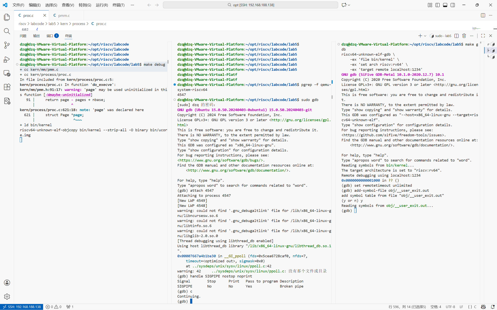
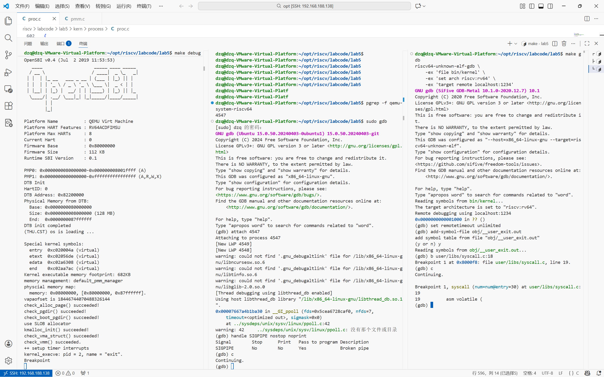
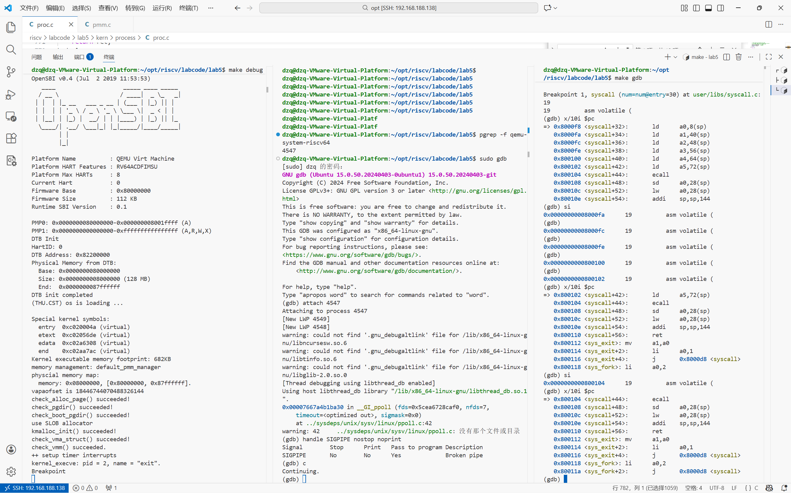
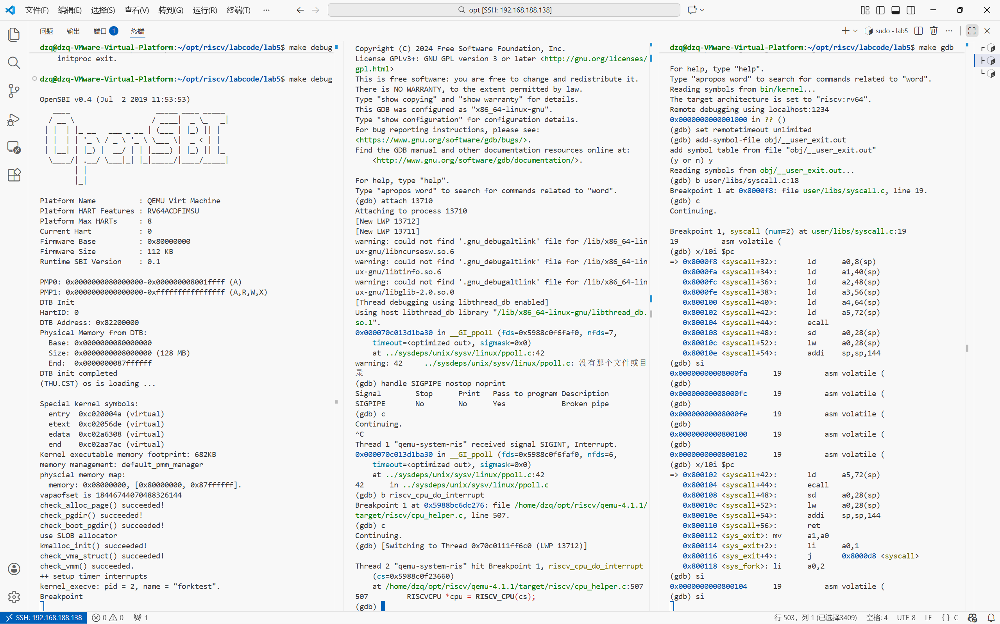
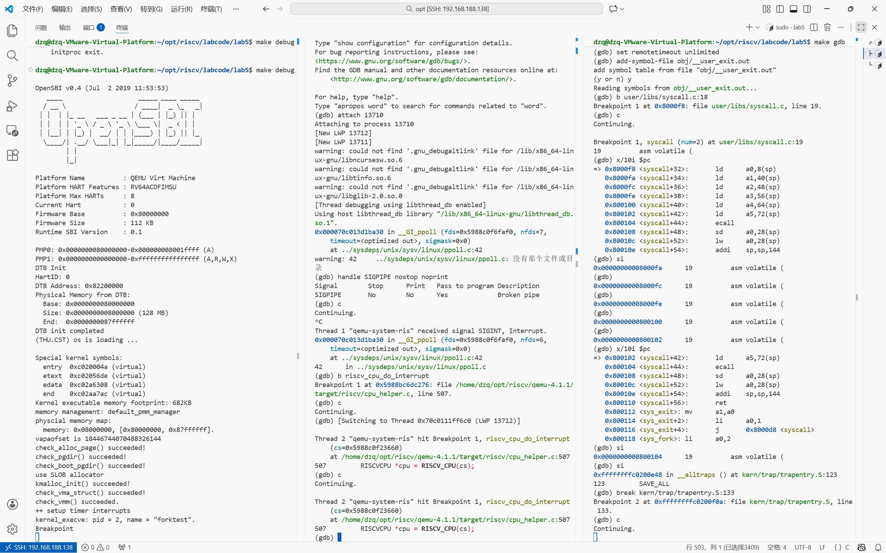
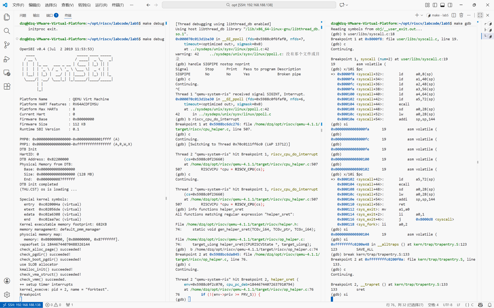

## 分支任务：gdb 调试系统调用以及返回

之前，我们使用双重gdb的方案观测了qemu将一个虚拟地址翻译成物理地址的整个过程。那么这一次，我们温故而知新，使用同一套方案来观察操作系统中一个至关重要的机制——系统调用的完整流程。

系统调用是用户程序与操作系统内核交互的核心桥梁。当运行在受限的用户态(U mode)的程序需要获得内核服务时（如读写文件、分配内存），必须通过**系统调用**请求内核在更高特权的内核态(S mode)代为执行。这种**特权级的隔离**保障了系统的安全性和稳定性。

通过本次调试，我们将能够亲眼观察从用户态触发系统调用到返回用户态的完整过程，包括特权级切换、参数传递、内核处理等关键环节。

本次我们使用的双重gdb方案和lab2中调试地址翻译流程的操作流程都是基本相同的。我们先分析一下**调试思路**。

> **思考**
>
> 回想一下我们之前调试地址翻译流程的调试思路，我们是找到了一个地址，并且知道这个地址一定会被访问，并且第一次访问的时候一定需要查找页表，我们直接在必经之路上打上**条件断点**来判断当前传入的地址是否是我们要观测的地址，然后直接启动内核执行就可以了，当ucore访问到这个地址的时候，qemu就会自动停下，我们就可以跟踪代码的执行。

那么系统调用的观测是不是也可以这么做呢？

应该是可以的，~~用大模型~~查看一下用户程序，可以发现，所有的系统调用接口最后都是对`syscall`这个函数的封装，在这个函数中，将参数放在指定的位置之后，使用内联汇编调用ecall，从而触发中断，进入到我们之前设置的中断入口点来进行中断处理流程。

那么很显然，这个地方的`ecall`就是一个相当合适的观测点，我们可以让ucore运行到这个`ecall`指令之前停住，然后为`qemu`设置合适的断点（同理，可以询问大模型：`qemu`的源码中是如何处理`ecall`指令的，给我找一下关键的代码和流程），随后单步执行这条指令，`qemu`就会及时打住执行，我们就可以继续跟踪`qemu`的代码执行逻辑，来观测它是如何处理`ecall`的。

等到`ecall`处理完之后，**移除掉原本的断点**，防止之后的执行被莫名打断，然后根据中断处理的流程找一下，系统调用执行结束之后，控制流是如何返回到用户态的，我们需要让ucore停在返回用户态之前的`sret`指令处，再次重复之前的流程，也就是找到`qemu`处理`sret`指令的关键代码，并设置断点跟踪执行。

### 实际操作

而当我们真正开始进行调试的时候，可能遇到的第一个问题就是，在前四章里面，我们都是处于内核态的，而这一次，我们调试的重点在于从**用户态进入内核态再返回**（也就是我们调试的实质上是一个运行在你的linux环境中的qemu上运行的内核上运行的用户程序），那么很自然的，我们按照先前的想法在用户态的syscall函数处打下一个断点，然后就会喜提一个奇怪的输出：

```bash
(gdb) b kern_entry
Breakpoint 1 at 0xffffffffc0200000: file kern/init/entry.S, line 10.
(gdb) b user/libs/syscall.c:26
No source file named user/libs/syscall.c.
<future shared library load? (y or [n]) y
Breakpoint 2 (user/libs/syscall.c:26) pending.
(gdb) b syscall
Breakpoint 3 at 0xffffffffc0205180: file kern/syscall/syscall.c, line 83.
```

这个输出的结果是什么意思呢（**要不你问问大模型吧**），其实就是目前gdb找到的"调试信息"中找不到用户程序的`libs`等内容，也就是说，我们目前的`makefile`中编写的用于调试的`make debug`和`make gdb`这两个目标只加载了内核本身的调试信息，而用户程序的调试信息并没有加载进去。

**模型使用示例** 向一个你使用顺手的大模型提问，我目前的内核是如何将用户程序加载进去的，如果我想要调试内核上运行的用户程序，是不是需要将用户程序的符号表也都加载进去，我应该怎么操作，为什么使用makedebug和makegdb调试的时候就会自动将内核符号表加载进去。

之后大模型就会给出一些解释和方案，根据项目中的文件夹和代码进行分析，大概信息如下。

```text
在 Lab5 中，用户程序并不是像现代 Linux 那样存储在磁盘文件系统（如 ext4）中的。为了简化实验，ucore 采用了一种 "Link-in-Kernel" (链接进内核) 的方式。
...
如何加载用户程序符号表
如果你想调试 exit.c，你需要手动告诉 GDB 加载这个文件的符号表。
操作步骤：
启动调试：运行 make debug 或 make qemu + make gdb。
加载符号：在 GDB 提示符下输入：
(gdb) add-symbol-file obj/__user_exit.out
GDB 会提示确认，输入 y。
不需要指定地址，因为 user.ld 已经定义了它是静态链接到 0x800020 的，GDB 会自动从 ELF 头中读取这个地址。
打断点：
现在 GDB 认识用户程序的函数了。
(gdb) b user/exit.c:9  # 推荐：直接对源文件打断点
```

那么我们只需要在`make gdb`命令之后，在gdb命令行中执行对应的命令，就可以正确的加载用户程序的调试信息了，之后我们就可以在用户库函数的`syscall`处打上断点了：

```bash
(gdb) add-symbol-file obj/__user_exit.out
add symbol table from file "obj/__user_exit.out"
(y or n) y
Reading symbols from obj/__user_exit.out...
(gdb) break user/libs/syscall.c:18
Breakpoint 1 at 0x8000f8: file user/libs/syscall.c, line 19.
```

那么我们只需要让ucore继续执行，就会在第一次执行到用户态的`syscall`函数的时候停住，此时，可能会遇到第二个问题，因为`syscall`是一个c函数，而我们真正关注的是这个c函数的内联汇编中的`ecall`指令，看起来很奇怪，不过不要被吓住，毕竟本质上cpu上执行的都是汇编指令，我们可以直接使用`si`来单步执行汇编指令，gdb中也有一些命令来帮助我们显示当前指令之后的几条汇编指令，我们就可以找到那个我们真正关心的指令——`ecall`，我们控制ucore执行到`ecall`指令之前：

```bash
(gdb) si
0x0000000000800104      19          asm volatile (
1: x/7i $pc
=> 0x800104 <syscall+44>:       ecall  
   0x800108 <syscall+48>:
    sd  a0,28(sp)
   0x80010c <syscall+52>:
    lw  a0,28(sp)
   0x80010e <syscall+54>:
    addi        sp,sp,144
   0x800110 <syscall+56>:       ret    
   0x800112 <sys_exit>: mv      a1,a0  
   0x800114 <sys_exit+2>:
    li  a0,1
(gdb) i r $pc
pc             0x800104 0x800104 <syscall+44>
```

此时，我们就需要为`qemu`打上断点了，目前，我们执行`make debug`的终端中由于调试ucore的`gdb`打断了ucore的执行而卡住，而调试ucore的`gdb`在等待我们的下一步指令，而附加到`qemu`的`gdb`中显示为`Continuing`，我们应该如何在qemu中添加一个断点呢？只需要在这个显示`Continuing`的终端中按下`ctrl + C`即可。

这时我们就可以像之前一样为`qemu`打下断点，然后继续执行`qemu`，接着让ucore执行`ecall`指令，我们就会发现attach在`qemu`上的`gdb`卡在了我们打下的断点处，我们就可以从这里开始跟踪执行，当`ecall`的处理完成之后，我们可以让ucore继续执行，停在`sret`指令前一句，并执行类似的操作，跟踪`sret`的处理流程。

到此，我们就完整的观测了一个从U态触发系统调用进入到S态，并在S态进行系统调用的处理，处理结束之后返回U态的过程，尤其是，我们细致的观测了qemu是如何模拟硬件进行`ecall`和`sret`两个指令的处理的。

> **最后的小建议**
>
> 调试过程中可能会遇到各种奇怪的问题，比如断点不触发、程序跑飞等等。别慌！ 这正是学习的机会。把错误信息、你的操作步骤、以及你的困惑一起扔给大模型，它会给你提供排查思路。记住，大模型不只是帮你写代码的工具，更是你学习的智能助手。用好它，你就能在复杂系统的探索路上走得更远。

### 调试要求

1. 在大模型的帮助下，完成整个调试的流程，观察一下ecall指令和sret指令是如何被qemu处理的，并简单阅读一下调试中涉及到的qemu源码，解释其中的关键流程。
2. 在执行ecall和sret这类汇编指令的时候，qemu进行了很关键的一步——指令翻译（TCG Translation），了解一下这个功能，思考一下另一个双重gdb调试的实验是否也涉及到了一些相关的内容。
3. 记录下你调试过程中比较~~抓马~~有趣的细节，以及在观察模拟器通过软件模拟硬件执行的时候了解到的知识。
4. 记录实验过程中，有哪些通过大模型解决的问题，记录下当时的情景，你的思路，以及你和大模型交互的过程。


### 准备带调试信息的QEMU

```bash
# 进入QEMU源码目录
cd qemu-4.1.1

# 清理之前的编译结果
make distclean

# 重新配置，这次要带上调试选项
./configure --target-list=riscv32-softmmu,riscv64-softmmu --enable-debug

# 重新编译
make -j$(nproc)
```

**重要提示**，~~这段重要提示也是大模型提醒的~~：编译完成后不要执行`sudo make install`！我们只是要生成一个带调试信息的QEMU可执行文件(编译完成之后，可以在`riscv64-softmmu`目录下找到一个`qemu-system-riscv64`)，而不是替换之前安装在系统里的QEMU。这样，系统里就有两个QEMU：一个是我们日常使用的"正式版"，另一个是我们专门用来调试的"调试版"。

**模型使用示例** 向一个你使用顺手的大模型提问，我要通过gdb来加断点单步调试`qemu-4.1.1`，从而理解在qemu中运行的riscv代码的地址转换逻辑，我需要注意哪些细节。你会得到跟下面差不多的信息。

接下来，我们需要修改ucore的Makefile，让它使用我们新编译的调试版QEMU：

```makefile
# 在Makefile中找到QEMU定义，修改为：
QEMU := /path/to/your/qemu-4.1.1/riscv64-softmmu/qemu-system-riscv64
```

请将`/path/to/your/qemu-4.1.1/`替换为你实际的QEMU源码路径。

```
# try to infer the correct QEMU
ifndef QEMU
QEMU := /home/dzq/opt/riscv/qemu-4.1.1/riscv64-softmmu/qemu-system-riscv64
```

#### 终端1：

```c
make debug
```

#### 终端2：

```
pgrep -f qemu-system-riscv64 #找到QEMU进程的PID
```

记住这个PID，然后启动GDB并附加到这个进程：

```bash
sudo gdb
```

在GDB会话中执行

```bash
(gdb) attach <刚才查到的PID>
(gdb) handle SIGPIPE nostop noprint
(gdb) # 你可以在这里执行一些操作，设置一些断点等
(gdb) continue # 之后就启动执行
```


#### 终端3：

在gdb已经设置好断点并启动qemu的执行（即执行了continue）之后，在项目目录下执行：

```bash
make gdb
```

这个GDB会话会连接到QEMU的`GDB stub`

```
(gdb) set remotetimeout unlimited  #防止error
(gdb) add-symbol-file obj/__user_exit.out  #加载用户程序符号表
```




### `ecall`指令

#### 终端3：

```
(gdb) b user/libs/syscall.c:18  #ecall附近加断点
(gdb) c
```



```
(gdb) x/10i $pc
```

单步执行

```
(gdb) si
```



#### 终端2：

ctrl^C中断执行

打断点，`riscv_cpu_do_interrupt`是QEMU 模拟器中处理 RISC-V CPU 所有异常的核心函数

```
(gdb) b riscv_cpu_do_interrupt
(gdb) c
```


```c++
void riscv_cpu_do_interrupt(CPUState *cs)
{
#if !defined(CONFIG_USER_ONLY)

    RISCVCPU *cpu = RISCV_CPU(cs);
    CPURISCVState *env = &cpu->env;

    /* cs->exception is 32-bits wide unlike mcause which is XLEN-bits wide
     * so we mask off the MSB and separate into trap type and cause.
     */
    bool async = !!(cs->exception_index & RISCV_EXCP_INT_FLAG);
    target_ulong cause = cs->exception_index & RISCV_EXCP_INT_MASK;
    target_ulong deleg = async ? env->mideleg : env->medeleg;
    target_ulong tval = 0;

    static const int ecall_cause_map[] = {
        [PRV_U] = RISCV_EXCP_U_ECALL,
        [PRV_S] = RISCV_EXCP_S_ECALL,
        [PRV_H] = RISCV_EXCP_H_ECALL,
        [PRV_M] = RISCV_EXCP_M_ECALL
    };

    if (!async) {
        /* set tval to badaddr for traps with address information */
        switch (cause) {
        case RISCV_EXCP_INST_ADDR_MIS:
        case RISCV_EXCP_INST_ACCESS_FAULT:
        case RISCV_EXCP_LOAD_ADDR_MIS:
        case RISCV_EXCP_STORE_AMO_ADDR_MIS:
        case RISCV_EXCP_LOAD_ACCESS_FAULT:
        case RISCV_EXCP_STORE_AMO_ACCESS_FAULT:
        case RISCV_EXCP_INST_PAGE_FAULT:
        case RISCV_EXCP_LOAD_PAGE_FAULT:
        case RISCV_EXCP_STORE_PAGE_FAULT:
            tval = env->badaddr;
            break;
        default:
            break;
        }
        /* ecall is dispatched as one cause so translate based on mode */
        if (cause == RISCV_EXCP_U_ECALL) {
            assert(env->priv <= 3);
            cause = ecall_cause_map[env->priv];
        }
    }

    trace_riscv_trap(env->mhartid, async, cause, env->pc, tval, cause < 16 ?
        (async ? riscv_intr_names : riscv_excp_names)[cause] : "(unknown)");

    if (env->priv <= PRV_S &&
            cause < TARGET_LONG_BITS && ((deleg >> cause) & 1)) {
        /* handle the trap in S-mode */
        target_ulong s = env->mstatus;
        s = set_field(s, MSTATUS_SPIE, env->priv_ver >= PRIV_VERSION_1_10_0 ?
            get_field(s, MSTATUS_SIE) : get_field(s, MSTATUS_UIE << env->priv));
        s = set_field(s, MSTATUS_SPP, env->priv);
        s = set_field(s, MSTATUS_SIE, 0);
        env->mstatus = s;
        env->scause = cause | ((target_ulong)async << (TARGET_LONG_BITS - 1));
        env->sepc = env->pc;
        env->sbadaddr = tval;
        env->pc = (env->stvec >> 2 << 2) +
            ((async && (env->stvec & 3) == 1) ? cause * 4 : 0);
        riscv_cpu_set_mode(env, PRV_S);
    } else {
        /* handle the trap in M-mode */
        target_ulong s = env->mstatus;
        s = set_field(s, MSTATUS_MPIE, env->priv_ver >= PRIV_VERSION_1_10_0 ?
            get_field(s, MSTATUS_MIE) : get_field(s, MSTATUS_UIE << env->priv));
        s = set_field(s, MSTATUS_MPP, env->priv);
        s = set_field(s, MSTATUS_MIE, 0);
        env->mstatus = s;
        env->mcause = cause | ~(((target_ulong)-1) >> async);
        env->mepc = env->pc;
        env->mbadaddr = tval;
        env->pc = (env->mtvec >> 2 << 2) +
            ((async && (env->mtvec & 3) == 1) ? cause * 4 : 0);
        riscv_cpu_set_mode(env, PRV_M);
    }

    /* NOTE: it is not necessary to yield load reservations here. It is only
     * necessary for an SC from "another hart" to cause a load reservation
     * to be yielded. Refer to the memory consistency model section of the
     * RISC-V ISA Specification.
     */

#endif
    cs->exception_index = EXCP_NONE; /* mark handled to qemu */
}
```

这个函数可以理解成：**RISC-V CPU 在 QEMU 里“真正发生异常/中断”时，统一在这里完成 CSR 更新、PC 跳转、特权级切换**。你在用户态执行 `ecall`，最终就是进到这里把 CPU 状态改成“进入 S-mode trap”的样子。

### 1）解析异常类型：async / cause / deleg / tval

```
bool async = !!(cs->exception_index & RISCV_EXCP_INT_FLAG);
target_ulong cause = cs->exception_index & RISCV_EXCP_INT_MASK;
target_ulong deleg = async ? env->mideleg : env->medeleg;
target_ulong tval = 0;
```

- `cs->exception_index` 是 QEMU 内部记录“将要处理的异常号”的字段
- `async`：是否为**异步中断**（interrupt）。
  - `async=0` → 同步异常（exception），比如 `ecall`、page fault
  - `async=1` → 外部/定时器/软件中断这类
- `cause`：异常原因编号（去掉 INT_FLAG 后的纯 cause）
- `deleg`：委派寄存器：
  - exception 用 `medeleg`
  - interrupt 用 `mideleg`
     用它来决定：**这个 trap 是交给 S-mode 处理还是 M-mode 处理**
- `tval`：RISC-V 的 `stval/mtval`（旧版本叫 badaddr），**给“带地址信息”的异常**保存出错地址。

### 2）为“带地址信息”的异常设置 tval

```
switch (cause) {
  case ..._PAGE_FAULT:
  case ..._ACCESS_FAULT:
  ...
      tval = env->badaddr;
}
```

- 像 page fault / access fault 这类需要把“出问题的虚拟地址”写入 `stval`
- `env->badaddr` 是前面翻译/访存阶段已经记录下来的“坏地址”

### 3）`ecall` 的特殊：根据当前特权级修正 cause

你看到这段：

```
if (cause == RISCV_EXCP_U_ECALL) {
    assert(env->priv <= 3);
    cause = ecall_cause_map[env->priv];
}
```

关键点：在 QEMU 内部，`ecall` 初始可能统一用一个标识进入异常处理，但**真正的 RISC-V 规范要求**：

- 从 U 发起 ecall → `CAUSE_USER_ECALL`
- 从 S 发起 ecall → `CAUSE_SUPERVISOR_ECALL`
- 从 M 发起 ecall → `CAUSE_MACHINE_ECALL`

所以这里根据 `env->priv`（当前特权级）把 cause 修正成正确的那一个。你这次调试的是用户态系统调用，所以这里会把它映射成 **U_ECALL** 对应的 cause。

### 4）决定走 S-mode trap 还是 M-mode trap（委派机制）

最核心的分叉：

```
if (env->priv <= PRV_S && cause < TARGET_LONG_BITS && ((deleg >> cause) & 1)) {
    /* handle the trap in S-mode */
    ...
    riscv_cpu_set_mode(env, PRV_S);
} else {
    /* handle the trap in M-mode */
    ...
    riscv_cpu_set_mode(env, PRV_M);
}
```

含义是：

- 若当前特权级 ≤ S（也就是 U 或 S），并且 `medeleg/mideleg` 对该 cause 的那一位是 1
   → **trap 委派给 S-mode 处理**：更新 `scause/sepc/stval`、跳 `stvec`、切到 S
- 否则
   → **trap 进 M-mode**：更新 `mcause/mepc/mtval`、跳 `mtvec`、切到 M

在 ucore + OpenSBI 的模型里，一般用户态 `ecall` 会被委派到 S-mode（也就是内核去处理），所以你会看到走 S-mode 分支。

### 5）进入 S-mode trap 时，QEMU 模拟硬件做了什么

S-mode 分支里你看到的就是“RISC-V 硬件规范的动作”：

1. 更新 `mstatus` 中的 SPIE/SPP/SIE（保存旧中断使能、记录来源特权级、关中断）
2. `env->scause = cause | (async<<XLEN-1)`（最高位标记是不是 interrupt）
3. `env->sepc = env->pc`（保存异常发生时 PC）
4. `env->sbadaddr = tval`（旧名 badaddr，实际就是 stval）
5. `env->pc = stvec 对应的入口`（根据 direct/vectored 决定是否加偏移）
6. `riscv_cpu_set_mode(env, PRV_S)` 切到 S-mode

**这一步就是“ecall 之后 CPU 自动跳到 trap 入口”的硬件行为，QEMU 用 C 代码把它模拟出来。**

最后：

```
cs->exception_index = EXCP_NONE;
```

表示异常已经处理完（已被“接管”），别再重复处理。

#### 终端3：

```
(gdb) si
```

可以看到

#### 终端2：

```c++
(gdb) [Switching to Thread 0x70c0111ff6c0 (LWP 13712)]

Thread 2 "qemu-system-ris" hit Breakpoint 1, riscv_cpu_do_interrupt
    (cs=0x5988c0f23660)
    at /home/dzq/opt/riscv/qemu-4.1.1/target/riscv/cpu_helper.c:507
507         RISCVCPU *cpu = RISCV_CPU(cs);
```



### 执行`sret`

#### 终端2：

```
(gdb) c
```

#### 终端3：

```
(gdb) break kern/trap/trapentry.S:133 #sret所在的位置
(gdb) c
```

#### 终端2：

```

Thread 2 "qemu-system-ris" hit Breakpoint 1, riscv_cpu_do_interrupt
    (cs=0x5988c0f23660)
    at /home/dzq/opt/riscv/qemu-4.1.1/target/riscv/cpu_helper.c:507
507         RISCVCPU *cpu = RISCV_CPU(cs);
```



```
(gdb) info functions helper_sret
All functions matching regular expression "helper_sret":

File /home/dzq/opt/riscv/qemu-4.1.1/target/riscv/helper.h:
74:     static void gen_helper_sret(TCGv_i64, TCGv_ptr, TCGv_i64);

File /home/dzq/opt/riscv/qemu-4.1.1/target/riscv/op_helper.c:
74:     target_ulong helper_sret(CPURISCVState *, target_ulong);
```

`sret` 是一条特权指令，QEMU 不会直接模拟它，而是通过 TCG 调用一个 helper 函数来实现其语义。

```
target_ulong helper_sret(CPURISCVState *env, target_ulong cpu_pc_deb)
{
    if (!(env->priv >= PRV_S)) {
        riscv_raise_exception(env, RISCV_EXCP_ILLEGAL_INST, GETPC());
    }

    target_ulong retpc = env->sepc;
    if (!riscv_has_ext(env, RVC) && (retpc & 0x3)) {
        riscv_raise_exception(env, RISCV_EXCP_INST_ADDR_MIS, GETPC());
    }

    if (env->priv_ver >= PRIV_VERSION_1_10_0 &&
        get_field(env->mstatus, MSTATUS_TSR)) {
        riscv_raise_exception(env, RISCV_EXCP_ILLEGAL_INST, GETPC());
    }

    target_ulong mstatus = env->mstatus;
    target_ulong prev_priv = get_field(mstatus, MSTATUS_SPP);
    mstatus = set_field(mstatus,
        env->priv_ver >= PRIV_VERSION_1_10_0 ?
        MSTATUS_SIE : MSTATUS_UIE << prev_priv,
        get_field(mstatus, MSTATUS_SPIE));
    mstatus = set_field(mstatus, MSTATUS_SPIE, 0);
    mstatus = set_field(mstatus, MSTATUS_SPP, PRV_U);
    riscv_cpu_set_mode(env, prev_priv);
    env->mstatus = mstatus;

    return retpc;
}
```

### 1）权限检查：不在 S 及以上执行 `sret` → 非法指令

```
if (!(env->priv >= PRV_S)) {
    riscv_raise_exception(env, RISCV_EXCP_ILLEGAL_INST, GETPC());
}
```

- `sret` 是 supervisor return，按规范只能在 **S-mode 或更高特权级**执行。
- 如果当前 `env->priv` 还在 U-mode，却执行 `sret`，QEMU 直接抛 `ILLEGAL_INST`。

这一步对应真实硬件：权限不足执行特权指令会触发非法指令异常。

------

### 2）返回地址 retpc = sepc，并检查对齐（无 RVC 时必须 4 字节对齐）

```
target_ulong retpc = env->sepc;
if (!riscv_has_ext(env, RVC) && (retpc & 0x3)) {
    riscv_raise_exception(env, RISCV_EXCP_INST_ADDR_MIS, GETPC());
}
```

- `sepc` 保存的是 trap 时的 PC（或者按实现是下一条），`sret` 返回时要跳回这里。
- 如果 CPU **不支持压缩指令 RVC**，指令地址必须 4 字节对齐，否则是 `INST_ADDR_MIS`（指令地址未对齐异常）。

这一步解释了为什么 QEMU 要检查 `retpc & 0x3`。

------

### 3）TSR 检查：S-mode 下可能禁止 sret（特权规范 1.10+）

```
if (env->priv_ver >= PRIV_VERSION_1_10_0 &&
    get_field(env->mstatus, MSTATUS_TSR)) {
    riscv_raise_exception(env, RISCV_EXCP_ILLEGAL_INST, GETPC());
}
```

- 在较新的特权规范里，`mstatus.TSR` 可以控制：**在 S-mode 执行 sret 是否允许**。
- 如果 `TSR=1`，则 S-mode 不能执行 `sret`，会被认为是非法指令（通常要求交给更高特权处理）。

------

### 4）更新 mstatus：恢复中断使能位、清 SPIE、清 SPP

```
target_ulong mstatus = env->mstatus;
target_ulong prev_priv = get_field(mstatus, MSTATUS_SPP);

mstatus = set_field(mstatus,
    env->priv_ver >= PRIV_VERSION_1_10_0 ?
    MSTATUS_SIE : MSTATUS_UIE << prev_priv,
    get_field(mstatus, MSTATUS_SPIE));

mstatus = set_field(mstatus, MSTATUS_SPIE, 0);
mstatus = set_field(mstatus, MSTATUS_SPP, PRV_U);
```

这一段是 `sret` 的核心：**状态位交换/恢复**。

- `prev_priv = MSTATUS_SPP`：
   `SPP` 保存“trap 发生前的特权级”（对 sret 来说就是返回目标）。
  - `SPP=0` 表示返回 U-mode
  - `SPP=1` 表示返回 S-mode
- 下一行把 `SPIE` 的值恢复到 `SIE`（或旧版本的 UIE/SIE 相关位）：
   直观理解：
  - trap 进入时通常会把 `SIE` 保存到 `SPIE` 并关掉中断
  - `sret` 返回时把 `SPIE` 再还原回 `SIE`，让中断使能恢复到 trap 前状态
- `SPIE` 被清零：表示“返回后 SPIE 不再保留旧值”，符合规范中 “xPIE 被置 0” 的行为（具体细节按版本会略有差异）。
- `SPP` 被置为 U：
   这一步非常关键：**返回之后，SPP 需要被清到最低特权**（通常是 U），避免后续错误地认为上次 trap 前是 S。
   在 ucore 的叙述里，你也看到“要让 SRET 回 U，SPP 必须是 0”的逻辑；这里就是 QEMU 侧模拟的对应动作。

------

### 5）切换特权级到 prev_priv，并提交 mstatus

```
riscv_cpu_set_mode(env, prev_priv);
env->mstatus = mstatus;
```

- 真正把 CPU 的当前特权级切换为 `prev_priv`（也就是 SPP 记录的那个级别）。
- 把更新后的 `mstatus` 写回。

这就是“硬件切回用户态/内核态”的软件模拟点。

------

### 6）返回 retpc：告诉翻译执行器下一条指令从哪开始

```
return retpc;
```

在 QEMU 的执行模型里，helper 返回一个 PC，TCG 运行时会把 CPU 的 PC 更新到这个值，继续执行。
 所以 `helper_sret` 的最终效果就是：**特权级切换 + 状态位更新 + PC 跳转到 sepc**

打断点

```
(gdb) b /home/dzq/opt/riscv/qemu-4.1.1/target/riscv/op_helper.c:74
(gdb) c
```


#### 终端3：

```
(gdb)si
```

#### 终端2：

```
Thread 2 "qemu-system-ris" hit Breakpoint 2, helper_sret (
    env=0x5988c0f2c070, cpu_pc_deb=18446744072637910794)
    at /home/dzq/opt/riscv/qemu-4.1.1/target/riscv/op_helper.c:76
76          if (!(env->priv >= PRV_S)) {
```

执行到了断点处，说明正在处理`sret`



**在大模型的帮助下，完成整个调试的流程，观察一下ecall指令和sret指令是如何被qemu处理的，并简单阅读一下调试中涉及到的qemu源码，解释其中的关键流程。**

**1. ecall 的处理流程**

在 ucore 中，用户态程序通过系统调用请求内核服务。用户程序调用 `fork / exit / wait / putc` 等接口时，最终都会进入 `user/libs/syscall.c` 中的 `syscall()` 函数。在该函数中，系统调用号和参数被放入约定的寄存器（`a0~a5`），随后执行 `ecall` 指令。

当 CPU 执行到 `ecall` 指令时，会触发同步异常。QEMU 在执行翻译后的代码时识别到该异常，并进入统一的异常处理入口函数 `riscv_cpu_do_interrupt(CPUState *cs)`。

在该函数中，QEMU完成了以下几步关键工作：

1. 从 `cs->exception_index` 中解析出异常类型和异常原因（`cause`），并判断这是同步异常而非异步中断。
2. 对 `ecall` 进行特殊处理：根据当前特权级（`env->priv`），将异常原因映射为 `U-mode ecall`、`S-mode ecall` 或 `M-mode ecall`。
3. 根据 `medeleg` / `mideleg` 判断该异常是否被委派给 S-mode 处理。在 ucore 中，用户态 ecall 会被委派给 S-mode。
4. 若进入 S-mode：
   - 保存异常发生时的 PC 到 `sepc`
   - 设置 `scause`
   - 设置 `stval`（若有）
   - 更新 `sstatus` 中的特权级和中断相关位
   - 将 PC 跳转到 `stvec` 指向的 trap 入口地址
   - 切换当前特权级为 S-mode

完成上述步骤后，CPU 状态就与真实硬件在执行 `ecall` 后进入内核 trap 时的状态一致，随后开始执行 ucore 的 `trapentry.S` 中的入口代码。

------

**2. sret 的处理流程**

当内核完成系统调用处理后，会在 `trapentry.S` 中执行 `sret` 指令返回用户态。

在 QEMU 中，`sret` 同样不会直接“执行一条指令”那么简单，而是由 QEMU 的 RISC-V helper 代码模拟其语义，主要完成以下工作：

1. 将 PC 恢复为 `sepc` 中保存的值，即异常发生前的下一条指令地址。
2. 根据 `sstatus.SPP` 判断返回的目标特权级（U-mode 或 S-mode），在系统调用场景下通常返回 U-mode。
3. 恢复中断使能位（如 SPIE → SIE）。
4. 更新当前特权级并继续执行用户程序。

通过在 QEMU 中跟踪 `sret` 的执行，可以清楚地看到系统调用结束后，控制流是如何从内核重新回到用户态的。

**在执行ecall和sret这类汇编指令的时候，qemu进行了很关键的一步——指令翻译（TCG Translation），了解一下这个功能，思考一下另一个双重gdb调试的实验是否也涉及到了一些相关的内容。**

**1. TCG Translation 在 ecall / sret 中的作用**

QEMU 并不是逐条解释执行指令，而是使用 TCG（Tiny Code Generator）将 Guest 指令翻译成中间表示（TCG ops），并缓存为 Translation Block（TB）。

在 `ecall` 和 `sret` 这样的特权指令上：

- 翻译阶段并不会生成普通的算术或访存操作
- 而是生成触发异常或调用特定 helper 函数的 TCG 代码
- 真正的异常进入（`ecall`）和特权返回（`sret`）逻辑，是在执行翻译后的 TB 时，通过 helper 函数完成的

因此，在 QEMU gdb 中看到的 `riscv_cpu_do_interrupt` 或 `sret` 相关处理函数，实际上是 **TCG 翻译结果在运行时触发的**。

------

**2.与 Lab2 双 gdb 地址翻译实验的关系**

在 Lab2 中调试虚拟地址到物理地址的转换过程时，虽然关注的是页表和地址翻译，但其底层机制与本次实验是类似的：

- Guest 的 load/store 指令首先被 TCG 翻译为 TB
- 执行 TB 时进入 QEMU 的 softmmu 路径
- 由 QEMU 的软件逻辑模拟 TLB 查找、页表遍历和权限检查

因此，无论是 Lab2 的地址翻译，还是本次实验中的 `ecall / sret`，本质上都是：

> **QEMU 通过 TCG 翻译 + helper 函数，用软件模拟真实硬件的执行和特权行为。**

这两次双 gdb 调试实验在机制上是高度一致的，只是关注的硬件行为不同。
