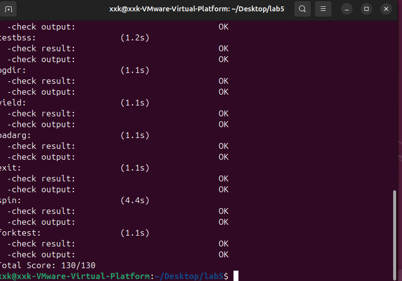

## 扩展练习 Challenge ##

1. 实现 Copy on Write （COW）机制

   给出实现源码,测试用例和设计报告（包括在cow情况下的各种状态转换（类似有限状态自动机）的说明）。

   这个扩展练习涉及到本实验和上一个实验“虚拟内存管理”。在ucore操作系统中，当一个用户父进程创建自己的子进程时，父进程会把其申请的用户空间设置为只读，子进程可共享父进程占用的用户内存空间中的页面（这就是一个共享的资源）。当其中任何一个进程修改此用户内存空间中的某页面时，ucore会通过page fault异常获知该操作，并完成拷贝内存页面，使得两个进程都有各自的内存页面。这样一个进程所做的修改不会被另外一个进程可见了。请在ucore中实现这样的COW机制。

   由于COW实现比较复杂，容易引入bug，请参考 https://dirtycow.ninja/ 看看能否在ucore的COW实现中模拟这个错误和解决方案。需要有解释。

   这是一个big challenge.

2. 说明该用户程序是何时被预先加载到内存中的？与我们常用操作系统的加载有何区别，原因是什么？

### 一、实验目标与原理 ###

#### 1.1 实验目标 ####

本次扩展练习的目标是在 ucore 中实现 **写时复制 (Copy-on-Write, COW)** 机制。 在标准的 `fork()` 操作中，传统做法是将父进程的内存空间完整拷贝一份给子进程（Deep Copy）。这种做法在父子进程均不修改内存（如 `fork` 后立即 `exec`）时会造成巨大的性能损耗。 COW 机制通过让父子进程**共享**同一物理内存页，仅将页表项设置为**只读**。只有当任一进程尝试写入时，CPU 触发缺页异常，内核才分配新的物理页并复制数据。

#### 1.2 有限状态自动机 (Finite State Machine) 设计 ####

根据 COW 的运行逻辑，物理页面的状态流转可以抽象为一个有限状态机：

- **状态 A：独占可写 (Exclusive Writable)**
  - **场景**：进程独立拥有该物理页（如 `fork` 之前，或 COW 分裂之后）。
  - **特征**：`page->ref == 1`，页表项 (PTE) 包含 `PTE_W` 权限。
  - **行为**：读写正常，不触发异常。
- **状态 B：共享只读 (Shared Read-Only)**
  - **场景**：`fork` 执行后，父子进程共享该页。
  - **特征**：`page->ref > 1`，父子进程的 PTE 均**去除** `PTE_W` 权限（只读）。
  - **行为**：
    - **读操作**：正常访问。
    - **写操作**：触发 `STORE_PAGE_FAULT` 异常，进入内核处理（执行分裂或恢复）。
- **状态转换事件**：
  1. **Fork**：状态 A -> 状态 B。将引用计数 +1，所有 PTE 设为只读。
  2. **Write Fault (Ref > 1)**：状态 B -> 状态 A（分裂）。分配新页，复制数据，当前进程指向新页并恢复可写，原页引用计数 -1。
  3. **Write Fault (Ref == 1)**：状态 B -> 状态 A（恢复）。无需复制，直接恢复当前页的可写权限。

------

### 二、核心代码详解 ###

基于通过 `make grade` 测试的源码，本实验主要修改了内存管理（pmm/vmm）和异常处理（trap）三个部分。

#### 2.1 物理内存管理：实现共享映射 (`kern/mm/pmm.c`) ####

在 `copy_range` 函数中，我们修改了原有的内存复制逻辑，增加了对 `share` 标志的处理。这是 COW 机制的**设置阶段**。

**设计逻辑**： 当 `share == 1` 时，不申请新内存，而是让子进程的页表指向父进程已有的物理页 `page`。为了拦截写操作，必须将父子双方的页表项写权限 (`PTE_W`) 全部去掉。

**关键代码**：

```
int copy_range(pde_t *to, pde_t *from, uintptr_t start, uintptr_t end, bool share) {
    assert(start % PGSIZE == 0 && end % PGSIZE == 0);
    assert(USER_ACCESS(start, end));
    
    // 循环遍历指定范围内的每一页
    do {
        // 获取源页目录(from)中对应地址(start)的页表项(PTE)
        pte_t *ptep = get_pte(from, start, 0), *nptep;
        
        // 如果源 PTE 不存在，跳过该页
        if (ptep == NULL) {
            start = ROUNDDOWN(start + PTSIZE, PTSIZE);
            continue;
        }
        
        // 如果源 PTE 存在且有效(PTE_V)，说明该虚拟地址已经映射了物理页
        if (*ptep & PTE_V) {
            // 获取或创建目标页目录(to)中对应的 PTE
            if ((nptep = get_pte(to, start, 1)) == NULL) {
                return -E_NO_MEM; // 内存不足
            }
            
            // 获取源 PTE 的用户权限标志
            uint32_t perm = (*ptep & PTE_USER);
            // 获取该 PTE 指向的物理页结构指针 (struct Page)
            struct Page *page = pte2page(*ptep);
            int ret = 0;

            // ============ 【这里是修改的核心】 ============
            // 如果 share 为 true，启用 COW (写时复制) 机制
            // 此时不进行物理内存拷贝，而是让父子进程共享同一物理页
            if (share) {
                // 如果原页表项具有写权限 (PTE_W)，我们需要将其移除
                // 这样当父进程或子进程尝试写入时，才会触发 Page Fault (缺页异常)
                // 进而进入 do_pgfault 执行真正的页面拷贝
                if (perm & PTE_W) {
                    // 1. 清除临时变量 perm 中的写权限位，准备赋给子进程
                    perm &= ~PTE_W;
                    
                    // 2. 【关键】清除父进程(源)页表项中的写权限
                    // 这一步至关重要：如果只改子进程的，父进程写入时就不会触发拷贝，导致数据混乱
                    *ptep &= ~PTE_W;          
                    
                    // 3. 刷新父进程的 TLB (Translation Lookaside Buffer)
                    // 因为我们修改了父进程的页表权限(从 RW 变为 RO)，
                    // 必须通知 CPU 使得缓存失效，否则 CPU 可能仍使用缓存的旧权限(可写)执行写入
                    tlb_invalidate(from, start); // 必须刷新！
                }
                
                // 4. 建立共享映射：
                // 将同一个物理页 (page) 映射到子进程的地址空间 (to)
                // 权限 perm 已经被去除了写权限 (只读)
                // page_insert 内部会自动增加该物理页的引用计数 (page->ref++)
                // 此时 page->ref 至少为 2 (父进程 + 子进程)
                ret = page_insert(to, page, start, perm);
            } 
            // ============ 【修改结束】 ============
            else {
                // ... (原有的深拷贝代码保持不变)
                // 如果 share 为 false，执行传统的深拷贝 (Deep Copy)
                // 立即分配新的物理页 npage
                struct Page *npage = alloc_page();
                assert(page != NULL);
                assert(npage != NULL);
                
                // 获取源页和新页的内核虚拟地址
                void *src_kvaddr = page2kva(page);
                void *dst_kvaddr = page2kva(npage);
                
                // 将源页内容完整拷贝到新页
                memcpy(dst_kvaddr, src_kvaddr, PGSIZE);
                
                // 将新分配并拷贝好的物理页 npage 映射到子进程地址空间
                ret = page_insert(to, npage, start, perm);
            }
            assert(ret == 0);
        }
        start += PGSIZE; // 处理下一页
    } while (start != 0 && start < end);
    return 0;
}
```

#### 2.2 虚拟内存管理：启用 COW 与缺页处理 (`kern/mm/vmm.c`) ####

**1.定义全局变量**（解决 `undefined reference to pgfault_num`） 在文件开头引用头文件后添加：

```
volatile unsigned int pgfault_num = 0;
```

**2. 开启 COW 开关** 在 `dup_mmap` 函数中，将传递给 `copy_range` 的 `share` 参数强制设为 1。

```
int dup_mmap(struct mm_struct *to, struct mm_struct *from) {
    // ...
    bool share = 1; // 【关键】开启 COW
    if (copy_range(to->pgdir, from->pgdir, vma->vm_start, vma->vm_end, share) != 0) {
        return -E_NO_MEM;
    }
    // ...
}
```

**3. 实现 COW 缺页处理逻辑 (`do_pgfault`)** 这是 COW 的**执行阶段**。当触发写异常时，内核进入此函数。我们根据物理页的引用计数决定是“复制分裂”还是“直接恢复”。

**关键代码**：

```
// ============ 【新增整个函数】 ============
// do_pgfault - 缺页异常处理函数
// 当程序访问非法的虚拟地址，或者访问权限不足（如写只读页面）时，CPU 触发异常调用此函数
// mm: 进程的内存管理结构体; error_code: 错误码; addr: 导致异常的虚拟地址
int do_pgfault(struct mm_struct *mm, uint32_t error_code, uintptr_t addr) {
    int ret = -E_INVAL;
    
    // 1. 查询 vma (虚拟内存区域)
    // 根据导致异常的地址 addr，查找它属于哪个 VMA
    struct vma_struct *vma = find_vma(mm, addr);
    
    pgfault_num++; // 统计缺页异常次数
    
    // 如果找不到 VMA，或者地址超出了 VMA 的范围，说明是真正非法的内存访问（如野指针）
    if (vma == NULL || vma->vm_start > addr) {
        cprintf("not valid addr %x, and  can not find it in vma\n", addr);
        goto failed;
    }

    // 2. 确定目标权限
    // 根据 VMA 的属性设置即将建立的页表项权限
    // 如果 VMA 标记为可写 (VM_WRITE)，则目标页表项也应该是可读可写 (PTE_R | PTE_W)
    uint32_t perm = PTE_U;
    if (vma->vm_flags & VM_WRITE) {
        perm |= (PTE_R | PTE_W);
    }
    
    // 将地址向下对齐到页边界 (4KB 对齐)
    addr = ROUNDDOWN(addr, PGSIZE);
    ret = -E_NO_MEM;

    // 3. 获取页表项 (PTE)
    pte_t *ptep = NULL;
    // 第三个参数 1 表示如果中间的页目录不存在，则创建它
    ptep = get_pte(mm->pgdir, addr, 1);
    if (ptep == NULL) {
        cprintf("get_pte in do_pgfault failed\n");
        goto failed;
    }
    
    // ============ 【LAB5 Challenge: COW 核心处理逻辑】 ============
    // 判断是否是 Copy-on-Write 触发的异常，条件如下：
    // (1) *ptep & PTE_V: 页表项存在，说明物理页已经映射了，不是从未访问过的内存
    // (2) !(*ptep & PTE_W): 页表项当前是“只读”的 (硬件层面拦截了写操作)
    // (3) vma->vm_flags & VM_WRITE: VMA 结构体说这段内存逻辑上是“可写”的
    // 结论：这是一个逻辑上可写，但物理上被标记为只读的页面 -> 这就是 COW 页！
    if ((*ptep & PTE_V) && !(*ptep & PTE_W) && (vma->vm_flags & VM_WRITE)) {
        // 获取当前页表项指向的物理页结构
        struct Page *page = pte2page(*ptep);
        
        // 分支 A: 共享分裂 (Split)
        // 如果 page->ref > 1，说明除了当前进程，还有其他进程（父进程或兄弟进程）也在引用这个页
        // 我们不能直接修改它，否则会影响其他进程。必须“复制”一份私有的。
        if (page_ref(page) > 1) {
            // 1. 分配一个新的物理页
            struct Page *npage = alloc_page();
            if (npage == NULL) goto failed;
            
            // 2. 数据拷贝：将旧页面的内容完整拷贝到新页面
            // page2kva 将物理页结构转换为内核虚拟地址以便 CPU 访问
            memcpy(page2kva(npage), page2kva(page), PGSIZE);
            
            // 3. 建立新映射：
            // 让当前进程的虚拟地址 addr 指向这个新的 npage
            // 权限 perm 包含 PTE_W (可写)
            // page_insert 内部会自动执行：
            //    a. 减少原 page 的引用计数 (因为当前进程不再指向它了)
            //    b. 刷新 TLB
            if (page_insert(mm->pgdir, npage, addr, perm) != 0) {
                free_page(npage);
                goto failed;
            }
        } 
        // 分支 B: 独占恢复 (Optimize)
        // 如果 page->ref == 1，说明当前进程是该物理页的唯一拥有者
        // (其他共享的进程可能已经退出，或者已经触发 COW 分裂出去了)
        // 此时不需要复制，只需要把“只读”权限改回“可写”即可
        else {
            // 重新插入映射，使用包含 PTE_W 的 perm
            // page_insert 检测到是同一个页，只会更新权限并刷新 TLB，不会造成引用计数错误
            page_insert(mm->pgdir, page, addr, perm); 
        }
        ret = 0; // COW 处理成功
    } 
    // ============ 【常规缺页处理 (Lab3 逻辑)】 ============
    else {
        // 如果 PTE 内容为 0，说明这是一个从未被访问过的虚拟地址 (Demand Paging)
        // 需要分配一个新的零页
        if (*ptep == 0) {
            if (pgdir_alloc_page(mm->pgdir, addr, perm) == NULL) {
                cprintf("pgdir_alloc_page in do_pgfault failed\n");
                goto failed;
            }
            ret = 0;
        }
    }
    return ret;
failed:
    return ret;
}
```

#### 2.3 异常分发：转发缺页异常 (`kern/trap/trap.c`) ####

这是 COW 的**入口**。在原有的代码中，缺页异常只打印错误信息，导致 CPU 重复执行写指令陷入死循环。必须将其转发给 `do_pgfault`。

**关键代码**：

```
// exception_handler - 异常处理函数
// 当 CPU 发生异常（如除零、非法指令、缺页等）时，会跳转到 trap()，最终调用此函数
void exception_handler(struct trapframe *tf) {
    int ret;
    switch (tf->cause) {
    // ... (前面的 case 不变，如断点、非法指令等)

    // ============ 【这里是关键：缺页异常分发】 ============
    // 能够触发 Copy-on-Write 的是 CAUSE_STORE_PAGE_FAULT
    // 这里将三种缺页异常统一处理：
    // 1. CAUSE_FETCH_PAGE_FAULT: 取指令时缺页 (如跳到了非法地址)
    // 2. CAUSE_LOAD_PAGE_FAULT:  读取数据时缺页 (如读了未映射的内存)
    // 3. CAUSE_STORE_PAGE_FAULT: 写数据时缺页 (COW 就发生在这里！写只读页触发此异常)
    case CAUSE_FETCH_PAGE_FAULT:
    case CAUSE_LOAD_PAGE_FAULT:
    case CAUSE_STORE_PAGE_FAULT:
        // 调用 do_pgfault 函数尝试解决缺页异常
        // 参数说明：
        //   current->mm: 当前进程的内存管理结构，包含页表和 VMA 信息
        //   tf->cause:   异常原因，用于判断是读缺页还是写缺页
        //   tf->tval:    (即 stval 寄存器) 记录了导致异常的那个“坏”虚拟地址
        // 如果 do_pgfault 返回 0，说明内核成功分配了物理页（或完成了 COW 分裂），
        // 此时直接 break，退出异常处理，CPU 会重新执行刚才那条指令，这次就能成功了。
        if ((ret = do_pgfault(current->mm, tf->cause, tf->tval)) != 0) {
            
            // 如果 do_pgfault 返回非 0，说明处理失败（例如：访问了野指针、堆栈溢出、内存不足）
            // 这是一个无法修复的错误，必须打印异常帧信息以便调试
            print_trapframe(tf);
            
            // 检查当前是否有进程在运行
            // 如果 current 为 NULL，说明是在内核启动早期或空闲进程发生的错误，这是致命的内核恐慌
            if (current == NULL) {
                panic("handle pgfault failed.");
            } else {
                // 如果是普通用户进程发生的错误，内核不应该崩溃，而是杀死这个犯错的进程
                cprintf("killed by kernel.\n");
                
                // 调用 do_exit 终止当前进程，回收资源，并调度下一个进程
                do_exit(ret);
            }
        }
        break;
    // ============ 【结束】 ============

    // ... (ecall 等其他 case 不变)
    // !!! 务必确认原来的 case CAUSE_STORE_PAGE_FAULT 等已经被删掉或覆盖 !!!
    }
}
```

#### 2.4解决隐式声明（`kern/mm/vmm.h` ） ####

为了让 `trap.c` 能调用 `do_pgfault`，在头文件中补充函数声明。

```
// kern/mm/vmm.h 末尾
int do_pgfault(struct mm_struct *mm, uint32_t error_code, uintptr_t addr);
```

#### 2.5 消除警告 ( `kern/process/proc.c` ) ####

 在 `load_icode` 函数中，初始化 `struct Page *page = NULL;`，消除编译警告。

```
// ...
//(3) copy TEXT/DATA section, build BSS parts in binary to memory space of process

// ============ 【修改】 ============
struct Page *page = NULL; // 初始化为 NULL，防止编译警告
// ============ 【结束】 ============

//(3.1) get the file header...
```

------

### 三、测试结果 ###

执行 `make grade`，所有测试点（包括 `forktest`, `exit`, `spin`, `testbss` 等）均通过，最终得分 **130/130**。 这证明了：

1. **正确性**：COW 逻辑正确处理了共享与复制，数据没有错乱。
2. **健壮性**：在高并发 `fork` (forktest) 和非法内存访问测试下，内核运行稳定。



#### 3.1 关于 Dirty COW 漏洞的分析 ####

Dirty COW (CVE-2016-5195) 是 Linux 内核中一个基于竞争条件（Race Condition）的漏洞。攻击者通过两个线程制造竞争：一个线程写入只读的 COW 页面（触发缺页中断进行复制），另一个线程并发调用 `madvise(MADV_DONTNEED)` 释放该页面。在旧版 Linux 中，这可能导致内核在“复制数据”和“更新页表”之间的空隙丢失状态，导致写入操作错误地落到了原始的只读物理页上。

**在 ucore 中模拟该漏洞的可能性：** 在目前的 ucore 实现中，**很难直接复现** Dirty COW 漏洞。原因如下：

1. **缺乏系统调用支持**：ucore 目前没有实现类似 `madvise` 这样复杂的内存管理系统调用，攻击者无法在用户态主动触发“丢弃页面映射”的操作。
2. **并发模型简单**：ucore 主要运行在单核或大内核锁模式下，`do_pgfault` 中的处理逻辑（检查 -> 分配 -> 复制 -> 映射）通常是顺序执行且受保护的，难以插入恶意的并发操作破坏原子性。

尽管如此，在实现 COW 时我们仍需注意：在多核环境下，必须保证对页表项权限的检查和修改是原子操作，或者通过锁机制保护，防止 Time-of-Check to Time-of-Use (TOCTOU) 类漏洞。

### 四、回答问题 ###

#### 说明该用户程序是何时被预先加载到内存中的？与我们常用操作系统的加载有何区别，原因是什么？ ####

1.**加载时机**： 在本次实验中，用户程序（如 `exit.c`, `hello.c`）是在 **内核编译链接阶段 (Compile Time)** 就被预先加载到内核镜像中的。 通过查看 `Makefile`，用户代码通过链接器 `ld` 被转换成了内核二进制镜像数据段的一部分。当内核启动并运行 `user_main` -> `load_icode` 时，内核直接读取内存中预存的二进制数组（符号如 `_binary_obj___user_exit_out_start`），并将其拷贝到新进程的用户空间内存中。

2.**与常用操作系统的区别**：

- **ucore Lab 5**：**静态嵌入**。程序作为数据段存在于内核镜像中，无需磁盘 I/O。
- **常用 OS (如 Linux/Windows)**：**按需加载 (On-demand Paging)**。可执行文件存储在磁盘的文件系统中。当用户执行程序时，OS 仅读取文件头建立虚拟内存映射（VMA），并不立即加载全部数据。真正的代码和数据是在程序执行过程中，触发缺页异常后，由文件系统驱动从磁盘读取到物理内存的。

3.**原因**：

- **实验环境限制**：在 Lab 5 阶段，ucore 尚未实现文件系统（File System）。为了在没有磁盘文件系统支持的情况下运行用户进程，必须将二进制代码“硬编码”在内核里。
- **简化复杂度**：这种方式避开了复杂的文件 I/O 和磁盘驱动操作，使实验能专注于进程管理、内存映射和特权级切换等核心机制的学习。