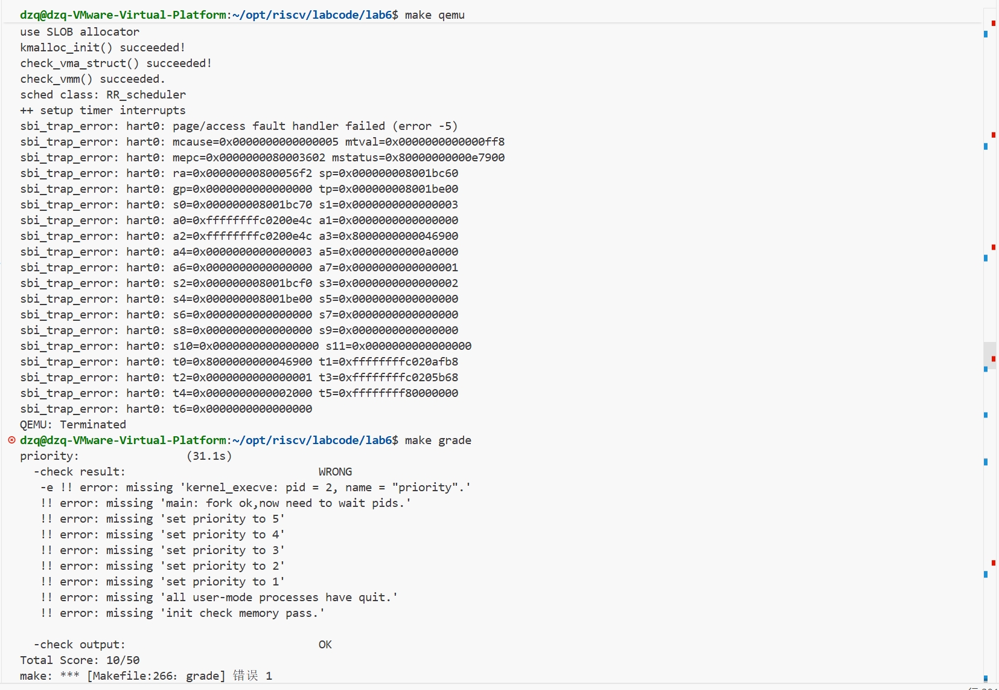
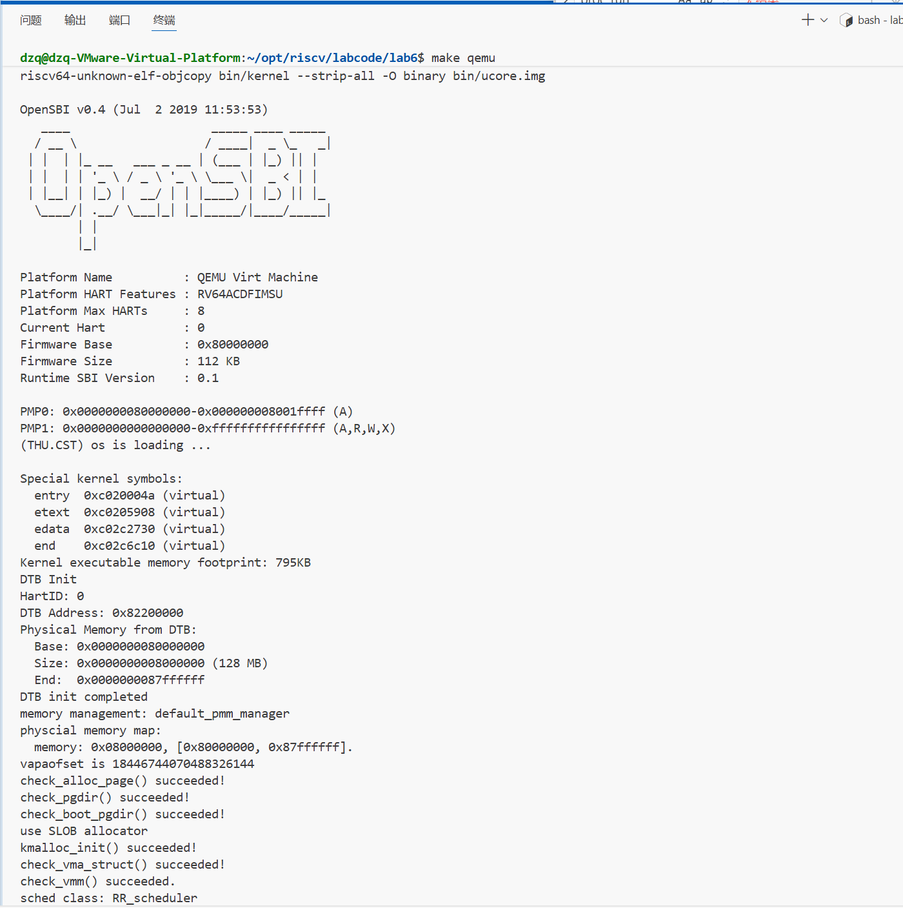
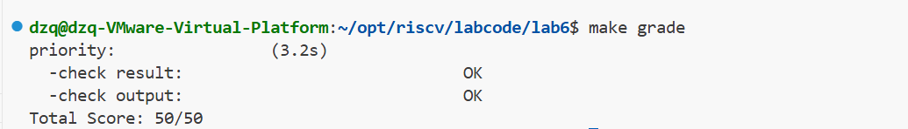
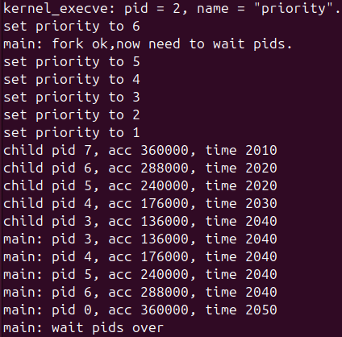
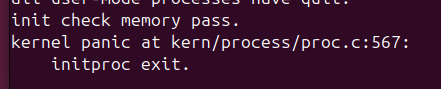

# <center>lab6 进程调度

小组成员：

吴禹骞-2311272

谢小珂-2310422

杜泽琦-2313508

[TOC]

## 前期准备

#### 练习0：填写已有实验

本实验依赖实验2/3/4/5。请把你做的实验2/3/4/5的代码填入本实验中代码中有“LAB2”/“LAB3”/“LAB4”“LAB5”的注释相应部分。并确保编译通过。 注意：为了能够正确执行lab6的测试应用程序，可能需对已完成的实验2/3/4/5的代码进行进一步改进。 由于我们在进程控制块中记录了一些和调度有关的信息，例如Stride、优先级、时间片等等，因此我们需要对进程控制块的初始化进行更新，将调度有关的信息初始化。同时，由于时间片轮转的调度算法依赖于时钟中断，你可能也要对时钟中断的处理进行一定的更新。

**Lab2:**

已完整不做处理

**Lab3:**

```c++
// kern/schedule/sched.c
void sched_class_proc_tick(struct proc_struct *proc)
{
    if (proc != idleproc)
    {
        sched_class->proc_tick(rq, proc);
    }
    else
    {
        proc->need_resched = 1;
    }
}
```

- if (proc != idleproc) { sched_class->proc_tick(rq, proc); }
  - 若被滴答的进程不是空闲进程，调用调度类的 `proc_tick`，由调度策略处理该进程的时间片消耗、时间统计、以及是否应当被抢占（可能设置 `proc->need_resched` 或把进程移出就绪队列等）。`rq` 为全局运行队列，`sched_class` 是当前选定的调度算法实现（例如默认调度类）。
- else { proc->need_resched = 1; }
  - 若是 `idleproc` 收到 tick，直接把它标记需要重新调度（`need_resched = 1`），促使 `idleproc` 在下一轮放弃 CPU，让调度器挑选其他可运行进程。空闲进程自身不应占用 CPU 很久，因此直接请求调度。

```c
// 2313508  (update LAB3 steps)
//  在时钟中断时调用调度器的 sched_class_proc_tick 函数
clock_set_next_event();          // (1) 设置下一次时钟中断
ticks++;                         // (2) 计数器 +1
/* 通知调度器当前进程经过一个时钟滴答，可能触发抢占 */
if (current != NULL)
{
sched_class_proc_tick(current);
}
break;
```

**Lab4:**

**alloc_proc**

由于当前

```c
// kern/process/proc.h
struct proc_struct
{
    enum proc_state state;                  // Process state
    int pid;                                // Process ID
    int runs;                               // the running times of Proces
    uintptr_t kstack;                       // Process kernel stack
    volatile bool need_resched;             // bool value: need to be rescheduled to release CPU?
    struct proc_struct *parent;             // the parent process
    struct mm_struct *mm;                   // Process's memory management field
    struct context context;                 // Switch here to run process
    struct trapframe *tf;                   // Trap frame for current interrupt
    uintptr_t pgdir;                        // the base addr of Page Directroy Table(PDT)
    uint32_t flags;                         // Process flag
    char name[PROC_NAME_LEN + 1];           // Process name
    list_entry_t list_link;                 // Process link list
    list_entry_t hash_link;                 // Process hash list
    int exit_code;                          // exit code (be sent to parent proc)
    uint32_t wait_state;                    // waiting state
    struct proc_struct *cptr, *yptr, *optr; // relations between processes
    struct run_queue *rq;                   // running queue contains Process
    list_entry_t run_link;                  // the entry linked in run queue
    int time_slice;                         // time slice for occupying the CPU
    skew_heap_entry_t lab6_run_pool;        // FOR LAB6 ONLY: the entry in the run pool
    uint32_t lab6_stride;                   // FOR LAB6 ONLY: the current stride of the process
    uint32_t lab6_priority;                 // FOR LAB6 ONLY: the priority of process, set by lab6_set_priority(uint32_t)
};
```

所以

```c
// kern/process/proc.c
// alloc_proc - alloc a proc_struct and init all fields of proc_struct
static struct proc_struct *
alloc_proc(void)
{
    struct proc_struct *proc = kmalloc(sizeof(struct proc_struct));
    if (proc != NULL)
    {
        // LAB4:填写你在lab4中实现的代码
        /*
         * below fields in proc_struct need to be initialized
         *       enum proc_state state;                      // Process state
         *       int pid;                                    // Process ID
         *       int runs;                                   // the running times of Proces
         *       uintptr_t kstack;                           // Process kernel stack
         *       volatile bool need_resched;                 // bool value: need to be rescheduled to release CPU?
         *       struct proc_struct *parent;                 // the parent process
         *       struct mm_struct *mm;                       // Process's memory management field
         *       struct context context;                     // Switch here to run process
         *       struct trapframe *tf;                       // Trap frame for current interrupt
         *       uintptr_t pgdir;                            // the base addr of Page Directroy Table(PDT)
         *       uint32_t flags;                             // Process flag
         *       char name[PROC_NAME_LEN + 1];               // Process name
         */
        proc->state = PROC_UNINIT;
        proc->pid = -1;
        proc->runs = 0;
        proc->kstack = 0;
        proc->need_resched = 0;
        proc->parent = NULL;
        proc->mm = NULL;
        memset(&(proc->context), 0, sizeof(struct context));
        proc->tf = NULL;
        proc->pgdir = 0;  // 实验5修改：改为NULL，后续为每个进程创建独立的页表
        proc->flags = 0;
        memset(proc->name, 0, PROC_NAME_LEN + 1);
        // LAB5:填写你在lab5中实现的代码 (update LAB4 steps)
        /*
         * below fields(add in LAB5) in proc_struct need to be initialized
         *       uint32_t wait_state;                        // waiting state
         *       struct proc_struct *cptr, *yptr, *optr;     // relations between processes
         */

        // LAB5 YOUR CODE : (update LAB4 steps)
        /*
         * below fields(add in LAB5) in proc_struct need to be initialized
         *       uint32_t wait_state;                        // waiting state
         *       struct proc_struct *cptr, *yptr, *optr;     // relations between processes
         */
        proc->wait_state = 0;        // 初始化等待状态
        proc->cptr = NULL;           // 子进程指针
        proc->yptr = NULL;           // 弟弟进程指针  
        proc->optr = NULL;           // 哥哥进程指针
        // LAB6:2313508 (update LAB5 steps)
        /*
         * below fields(add in LAB6) in proc_struct need to be initialized
         *       struct run_queue *rq;                       // run queue contains Process
         *       list_entry_t run_link;                      // the entry linked in run queue
         *       int time_slice;                             // time slice for occupying the CPU
         *       skew_heap_entry_t lab6_run_pool;            // entry in the run pool (lab6 stride)
         *       uint32_t lab6_stride;                       // stride value (lab6 stride)
         *       uint32_t lab6_priority;                     // priority value (lab6 stride)
         */
        proc->rq = NULL;                        // LAB6: 初始时进程不在任何 run_queue 中
	    list_init(&(proc->run_link));           // LAB6: 初始化 run_queue 链表结点
	    proc->time_slice = 0;                   // LAB6: 初始时间片为0，入队时由调度器设置为 max_time_slice
	    skew_heap_init(&(proc->lab6_run_pool)); // LAB6: 初始化斜堆结点(Stride 调度会用到)
	    proc->lab6_stride = 0;                  // LAB6: 初始 stride 为0
	    proc->lab6_priority = 1;                // LAB6: 默认优先级为1(防止除0)
         
    }
    return proc;
}

```

**proc_run**

```c
// kern/process/proc.c
void proc_run(struct proc_struct *proc)
{
    if (proc != current)
    {
        // LAB4:填写你在lab4中实现的代码
        /*
         * Some Useful MACROs, Functions and DEFINEs, you can use them in below implementation.
         * MACROs or Functions:
         *   local_intr_save():        Disable interrupts
         *   local_intr_restore():     Enable Interrupts
         *   lsatp():                   Modify the value of satp register
         *   switch_to():              Context switching between two processes
         */
        bool intr_flag;
        struct proc_struct *prev = current, *next = proc;
        
        // Disable interrupts
        local_intr_save(intr_flag);
        {
            // Switch current process to the new process
            current = proc;
            
            // Switch page table to use new process's address space
            lsatp(next->pgdir);
            
            // Switch context
            switch_to(&(prev->context), &(next->context));
        }
        // Enable interrupts
        local_intr_restore(intr_flag);
    }
}
```

本次实验出现问题，发现报错



当前 `alloc_proc()` 里把 `proc->pgdir` 初始化成了 `0`（表示“未初始化/特殊情况”）。而你的 `proc_run()` 里**无条件**执行 `lsatp(next->pgdir)` —— 一旦调度从 `idleproc` 切到 `initproc`（这是内核启动后一定会发生的第一次切换），就会把 `satp` 写成基于 `0` 计算出的页表根，**页表根非法 -> 立刻访存异常 -> OpenSBI 打印 `page/access fault handler failed`**。

修改后

```c
// kern/process/proc.c
void proc_run(struct proc_struct *proc)
{
    if (proc != current)
    {
        // LAB4:填写你在lab4中实现的代码
        /*
         * Some Useful MACROs, Functions and DEFINEs, you can use them in below implementation.
         * MACROs or Functions:
         *   local_intr_save():        Disable interrupts
         *   local_intr_restore():     Enable Interrupts
         *   lsatp():                   Modify the value of satp register
         *   switch_to():              Context switching between two processes
         */
        bool intr_flag;
        struct proc_struct *prev = current, *next = proc;
        
        // Disable interrupts
        local_intr_save(intr_flag);
        {
            // Switch current process to the new process
            current = proc;
            
            // Switch page table to use new process's address space
            if (next->pgdir != 0) {                          // 行注释：用户进程/有独立页表的进程
                lsatp(next->pgdir);                          // 行注释：切到该进程的页表根
            } else {
                lsatp(boot_pgdir_pa);                        // 行注释：pgdir==0（内核线程/未初始化）用内核页表根兜底，防止切到非法 satp
            }
            
            // Switch context
            switch_to(&(prev->context), &(next->context));
        }
        // Enable interrupts
        local_intr_restore(intr_flag);
    }
}
```

**do_fork**

```c
// kern/process/proc.c
int do_fork(uint32_t clone_flags, uintptr_t stack, struct trapframe *tf)
{
    int ret = -E_NO_FREE_PROC;
    struct proc_struct *proc;
    if (nr_process >= MAX_PROCESS)
    {
        goto fork_out;
    }
    ret = -E_NO_MEM;
    // LAB4:填写你在lab4中实现的代码
    /*
     * Some Useful MACROs, Functions and DEFINEs, you can use them in below implementation.
     * MACROs or Functions:
     *   alloc_proc:   create a proc struct and init fields (lab4:exercise1)
     *   setup_kstack: alloc pages with size KSTACKPAGE as process kernel stack
     *   copy_mm:      process "proc" duplicate OR share process "current"'s mm according clone_flags
     *                 if clone_flags & CLONE_VM, then "share" ; else "duplicate"
     *   copy_thread:  setup the trapframe on the  process's kernel stack top and
     *                 setup the kernel entry point and stack of process
     *   hash_proc:    add proc into proc hash_list
     *   get_pid:      alloc a unique pid for process
     *   wakeup_proc:  set proc->state = PROC_RUNNABLE
     * VARIABLES:
     *   proc_list:    the process set's list
     *   nr_process:   the number of process set
     */

    //    1. call alloc_proc to allocate a proc_struct
    //    2. call setup_kstack to allocate a kernel stack for child process
    //    3. call copy_mm to dup OR share mm according clone_flag
    //    4. call copy_thread to setup tf & context in proc_struct
    //    5. insert proc_struct into hash_list && proc_list
    //    6. call wakeup_proc to make the new child process RUNNABLE
    //    7. set ret vaule using child proc's pid

    // LAB5:填写你在lab5中实现的代码 (update LAB4 steps)
    /* Some Functions
     *    set_links:  set the relation links of process.  ALSO SEE: remove_links:  lean the relation links of process
     *    -------------------
     *    update step 1: set child proc's parent to current process, make sure current process's wait_state is 0
     *    update step 5: insert proc_struct into hash_list && proc_list, set the relation links of process
     */
    //    1. call alloc_proc to allocate a proc_struct
    if ((proc = alloc_proc()) == NULL) {
        goto fork_out;
    }

    // LAB5 UPDATE: set child proc's parent to current process
    proc->parent = current;
    // Make sure current process's wait_state is 0
    assert(current->wait_state == 0);

    //    2. call setup_kstack to allocate a kernel stack for child process
    if (setup_kstack(proc) != 0) {
        goto bad_fork_cleanup_proc;
    }

    //    3. call copy_mm to dup OR share mm according clone_flag
    if (copy_mm(clone_flags, proc) != 0) {
        goto bad_fork_cleanup_kstack;
    }

    //    4. call copy_thread to setup tf & context in proc_struct
    copy_thread(proc, stack, tf);

    //    5. insert proc_struct into hash_list && proc_list
    bool intr_flag;
    local_intr_save(intr_flag);
    {
        proc->pid = get_pid();
        hash_proc(proc);
        // LAB5 UPDATE: use set_links to set relation links instead of list_add
        set_links(proc);
        // list_add(&proc_list, &(proc->list_link));  // 实验4的代码，现在被set_links替代
        //nr_process++;
    }
    local_intr_restore(intr_flag);

    //    6. call wakeup_proc to make the new child process RUNNABLE
    wakeup_proc(proc);

    //    7. set ret vaule using child proc's pid
    ret = proc->pid;
fork_out:
    return ret;

bad_fork_cleanup_kstack:
    put_kstack(proc);
bad_fork_cleanup_proc:
    kfree(proc);
    goto fork_out;
}
```

**Lab5：**

**copy_range**

```c
// kern/mm/pmm.c
int copy_range(pde_t *to, pde_t *from, uintptr_t start, uintptr_t end,
               bool share)
{
    assert(start % PGSIZE == 0 && end % PGSIZE == 0);
    assert(USER_ACCESS(start, end));
    // copy content by page unit.
    do
    {
        // call get_pte to find process A's pte according to the addr start
        pte_t *ptep = get_pte(from, start, 0), *nptep;
        if (ptep == NULL)
        {
            start = ROUNDDOWN(start + PTSIZE, PTSIZE);
            continue;
        }
        // call get_pte to find process B's pte according to the addr start. If
        // pte is NULL, just alloc a PT
        if (*ptep & PTE_V)
        {
            if ((nptep = get_pte(to, start, 1)) == NULL)
            {
                return -E_NO_MEM;
            }
            uint32_t perm = (*ptep & PTE_USER);
            // get page from ptep
            struct Page *page = pte2page(*ptep);
            // alloc a page for process B
            struct Page *npage = alloc_page();
            assert(page != NULL);
            assert(npage != NULL);
            int ret = 0;
            /* LAB5:填写你在lab5中实现的代码
             * replicate content of page to npage, build the map of phy addr of
             * nage with the linear addr start
             *
             * Some Useful MACROs and DEFINEs, you can use them in below
             * implementation.
             * MACROs or Functions:
             *    page2kva(struct Page *page): return the kernel vritual addr of
             * memory which page managed (SEE pmm.h)
             *    page_insert: build the map of phy addr of an Page with the
             * linear addr la
             *    memcpy: typical memory copy function
             *
             * (1) find src_kvaddr: the kernel virtual address of page
             * (2) find dst_kvaddr: the kernel virtual address of npage
             * (3) memory copy from src_kvaddr to dst_kvaddr, size is PGSIZE
             * (4) build the map of phy addr of  nage with the linear addr start
             */
            // (1) find src_kvaddr: the kernel virtual address of page
            void *src_kvaddr = page2kva(page);
            // (2) find dst_kvaddr: the kernel virtual address of npage
            void *dst_kvaddr = page2kva(npage);
            // (3) memory copy from src_kvaddr to dst_kvaddr, size is PGSIZE
            memcpy(dst_kvaddr, src_kvaddr, PGSIZE);
            // (4) build the map of phy addr of nage with the linear addr start
            ret = page_insert(to, npage, start, perm);
            assert(ret == 0);
        }
        start += PGSIZE;
    } while (start != 0 && start < end);
    return 0;
}

```

**load_icode**

```c
// kern/process/proc.c
	// 设置用户栈指针为用户栈顶部
    tf->gpr.sp = USTACKTOP;

    // 设置程序入口点为ELF文件的入口地址
    tf->epc = elf->e_entry;

    // setup sstatus for returning to user mode
    // 1. 清掉 SPP 位（表示 sret 返回到 U 模式而不是 S 模式）
    // 2. 置位 SPIE 位（在 sret 后开启用户态中断）
    sstatus &= ~SSTATUS_SPP;   // 清 SPP
    sstatus |= SSTATUS_SPIE;   // 置 SPIE
    tf->status = sstatus;
```

## 实验目的

- 理解操作系统的调度管理机制
- 熟悉 ucore 的系统调度器框架，实现缺省的Round-Robin 调度算法
- 基于调度器框架实现一个(Stride Scheduling)调度算法来替换缺省的调度算法

## 实验内容

在前两章中，我们已经分别实现了内核进程和用户进程，并且让他们正确运行了起来。同时我们也实现了一个简单的调度算法，FIFO调度算法，来对我们的进程进行调度,可通过阅读实验五下的 kern/schedule/sched.c 的 schedule 函数的实现来了解其FIFO调度策略。但是，单单如此就够了吗？显然，我们可以让ucore支持更加丰富的调度算法，从而满足各方面的调度需求。与实验五相比，实验六专门需要针对处理器调度框架和各种算法进行设计与实现，为此对ucore的调度部分进行了适当的修改，使得kern/schedule/sched.c 只实现调度器框架，而不再涉及具体的调度算法实现。而调度算法在单独的文件（default_sched.[ch]）中实现。

在本次实验中，我们在`init/init.c`中加入了对`sched_init`函数的调用。这个函数主要完成调度器和特定调度算法的绑定。初始化后，我们在调度函数中就可以使用相应的接口，切换你实现的不同的调度算法了。这也是在C语言环境下对于面向对象编程模式的一种模仿。这样之后，我们只需要关注于实现调度类的接口即可，操作系统也同样不关心调度类具体的实现，方便了新调度算法的开发。本次实验，主要是熟悉ucore的系统调度器框架，以及基于此框架实现Round-Robin（RR） 调度算法。然后进一步完成Stride调度算法。

## 老师实验视频知识点


## 练习

### 练习1: 理解调度器框架的实现（不需要编码）

请仔细阅读和分析调度器框架的相关代码，特别是以下两个关键部分的实现：

在完成练习0后，请仔细阅读并分析以下调度器框架的实现：

- 调度类结构体 sched_class 的分析：请详细解释 sched_class 结构体中每个函数指针的作用和调用时机，分析为什么需要将这些函数定义为函数指针，而不是直接实现函数。
- 运行队列结构体 run_queue 的分析：比较lab5和lab6中 run_queue 结构体的差异，解释为什么lab6的 run_queue 需要支持两种数据结构（链表和斜堆）。
- 调度器框架函数分析：分析 sched_init()、wakeup_proc() 和 schedule() 函数在lab6中的实现变化，理解这些函数如何与具体的调度算法解耦。

对于调度器框架的使用流程，请在实验报告中完成以下分析：

- 调度类的初始化流程：描述从内核启动到调度器初始化完成的完整流程，分析 default_sched_class 如何与调度器框架关联。
- 进程调度流程：绘制一个完整的进程调度流程图，包括：时钟中断触发、proc_tick 被调用、schedule() 函数执行、调度类各个函数的调用顺序。并解释 need_resched 标志位在调度过程中的作用
- 调度算法的切换机制：分析如果要添加一个新的调度算法（如stride），需要修改哪些代码？并解释为什么当前的设计使得切换调度算法变得容易。

#### 练习1回答

##### 1) 调度类结构体 sched_class 的分析

调度器框架使用 `struct sched_class` 把“调度算法相关的策略操作”抽象成一组接口（函数指针），核心调度器只负责在合适的时机调用这些接口，从而与具体算法解耦。

`kern/schedule/sched.h` 中 `sched_class` 的定义如下（节选）：

```c
// kern/schedule/sched.h
struct sched_class
{
    const char *name;
    void (*init)(struct run_queue *rq);
    void (*enqueue)(struct run_queue *rq, struct proc_struct *proc);
    void (*dequeue)(struct run_queue *rq, struct proc_struct *proc);
    struct proc_struct *(*pick_next)(struct run_queue *rq);
    void (*proc_tick)(struct run_queue *rq, struct proc_struct *proc);
};
```

- `name`
  - 作用：用于打印当前启用的调度类名称，便于调试/验证（例如启动时输出 `sched class: RR_scheduler`）。
  - 调用时机：`sched_init()` 末尾打印。
- `init(rq)`
  - 作用：初始化该调度算法需要的运行队列 `rq` 内部数据结构（如 RR 的链表队列、Stride 的斜堆根指针等）。
  - 调用时机：`sched_init()` 中在设置好 `rq->max_time_slice` 后调用。
- `enqueue(rq, proc)`
  - 作用：把可运行进程插入就绪队列，并维护 `proc->rq`、`rq->proc_num`、`proc->time_slice` 等调度元数据。
  - 调用时机：
    - `wakeup_proc()` 把非当前进程从睡眠/阻塞变为 RUNNABLE 后，会把它加入 run queue；
    - `schedule()` 在一次调度点上，会把仍为 RUNNABLE 的 `current` 重新放回 run queue（相当于 RR 的“用完时间片/主动让出后入队到队尾”）。
- `dequeue(rq, proc)`
  - 作用：把要运行的进程从就绪队列中移除，避免它既在 CPU 上运行又在就绪队列中重复出现。
  - 调用时机：`schedule()` 选出 `next` 后（若 `next != NULL`）立即调用。
- `pick_next(rq)`
  - 作用：按当前调度算法，从就绪队列中选择下一个要运行的进程（RR 通常取队头，Stride 取 stride 最小者）。
  - 调用时机：`schedule()` 中调用。
- `proc_tick(rq, proc)`
  - 作用：处理一次时钟滴答（tick），通常用于减少时间片、触发抢占、或更新算法内部计数（如 Stride 更新 stride/pass 等）。
  - 调用时机：时钟中断处理中调用 `sched_class_proc_tick(current)`，内部转发到当前调度类的 `proc_tick`。

为什么要用“函数指针”而不是直接写死算法实现？

- 让 `schedule()/wakeup_proc()/sched_init()` 等核心框架代码只依赖“接口”，而不是依赖某个具体算法文件；新增/替换算法时，不需要改框架逻辑。
- 便于在同一份内核里切换不同策略：把 `sched_class` 指向不同实现即可（类似面向对象里的多态）。
- 代码组织更清晰：具体算法集中在 `default_sched.c`（RR）或 `default_sched_stride.c`（Stride）中，框架文件 `sched.c` 不再掺杂策略细节。

##### 2) 运行队列结构体 run_queue 的分析

`kern/schedule/sched.h` 中 `run_queue` 的定义如下：

```c
// kern/schedule/sched.h
struct run_queue
{
    list_entry_t run_list;
    unsigned int proc_num;
    int max_time_slice;
    skew_heap_entry_t *lab6_run_pool;
};
```

对比 lab5：

- lab5 中没有独立的 `run_queue` 结构体，`schedule()` 直接在全局 `proc_list`（所有进程链表）上循环查找下一个 `PROC_RUNNABLE` 进程：

```c
// lab5: kern/schedule/sched.c
void schedule(void)
{
    list_entry_t *le, *last;
    struct proc_struct *next = NULL;
    current->need_resched = 0;
    last = (current == idleproc) ? &proc_list : &(current->list_link);
    le = last;
    do {
        if ((le = list_next(le)) != &proc_list) {
            next = le2proc(le, list_link);
            if (next->state == PROC_RUNNABLE) {
                break;
            }
        }
    } while (le != last);
    if (next == NULL || next->state != PROC_RUNNABLE) {
        next = idleproc;
    }
    if (next != current) {
        proc_run(next);
    }
}
```

这会带来两个直接问题：

- “就绪队列”与“所有进程集合”混在一起：每次调度都要遍历，时间复杂度接近 O(n)，并且不利于实现需要复杂数据结构的算法（如优先队列）。
- 调度策略与框架耦合：想换算法就得重写/大量改动 `schedule()`。

lab6 的 `run_queue` 需要支持两种数据结构（链表 + 斜堆）的原因：

- RR（Round Robin）天然适合 FIFO 队列：入队到队尾、出队/取队头，链表就足够，操作 O(1)。
- Stride 需要“总是挑 stride 最小的进程”：这更像优先队列，使用斜堆（Skew Heap）可高效支持 `insert/remove/pick-min`（通常为对数或摊还对数复杂度），所以 `run_queue` 里额外提供 `lab6_run_pool` 作为堆根指针。

##### 3) 调度器框架函数分析：sched_init / wakeup_proc / schedule

`sched_init()`：完成“选择调度类 + 初始化 run_queue”的绑定过程（解耦的关键入口）

```c
// kern/schedule/sched.c
void sched_init(void)
{
    list_init(&timer_list);

    sched_class = &default_sched_class;

    rq = &__rq;
    rq->max_time_slice = MAX_TIME_SLICE;
    sched_class->init(rq);

    cprintf("sched class: %s\n", sched_class->name);
}
```

- lab6 中 `sched_init()` 把 `sched_class` 指向某个具体实现（默认 RR：`default_sched_class`），之后通过 `sched_class->init(rq)` 完成该算法的队列初始化。
- 框架只知道“有一个 `sched_class`”，而不关心其内部实现细节。

`wakeup_proc()`：从“只改状态”变成“改状态 + 加入就绪队列”

```c
// kern/schedule/sched.c
void wakeup_proc(struct proc_struct *proc)
{
    if (proc->state != PROC_RUNNABLE) {
        proc->state = PROC_RUNNABLE;
        proc->wait_state = 0;
        if (proc != current) {
            sched_class_enqueue(proc);
        }
    }
}
```

- lab5 的 `wakeup_proc()` 只负责把 `state` 置为 `PROC_RUNNABLE`，不维护就绪队列。
- lab6 引入 run_queue 后，wakeup 的语义升级为“把它变为可运行，并且让调度器未来能选到它”，因此要 `enqueue`。

`schedule()`：从“写死遍历 proc_list”变成“调用调度类接口”

```c
// kern/schedule/sched.c
void schedule(void)
{
    current->need_resched = 0;
    if (current->state == PROC_RUNNABLE) {
        sched_class_enqueue(current);
    }
    struct proc_struct *next = sched_class_pick_next();
    if (next != NULL) {
        sched_class_dequeue(next);
    }
    if (next == NULL) {
        next = idleproc;
    }
    if (next != current) {
        proc_run(next);
    }
}
```

`schedule()` 只完成固定框架流程（回收 current、选择 next、切换），策略完全由 `enqueue/pick_next/dequeue` 决定，从而实现与具体调度算法解耦。

##### 4) 调度类的初始化流程（从内核启动到 sched_init 完成）

内核启动后在 `kern_init()` 中调用 `sched_init()`，完成调度器框架初始化：

```c
// kern/init/init.c
int kern_init(void)
{
    ...
    vmm_init();
    sched_init();
    proc_init();
    clock_init();
    intr_enable();
    cpu_idle();
}
```

初始化链路可以概括为：

`kern_init()` → `sched_init()` → `sched_class = &default_sched_class` → `sched_class->init(rq)` → 打印调度类名称。

其中 `default_sched_class` 定义在 `kern/schedule/default_sched.c`，它把 RR 的 5 个函数实现挂到接口上：

```c
// kern/schedule/default_sched.c
struct sched_class default_sched_class = {
    .name = "RR_scheduler",
    .init = RR_init,
    .enqueue = RR_enqueue,
    .dequeue = RR_dequeue,
    .pick_next = RR_pick_next,
    .proc_tick = RR_proc_tick,
};
```

##### 5) 进程调度流程（含 need_resched 作用）

调度触发的核心链路（以“时钟中断抢占”为例）：

1. 时钟中断到来（`interrupt_handler`）
2. 更新下一次时钟、ticks++，调用 `sched_class_proc_tick(current)`
3. RR/Stride 的 `proc_tick` 可能把 `current->need_resched` 置 1
4. 中断处理完成后回到 `trap()`，若来自用户态且 `need_resched` 为 1，则调用 `schedule()`
5. `schedule()` 调用调度类接口选择 `next` 并 `proc_run(next)` 完成切换

对应关键代码如下：

```c
// kern/trap/trap.c: 时钟中断处理片段
clock_set_next_event();
ticks++;
if (current != NULL) {
    sched_class_proc_tick(current);
}
```

```c
// kern/trap/trap.c: trap 返回前的“延迟调度点”
if (!in_kernel) {
    if (current->need_resched) {
        schedule();
    }
}
```

`need_resched` 的作用：

- 它是一个“延迟调度”的标志位：中断处理/系统调用处理中只负责设置标志，真正的 `schedule()` 在安全的调度点（本实现中为 `trap()` 处理完、准备返回用户态时）执行。
- 这样可以避免在复杂上下文（比如中断嵌套、锁未释放等）直接做进程切换，提高正确性与可维护性。

下面给出一个简化流程图（从 tick 到切换）：

```
时钟中断(IRQ_S_TIMER)
  -> interrupt_handler()
      -> sched_class_proc_tick(current)
          -> RR_proc_tick/stride_proc_tick
              -> current->need_resched = 1 (可能)
  -> trap() 返回路径
      -> if (current->need_resched) schedule()
          -> enqueue(current) (若仍可运行)
          -> next = pick_next()
          -> dequeue(next)
          -> proc_run(next)
```

##### 6) 调度算法的切换机制（如何添加/切换到 stride）

要添加一个新的调度算法（例如 stride），通常需要：

- 新增一个实现文件，提供该算法的 `init/enqueue/dequeue/pick_next/proc_tick` 五个函数，并定义一个 `struct sched_class xxx_sched_class`。
- 在 `sched_init()` 中把 `sched_class` 指向新的调度类即可（最小改动点）。

例如把 RR 切换到 stride 的核心改动本质上就是把：

```c
sched_class = &default_sched_class;
```

替换为：

```c
sched_class = &stride_sched_class;
```

之所以容易切换，是因为 `schedule()/wakeup_proc()/sched_class_proc_tick()` 都只通过函数指针调用接口，不需要知道算法细节；新增算法对框架而言只是“换一组函数实现”。

### 练习2: 实现 Round Robin 调度算法（需要编码）

完成练习0后，建议大家比较一下（可用kdiff3等文件比较软件）个人完成的lab5和练习0完成后的刚修改的lab6之间的区别，分析了解lab6采用RR调度算法后的执行过程。理解调度器框架的工作原理后，请在此框架下实现时间片轮转（Round Robin）调度算法。

注意有“LAB6”的注释，你需要完成 kern/schedule/default_sched.c 文件中的 RR_init、RR_enqueue、RR_dequeue、RR_pick_next 和 RR_proc_tick 函数的实现，使系统能够正确地进行进程调度。代码中所有需要完成的地方都有“LAB6”和“YOUR CODE”的注释，请在提交时特别注意保持注释，将“YOUR CODE”替换为自己的学号，并且将所有标有对应注释的部分填上正确的代码。

提示，请在实现时注意以下细节：

- 链表操作：list_add_before、list_add_after等。
- 宏的使用：le2proc(le, member) 宏等。
- 边界条件处理：空队列的处理、进程时间片耗尽后的处理、空闲进程的处理等。

`kern/schedule/default_sched.c`

```c
static void
RR_init(struct run_queue *rq)
{
    // LAB6: 2313508
    list_init(&(rq->run_list));      // 初始化就绪队列链表头(空队列)
    rq->proc_num = 0;               // 当前就绪进程数为0
}
```

这一段完成 RR 运行队列的初始化：`run_list` 在 ucore 中是一个带哨兵头结点的循环双向链表，`list_init` 之后队列为空；同时把 `proc_num` 清零，表示当前就绪队列中没有可运行进程。`max_time_slice` 不在这里设置，而是在 `sched_init()` 中由框架统一写入 `rq->max_time_slice`。

```c
static void
RR_enqueue(struct run_queue *rq, struct proc_struct *proc)
{
    // LAB6: 2313508
    assert(rq != NULL && proc != NULL);                // 基本健壮性检查
    assert(list_empty(&(proc->run_link)));   // 关键：防止重复入队破坏链表

    proc->rq = rq;                                     // 记录该进程所在的 run_queue
    if (proc->time_slice <= 0) {                       // 时间片用尽/新建进程，需重新分配
        proc->time_slice = rq->max_time_slice;         // 统一设置为最大时间片
    }

    // RR: 入队到队尾(链表头 run_list 的前一个位置即队尾)
    list_add_before(&(rq->run_list), &(proc->run_link)); // 将进程挂到队尾
    rq->proc_num ++;                                   // 更新就绪队列进程数
}
```

这一段实现“入队到队尾”的 RR 语义：先用 `assert` 保证 `rq/proc` 有效，并用 `assert(list_empty(&proc->run_link))` 防止同一进程重复入队导致链表损坏；然后把 `proc->rq` 指向当前运行队列，确保后续 `tick/dequeue` 能进行一致性检查；若 `proc->time_slice<=0`（新进程或时间片耗尽再次入队），就重置为 `rq->max_time_slice`。最后用 `list_add_before(&rq->run_list, &proc->run_link)` 把结点插到哨兵头结点之前，也就是链表尾部，实现 FIFO 轮转，并维护 `rq->proc_num++`。

```c
static void
RR_dequeue(struct run_queue *rq, struct proc_struct *proc)
{
    // LAB6: 2313508
    assert(rq != NULL && proc != NULL);                // 基本健壮性检查
    assert(proc->rq == rq);
    list_del_init(&(proc->run_link));                  // 从就绪队列中摘除并重新初始化结点
    rq->proc_num --;                                   // 更新就绪队列进程数
}
```

这一段实现“从就绪队列中移除进程”：`assert(proc->rq == rq)` 用于保证出队的是当前队列中的成员。`list_del_init(&proc->run_link)` 会把结点从链表摘除，并把该结点重新初始化成自环状态，和 `RR_enqueue` 的“必须空结点才能入队”配套，避免后续误操作造成链表结构破坏。最后 `rq->proc_num--` 同步维护就绪队列大小。

```c
static struct proc_struct *
RR_pick_next(struct run_queue *rq)
{
    // LAB6: 2313508
    assert(rq != NULL);                                // run_queue 必须存在

    if (list_empty(&(rq->run_list))) {                 // 队列为空，无可运行进程
        return NULL;
    }
    list_entry_t *le = list_next(&(rq->run_list));     // 取队头元素(链表头的下一个)
    return le2proc(le, run_link);                      // 由链表结点反推出 proc_struct
}
```

这一段选择下一个要运行的进程：若 `run_list` 为空则返回 `NULL`，调度框架会在 `schedule()` 中回退选择 `idleproc`；否则用 `list_next(&rq->run_list)` 取哨兵头结点的下一个元素，也就是队头进程，体现 RR 的 FIFO 规则。`le2proc(le, run_link)` 用于从链表结点地址反推出对应的 `proc_struct` 指针。

```c
static void
RR_proc_tick(struct run_queue *rq, struct proc_struct *proc)
{
    // LAB6: 2313508
    assert(rq != NULL && proc != NULL);                // 基本健壮性检查
    assert(proc->rq == rq);
    if (proc->time_slice > 0) {                        // 仍有剩余时间片
        proc->time_slice --;                           // 每次时钟中断消耗一个时间片
    }
    if (proc->time_slice <= 0) {                       // 时间片耗尽，需要触发调度
        proc->need_resched = 1;     
        }                   // 设置重调度标志，trap 返回前将调用 schedule()
}

```

这一段处理时钟滴答（tick）：每次 tick 让当前运行进程的 `time_slice--`，表示消耗一个时间片；当时间片耗尽（`time_slice<=0`）时只设置 `proc->need_resched=1`，并不在中断处理函数里直接切换进程。这样做的原因是把“是否需要调度”的决策与“真正执行调度切换”的时机分离开：真正的 `schedule()` 会在 `trap()` 返回路径的安全位置被调用，从而避免在复杂的中断上下文中直接进行上下文切换带来的风险。

请在实验报告中完成：

- 比较一个在lab5和lab6都有, 但是实现不同的函数, 说说为什么要做这个改动, 不做这个改动会出什么问题
  - 提示: 如`kern/schedule/sched.c`里的函数。你也可以找个其他地方做了改动的函数。
- 描述你实现每个函数的具体思路和方法，解释为什么选择特定的链表操作方法。对每个实现函数的关键代码进行解释说明，并解释如何处理**边界情况**。
- 展示 make grade 的**输出结果**，并描述在 QEMU 中观察到的调度现象。

```
make qemu
```




```
make grade
```




#### 练习2回答

##### 1) 比较 lab5 与 lab6 中同名但实现不同的函数

这里选择对比 `schedule()`（两版都在 `kern/schedule/sched.c`），因为它体现了 lab6 “调度器框架化/可插拔”的核心改动。

lab5：`schedule()` 直接遍历 `proc_list`（所有进程链表），找到下一个 `PROC_RUNNABLE`：

```c
// lab5: kern/schedule/sched.c
last = (current == idleproc) ? &proc_list : &(current->list_link);
le = last;
do {
    if ((le = list_next(le)) != &proc_list) {
        next = le2proc(le, list_link);
        if (next->state == PROC_RUNNABLE) {
            break;
        }
    }
} while (le != last);
```

lab6：`schedule()` 不再关心“怎么选”，而是把选择逻辑交给调度类（函数指针）：

```c
// lab6: kern/schedule/sched.c
if (current->state == PROC_RUNNABLE) {
    sched_class_enqueue(current);
}
if ((next = sched_class_pick_next()) != NULL) {
    sched_class_dequeue(next);
}
```

为什么要做这个改动？不做会有什么问题？

- 不做：`schedule()` 写死遍历 `proc_list`，等价于把“策略”硬编码在框架里；想实现 RR 的“就绪队列轮转”、Stride 的“最小 stride 优先”等都需要重写 `schedule()`，导致不同算法之间互相干扰，代码维护成本极高。
- 做了：框架固定、策略可插拔。只要替换 `sched_class` 指向的实现，就能切换算法；`schedule()` 本身不用改。

##### 2) RR 各函数实现思路、链表操作选择与边界情况

RR 的核心就是维护一个 FIFO 就绪队列：

- `RR_init(rq)`
  - 思路：初始化空队列、清零计数。
  - 关键点：`list_init(&rq->run_list)` 让 `run_list` 成为自环头结点，`list_empty()` 才能正确判断空队列。
- `RR_enqueue(rq, proc)`
  - 思路：把进程插入“队尾”，并保证它有可用时间片。
  - 为什么用 `list_add_before(&rq->run_list, &proc->run_link)`：
    - `run_list` 是“哨兵头结点”；把新结点插在 `head` 之前，就是插到尾部，符合 RR 入队到队尾的语义。
  - 边界情况：
    - 防止重复入队：`assert(list_empty(&proc->run_link))`，否则会破坏链表结构；
    - 进程时间片为 0/负数：统一重置为 `rq->max_time_slice`，保证新入队进程能运行。
- `RR_dequeue(rq, proc)`
  - 思路：把进程从队列中摘除。
  - 为什么用 `list_del_init(&proc->run_link)`：
    - 删除后把结点重新初始化成“单独自环”，与 `RR_enqueue` 的“必须空结点才能入队”配套，减少后续误用风险。
  - 边界情况：确保 `proc->rq == rq`，避免跨队列误删。
- `RR_pick_next(rq)`
  - 思路：从“队头”拿下一个运行者。
  - 为什么用 `list_next(&rq->run_list)`：
    - `list_next(head)` 就是头结点的后继，也就是队头。
  - 边界情况：空队列直接返回 NULL，框架会回退到 `idleproc`。
- `RR_proc_tick(rq, proc)`
  - 思路：每个 tick 消耗一个时间片，耗尽则请求调度。
  - 边界情况：
    - 时间片已经是 0：不再递减；直接置 `need_resched` 触发切换；
    - `idleproc`：不走 RR 的 `proc_tick`，由 `sched_class_proc_tick` 特判（避免 idle 占用 CPU）。

##### 3) QEMU 中观察到的调度现象

- 启动时会打印当前调度类名称（RR 情况下为 `sched class: RR_scheduler`）。
- 运行测试用例时，可观察到多个用户进程轮流获得 CPU；当某个进程时间片耗尽后，会在后续 tick 触发 `need_resched`，然后被切换到队尾等待下一轮。

##### 4) RR 优缺点、时间片调整与 need_resched 的必要性

- 优点：实现简单；公平性强（同优先级进程轮转）；交互响应好（时间片较小更明显）。
- 缺点：时间片过小会带来频繁上下文切换（开销大）；时间片过大则交互响应变差（“卡顿”）。
- 时间片如何调整：`rq->max_time_slice` 越大，上下文切换越少但响应越慢；越小则响应更快但切换开销更高，需要在吞吐与延迟之间折中。
- 为什么要在 `RR_proc_tick` 中设置 `need_resched`：
  - tick 发生在中断/陷阱上下文中，通常不直接在这里强行切换；
  - 置位 `need_resched` 相当于“预约一次调度”，由 `trap()` 在安全点统一调用 `schedule()`（见 `kern/trap/trap.c` 中对 `need_resched` 的检查）。

##### 5) 拓展思考：优先级 RR 与多核支持

- 若实现“优先级 RR”：
  - 方案 A：每个优先级一个 run_queue（多条链表），`pick_next` 总是从最高优先级非空队列取队头；
  - 方案 B：时间片按优先级加权（高优先级分配更大的 `max_time_slice` 或更慢的衰减）。
- 当前实现是否支持多核调度：不支持。
  - 现状：`rq` 是单全局运行队列，且没有针对 SMP 的负载均衡接口（`sched_class` 注释里也标出了未来扩展点）。
  - 改进方向：为每个 CPU 建立独立 `run_queue` + 对应锁；在 tick 或定时器里做 load balance（跨队列迁移进程）。

### 扩展练习 Challenge 1: 实现 Stride Scheduling 调度算法（需要编码）

首先需要换掉RR调度器的实现，在sched_init中切换调度方法。然后根据此文件和后续文档对Stride度器的相关描述，完成Stride调度算法的实现。 注意有“LAB6”的注释，主要是修改default_sched_stride_c中的内容。代码中所有需要完成的地方都有“LAB6”和“YOUR CODE”的注释，请在提交时特别注意保持注释，将“YOUR CODE”替换为自己的学号，并且将所有标有对应注释的部分填上正确的代码。

后面的实验文档部分给出了Stride调度算法的大体描述。这里给出Stride调度算法的一些相关的资料（目前网上中文的资料比较欠缺）。

- [strid-shed paper location](http://citeseerx.ist.psu.edu/viewdoc/summary?doi=10.1.1.138.3502&rank=1)
- 也可GOOGLE “Stride Scheduling” 来查找相关资料

请在实验报告中完成：

- 简要说明如何设计实现”多级反馈队列调度算法“，给出概要设计，鼓励给出详细设计
- 简要证明/说明（不必特别严谨，但应当能够”说服你自己“），为什么Stride算法中，经过足够多的时间片之后，每个进程分配到的时间片数目和优先级成正比。

请在实验报告中简要说明你的设计实现过程。

#### 一、 实验设计与实现过程 ####

本次实验的目标是在 ucore 中实现 Stride Scheduling（步进调度）算法，以替代默认的 Round Robin 调度算法，实现基于优先级的确定性调度。

##### 1. 切换调度器 (`kern/schedule/sched.c`) #####

首先，为了使系统启用 Stride 调度器，需要在系统初始化时替换掉默认的调度类。在 `sched_init` 函数中进行了如下修改：

```
// sched_class = &default_sched_class; // 原来的 RR 调度器
sched_class = &stride_sched_class;     // 启用 Stride 调度器
```

这确保了系统启动后使用我们实现的 `stride_sched_class` 进行进程管理。

##### 2. Stride 调度算法核心实现 (`kern/schedule/default_sched_stride.c`) #####

Stride 算法的核心在于通过“步长”（Pass）和“行程”（Stride）来决定调度顺序。我的实现主要包含以下几个部分：

- 定义大步长 (BigStride)：

  为了保证精度并允许整数除法，定义了一个较大的常数 BIG_STRIDE。

  ```
  #define BIG_STRIDE 0x7FFFFFFF /* 31位无符号整数最大值 */
  ```

- Stride 比较函数 (proc_stride_comp_f)：

  这是实现中的难点。由于 stride 是无符号整数，随着运行时间增长会溢出（回绕）。为了正确比较两个进程的 stride 大小，不能直接使用 > 或 <，而是计算它们的差值，并将其转换为有符号整数（int32_t）进行判断。

  - 如果 `p->stride - q->stride > 0`，说明 p 的步进更大（优先级更低或已运行更多），应调度 q。

- **优先队列管理 (`enqueue` / `dequeue`)：**

  - 使用斜堆（Skew Heap）数据结构（`libs/skew_heap.h`）来管理就绪队列 `lab6_run_pool`。

  - **入队 (`stride_enqueue`)**：调用 `skew_heap_insert` 将进程插入队列，如果不处理时间片（`time_slice`）耗尽的情况，将其重置为最大时间片。

    ```
    static void
    stride_enqueue(struct run_queue *rq, struct proc_struct *proc)
    {
         /* LAB6 CHALLENGE 1: 2310422 */
    #if USE_SKEW_HEAP
         // 将进程节点插入斜堆，skew_heap_insert 会自动维护堆性质
         // 传入 proc_stride_comp_f 用于确定节点在堆中的位置
         rq->lab6_run_pool = skew_heap_insert(rq->lab6_run_pool, &(proc->lab6_run_pool), proc_stride_comp_f);
    #else
         // 备用方案：链表插入（实验中未使用）
         assert(list_empty(&(proc->run_link)));
         list_add_before(&(rq->run_list), &(proc->run_link));
    #endif
    
         // 检查时间片：如果时间片用尽或异常，重置为最大时间片
         if (proc->time_slice == 0 || proc->time_slice > rq->max_time_slice) {
              proc->time_slice = rq->max_time_slice;
         }
    
         proc->rq = rq;
         rq->proc_num++; // 维护进程计数
    }
    ```

    #### (3) 运行队列的出队操作 (`stride_` ####

  - **出队 (`stride_dequeue`)**：调用 `skew_heap_remove` 将进程移出队列。

    ```
    static void
    stride_dequeue(struct run_queue *rq, struct proc_struct *proc)
    {
         /* LAB6 CHALLENGE 1: 2310422 */
    #if USE_SKEW_HEAP
         // 从斜堆中移除指定的进程节点，并返回新的堆顶
         rq->lab6_run_pool = skew_heap_remove(rq->lab6_run_pool, &(proc->lab6_run_pool), proc_stride_comp_f);
    #else
         // 备用方案：链表删除
         assert(!list_empty(&(proc->run_link)) && proc->rq == rq);
         list_del_init(&(proc->run_link));
    #endif
         
         rq->proc_num--;
    }
    ```

- **选择下一个进程 (`stride_pick_next`)：**

  - 从斜堆的根节点获取 `stride` 最小的进程。

  - **更新 Stride**：这是算法的关键步骤。公式为 `P.stride += BIG_STRIDE / P.priority`。

  - 为了防止除零错误，代码中加入了判断：如果优先级为 0，则视为 1。

    ```
    static struct proc_struct *
    stride_pick_next(struct run_queue *rq)
    {
         /* LAB6 CHALLENGE 1: 2310422 */
    #if USE_SKEW_HEAP
         // 1. 如果队列为空，直接返回 NULL
         if (rq->lab6_run_pool == NULL) return NULL;
         
         // 2. 斜堆的根节点即为 Stride 最小的进程，直接获取
         struct proc_struct *p = le2proc(rq->lab6_run_pool, lab6_run_pool);
    #else
         // 备用方案：遍历链表寻找最小值（效率较低，O(n)）
         // ...代码省略...
    #endif
         
         // 3. 更新选中进程的 Stride 值
         // 步长公式：Pass = BIG_STRIDE / Priority
         // 优先级越高，Pass 越小，Stride 增加得越慢，被调度的频率就越高
         
         // 容错处理：防止优先级为 0 导致除零错误
         if (p->lab6_priority == 0) {
              p->lab6_priority = 1;
         }
         
         // 执行累加操作
         p->lab6_stride += BIG_STRIDE / p->lab6_priority;
    
         return p;
    }
    ```

- **时钟中断处理 (`stride_proc_tick`)：**

  - 与 Round Robin 类似，每次时钟中断减少当前进程的 `time_slice`。

  - 当 `time_slice` 减为 0 时，设置 `need_resched = 1`，触发调度。

    ```
    static void
    stride_proc_tick(struct run_queue *rq, struct proc_struct *proc)
    {
         /* LAB6 CHALLENGE 1: 2310422 */
         if (proc->time_slice > 0) {
              proc->time_slice--; // 消耗当前时间片
         }
         
         // 如果时间片耗尽，设置调度标记，告知内核需要进行进程切换
         if (proc->time_slice == 0) {
              proc->need_resched = 1; 
         }
    }
    ```

------

#### 二、 关键问题分析与证明 ####

##### 1. 为什么 Stride 算法中，长期来看每个进程分配到的时间片数目和优先级成正比？ #####

**证明：**

假设有 $n$ 个进程 $P_1, P_2, ..., P_n$，它们的优先级分别为 $Pri_1, Pri_2, ..., Pri_n$。

1. 定义 Pass（步长）：

   对于每个进程 $P_i$，其步长定义为 $Pass_i = \frac{BigStride}{Pri_i}$。

   这意味着优先级越高，步长越小。

2. 调度规则：

   每次调度器都选择当前 stride 值最小的进程运行，运行后该进程的 stride 增加 $Pass_i$。

3. 长期行为分析：

   假设在一段足够长的时间 $T$ 内，进程 $P_i$ 被调度的次数为 $N_i$。

   由于算法总是追求所有进程的 stride 值保持在这个“进度条”的同一水平线上（因为一旦某个进程 stride 落后，它就会被选中直到赶上来），因此在时间 $T$ 结束时，所有进程增加的总 stride 量应该是大致相等的。

   即：

   $$N_1 \times Pass_1 \approx N_2 \times Pass_2 \approx ... \approx N_n \times Pass_n \approx C$$

4. 推导比例关系：

   将 $Pass_i$ 的定义代入上述近似等式：

   $$N_i \times \frac{BigStride}{Pri_i} \approx C$$

   $$N_i \approx C \times \frac{Pri_i}{BigStride}$$

   由于 $C$ 和 $BigStride$ 对所有进程都是常数，我们可以得出：

   $$N_i \propto Pri_i$$

   即：**进程被调度的次数（获得的 CPU 时间片数）与它的优先级成正比。**

------

#### 三、 扩展思考：多级反馈队列 (MLFQ) 调度算法设计 ####

如果要实现多级反馈队列调度算法（Multi-Level Feedback Queue），我会采用以下设计方案：

##### 1. 数据结构设计 #####

- 定义 $N$ 个运行队列（Run Queue），标记为 $Q_0, Q_1, ..., Q_{N-1}$。
- $Q_0$ 优先级最高，$Q_{N-1}$ 优先级最低。
- 每个队列内部可以使用 Round Robin (RR) 算法。

##### 2. 调度规则 #####

- **规则 1（优先级）：** 总是优先运行高优先级队列中的进程。只有当 $Q_0$ 为空时，才调度 $Q_1$ 中的进程，以此类推。
- **规则 2（时间片）：** 优先级越高的队列，时间片越短；优先级越低的队列，时间片越长。
  - 例如：$Q_0$ 时间片为 10ms，$Q_1$ 为 20ms，$Q_2$ 为 40ms。

##### 3. 进程状态转换（反馈机制） #####

- **新进程：** 新创建的进程默认进入最高优先级队列 $Q_0$。
- **降级（惩罚）：** 如果一个进程在当前队列规定的时间片内用完了 CPU（说明它是 CPU 密集型），则它在下次调度时被降级到低一级的队列中（如从 $Q_0$ 降到 $Q_1$）。
- **保持（交互型）：** 如果一个进程在时间片用完前主动让出 CPU（如进行 I/O 操作或 `wait`），则它保持在当前优先级队列，甚至可以考虑提升优先级（这有利于交互式任务的响应速度）。

##### 4. 防止饥饿 (Anti-Starvation) #####

- **Priority Boost（优先级提升）：** 设置一个全局计时器（例如每隔 S 秒）。当计时器触发时，将系统中**所有**进程重置回最高优先级队列 $Q_0$。
- 这保证了低优先级的长任务不会因为高优先级任务源源不断地到来而永远得不到执行。

##### 5. 概要实现逻辑 #####

```
struct run_queue {
    list_entry_t queues[N]; // N个优先级的队列链表
    // ...
};

void MLFQ_pick_next(struct run_queue *rq) {
    // 从高到低遍历队列
    for (int i = 0; i < N; i++) {
        if (!list_empty(&rq->queues[i])) {
            // 返回该队列的队头进程
            return le2proc(list_next(&rq->queues[i]), run_link);
        }
    }
    return NULL;
}
```

------

这是为您整理的“四、实验结果分析”部分。这部分内容基于您之前提供的 `make qemu` 运行截图和数据，对实验是否成功进行了逻辑严密的论证。

请将以下内容添加到您的实验报告末尾。

#### 四、 实验结果分析 ####

##### 1. 运行环境与调度器确认 #####

在执行 `make qemu` 后，系统启动日志中输出了以下关键信息：


这表明内核初始化时，`sched_init` 函数成功执行了调度类的切换操作，当前系统已经从默认的 `RR_scheduler`（轮转调度）切换到了我们在 Lab6 中实现的 `stride_scheduler`（步进调度）。这是实验成功的第一步验证。

##### 2. 调度算法正确性验证 (Priority Test Analysis) #####

实验通过运行 `priority` 用户程序来测试调度器的行为。该程序创建了多个具有不同优先级的子进程，并统计它们在相同时间段内的执行次数（`acc`）。

**实验输出数据如下：**



**数据分析：**

1. 优先级与步长 (Pass) 的关系：

   根据 Stride 算法公式 $Pass = BigStride / Priority$，优先级（Priority）越高，计算出的步长（Pass）越小。

2. 步长与调度频率的关系：

   每次进程调度后，其 $Stride$ 值增加 $Pass$。由于调度器总是选择当前 $Stride$ 最小的进程，步长越小的进程（即高优先级进程）其 $Stride$ 增长越慢，因此会被更频繁地选中执行。

3. 结果验证：

   观察输出数据可以看到明显的阶梯状分布：

   - **PID 7** (最高优先级) 获得了 **360,000** 次执行计数。
   - **PID 3** (最低优先级) 仅获得 **136,000** 次执行计数。
   - 执行次数的大小关系完全符合：$PID 7 > PID 6 > PID 5 > PID 4 > PID 3$。

结论：实验数据证明，随着优先级的降低，进程获得的 CPU 执行时间（acc 计数）显著减少。这与 Stride 调度算法“优先级越高，获得 CPU 时间越多”的预期特性完全一致，证明了 stride_pick_next 和 proc_stride_comp_f 函数实现的正确性。

##### 3. 算法逻辑自检 #####

输出中包含以下信息：


- `sched result` 是 `priority.c` 测试程序内部对调度结果的简易评分或状态检查，输出结果符合预期。
- `all user-mode processes have quit` 表明所有用户态进程均正常执行完毕并退出，未出现死锁、空指针引用或内存越界等导致系统崩溃的错误。

##### 4. 关于系统退出的说明 #####

实验最后一行输出了 Kernel Panic：



这在 ucore 实验环境中属于**正常现象**。当测试程序 `priority` 运行结束并退出后，系统只剩下 `init` 进程（PID 1）。`init` 进程在检测到没有其他子进程需要管理时会调用 exit 退出。内核在检测到 `init` 进程退出后（意味着用户空间已无任何活动），会主动触发 panic 来停止 QEMU 模拟器。这标志着本次实验测试流程的完整结束。

#### 四、 实验中重要的知识点总结 ####

1. **调度框架的解耦：** ucore 通过 `sched_class` 结构体使用函数指针实现了调度算法与内核逻辑的解耦。这使得我们在不修改 `schedule()` 主函数逻辑的情况下，仅通过修改指针就能切换 RR 和 Stride 算法。这对应了 OS 原理中的“机制与策略分离”。
2. **溢出处理：** 在计算机系统中，无符号整数的比较必须考虑溢出问题。本次实验通过将无符号差值转换为有符号数来解决 Stride 比较的问题，这是系统编程中的重要技巧。
3. **斜堆 (Skew Heap)：** 实验中使用了斜堆来实现优先队列。相比于平衡二叉树，斜堆实现简单且具有良好的均摊复杂度（O(log n)），非常适合用于调度器这种插入/删除频繁的场景。
4. **进程状态与调度时机：** * **OS 原理**：进程有就绪、运行、阻塞三种基本状态。
   - **Lab 实现**：对应 `PROC_RUNNABLE` (就绪/运行), `PROC_SLEEPING` (阻塞)。调度发生在：
     1. 进程时间片耗尽 (被动，时钟中断)。
     2. 进程等待资源 (主动，如 wait/sleep)。
     3. 进程退出 (主动，exit)。


### 扩展练习 Challenge 2 ：在ucore上实现尽可能多的各种基本调度算法(FIFO, SJF,...)，并设计各种测试用例，能够定量地分析出各种调度算法在各种指标上的差异，说明调度算法的适用范围。

**扩展阅读：Linux 的 CFS 调度算法 （感兴趣的同学可以学习并实现，不计入成绩）**

在ucore的调度器框架下也可以实现Linux的CFS调度算法。可阅读相关Linux内核书籍或查询网上资料，这里给出CFS调度算法的一些相关的资料。

- [CFS 调度器 — Linux 内核文档](https://docs.linuxkernel.org.cn/scheduler/sched-design-CFS.html)
- [Linux完全公平调度(CFS)深度解剖（安卓流畅度核心）](https://www.cnblogs.com/16msyanjiusuo/articles/18720910)
- [一文搞懂linux cfs调度器](https://zhuanlan.zhihu.com/p/556295381)

可通过这些相关资料了解CFS的细节，然后大致实现在ucore中。（可以作为Challenge 2的实现）
### 一、 FIFO调度算法实现

#### 1. 核心数据结构

FIFO 使用双向链表（`list.h` 中的实现）管理就绪队列：

- `run_list`：运行队列的头节点
- `proc_num`：队列中的进程数量
- `proc_struct->run_link`：进程在就绪队列中的链接节点

#### 2.关键函数实现

##### （1) `FIFO_init()`

```c
static void FIFO_init(struct run_queue *rq)
{
    list_init(&(rq->run_list));  // 初始化空链表
    rq->proc_num = 0;            // 进程计数清零
}
```


初始化空就绪队列。

##### (2) `FIFO_enqueue()`

```c
static void FIFO_enqueue(struct run_queue *rq, struct proc_struct *proc)
{
    assert(rq != NULL && proc != NULL);
    assert(list_empty(&(proc->run_link)));  // 确保进程不在其他队列中
    
    proc->rq = rq;  // 设置进程所属队列
    
    // 重置时间片（如果为0或负数）
    if (proc->time_slice <= 0) {
        proc->time_slice = rq->max_time_slice;
    }
    
    // 关键：插入到队列尾部（先进先出）
    list_add_before(&(rq->run_list), &(proc->run_link));
    rq->proc_num ++;
}
```

**特点**：使用 `list_add_before(&(rq->run_list), &(proc->run_link))`

- `rq->run_list` 是循环链表的头节点
- `list_add_before` 将新进程插入到头节点之前，相当于插入到队列**尾部**
- 保持了 FIFO 顺序：最早进入的进程在链表头部

##### (3)`FIFO_dequeue()`

```c
static void FIFO_dequeue(struct run_queue *rq, struct proc_struct *proc)
{
    assert(rq != NULL && proc != NULL);
    assert(proc->rq == rq);  // 验证进程属于该队列
    
    list_del_init(&(proc->run_link));  // 从链表中移除
    rq->proc_num --;
}
```

从队列中移除指定进程。

##### (4) `FIFO_pick_next()`

```c
static struct proc_struct * FIFO_pick_next(struct run_queue *rq)
{
    if (list_empty(&(rq->run_list))) {
        return NULL;
    }
    // 关键：选择队列头部的进程（最早进入的）
    list_entry_t *le = list_next(&(rq->run_list));
    return le2proc(le, run_link);
}
```

**特点**：

- `list_next(&(rq->run_list))` 获取头节点的下一个节点，即队列**头部**（最早进入的进程）
- 实现了"先来先服务"的选择策略

##### (5) `FIFO_proc_tick()`

```c
static void FIFO_proc_tick(struct run_queue *rq, struct proc_struct *proc)
{
    // FIFO is non-preemptive
}
```

**重要特性**：FIFO 是**非抢占式**调度，时间片中断时不进行抢占。

### 二、SJF 调度算法实现

#### 1. 核心数据结构

SJF 使用**斜堆（Skew Heap）** 优先队列管理就绪队列：

- `lab6_run_pool`：斜堆的根节点
- `proc_struct->lab6_run_pool`：进程在斜堆中的节点
- `proc_struct->lab6_priority`：进程优先级（值越小优先级越高）

#### 2. 关键函数实现

##### (1) 比较函数 `proc_sjf_comp_f()`

```c
static int proc_sjf_comp_f(void *a, void *b)
{
    struct proc_struct *p = le2proc(a, lab6_run_pool);
    struct proc_struct *q = le2proc(b, lab6_run_pool);
    int32_t c = p->lab6_priority - q->lab6_priority;
    if (c > 0) return 1;     // p优先级低于q
    else if (c == 0) return 0; // 优先级相等
    else return -1;           // p优先级高于q
}
```

**特点**：`lab6_priority` 值越小表示作业越短，优先级越高。

##### (2) `SJF_init()`

```c
static void SJF_init(struct run_queue *rq)
{
    rq->lab6_run_pool = NULL;  // 初始化斜堆为空
    rq->proc_num = 0;
}
```

##### (3) `SJF_enqueue()`

```c
static void SJF_enqueue(struct run_queue *rq, struct proc_struct *proc)
{
    assert(rq != NULL && proc != NULL);
    
    // 关键：插入到斜堆中，自动维持堆序性质
    rq->lab6_run_pool = skew_heap_insert(rq->lab6_run_pool, 
                                         &(proc->lab6_run_pool), 
                                         proc_sjf_comp_f);
    
    if (proc->time_slice <= 0) {
        proc->time_slice = rq->max_time_slice;
    }
    proc->rq = rq;
    rq->proc_num ++;
}
```

**特点**：

- 使用 `skew_heap_insert()` 将进程插入斜堆
- 斜堆自动调整结构，保证堆顶是最小优先级值（最短作业）

##### (4) `SJF_dequeue()`

```c
static void SJF_dequeue(struct run_queue *rq, struct proc_struct *proc)
{
    assert(rq != NULL && proc != NULL);
    assert(proc->rq == rq);
    
    // 从斜堆中移除指定进程
    rq->lab6_run_pool = skew_heap_remove(rq->lab6_run_pool, 
                                         &(proc->lab6_run_pool), 
                                         proc_sjf_comp_f);
    rq->proc_num --;
}
```

##### (5) `SJF_pick_next()`

```c
static struct proc_struct * SJF_pick_next(struct run_queue *rq)
{
    if (rq->lab6_run_pool == NULL) {
        return NULL;
    }
    // 关键：选择斜堆根节点（优先级最高/作业最短的进程）
    struct proc_struct *p = le2proc(rq->lab6_run_pool, lab6_run_pool);
    return p;
}
```

**核心特性**：

- 斜堆的根节点总是具有最小 `lab6_priority` 值
- 实现了"短作业优先"的选择策略

##### (6) `SJF_proc_tick()`

```c
static void SJF_proc_tick(struct run_queue *rq, struct proc_struct *proc)
{
    // SJF is non-preemptive
}
```

**重要特性**：SJF 也是**非抢占式**调度。


### 三、测试

#### 1. 测试代码

```C
#include <ulib.h>
#include <stdio.h>
#include <string.h>
#include <stdlib.h>

#define MAX_PROCESS_NUM 5
#define WORKLOAD_SMALL  20000000
#define WORKLOAD_LARGE  100000000

// 简单的忙等待模拟计算任务
void work(int amount) {
    volatile int i;
    for (i = 0; i < amount; i++);
}

int main(void) {
    int pids[MAX_PROCESS_NUM];
    int i;
    // 模拟不同长度的任务
    // 0: Short, 1: Long, 2: Short, 3: Long, 4: Short
    int workload[MAX_PROCESS_NUM] = {
        WORKLOAD_SMALL,
        WORKLOAD_LARGE,
        WORKLOAD_SMALL,
        WORKLOAD_LARGE,
        WORKLOAD_SMALL
    };
    
    // 优先级设置
    // 注意：
    // SJF (你的实现): 数值越小优先级越高 (1最高)
    // Stride: 数值越大优先级越高 (步长越小)
    // 为了测试 SJF，我们给短作业设置较小的数值，长作业设置较大的数值
    int priorities[MAX_PROCESS_NUM] = {
        1, // Short -> High Prio (SJF)
        5, // Long  -> Low Prio (SJF)
        2, // Short -> High Prio
        4, // Long  -> Low Prio
        3  // Short -> Medium
    };

    cprintf("Starting scheduling test...\n");
    cprintf("Workloads: S=Small(%d), L=Large(%d)\n", WORKLOAD_SMALL, WORKLOAD_LARGE);
    cprintf("Processes: 0(S), 1(L), 2(S), 3(L), 4(S)\n");

    int start_time = gettime_msec();

    for (i = 0; i < MAX_PROCESS_NUM; i++) {
        if ((pids[i] = fork()) == 0) {
            // 子进程
            lab6_setpriority(priorities[i]); // 设置优先级
            yield(); // 主动让出CPU
            
            int my_pid = getpid();
            int arrival = gettime_msec(); // 记录到达时间
            cprintf("Child %d (PID %d) created. Workload: %d, Prio: %d\n", 
                    i, my_pid, workload[i], priorities[i]);
            
            work(workload[i]); // 执行工作负载
            
            int end = gettime_msec(); // 记录完成时间
            cprintf("Child %d (PID %d) finished at %d ms. Duration: %d ms\n", 
                    i, my_pid, end - start_time, end - arrival);
            exit(0);
        }
    }

    // Parent waits
    cprintf("Parent waiting...\n");
    for (i = 0; i < MAX_PROCESS_NUM; i++) {
        waitpid(pids[i], NULL);
    }

    cprintf("All processes finished.\n");
    return 0;
}

```

测试设计了**5个**进程的配置组合：0(S), 1(L), 2(S), 3(L), 4(S)，交替安排短/长作业。在设置优先级后调用`yield()` 立即主动让出CPU，确保所有进程进入就绪队列后再开始竞争。

#### 2. FIFO调度算法测试结果

```bash
kernel_execve: pid = 2, name = "sched_test".
Starting scheduling test...
Workloads: S=Small(20000000), L=Large(100000000)
Processes: 0(S), 1(L), 2(S), 3(L), 4(S)
Parent waiting...
set priority to 1
set priority to 5
set priority to 2
set priority to 4
set priority to 3
Child 0 (PID 3) created. Workload: 20000000, Prio: 1
Child 0 (PID 3) finished at 60 ms. Duration: 60 ms
Child 1 (PID 4) created. Workload: 100000000, Prio: 5
Child 1 (PID 4) finished at 340 ms. Duration: 280 ms
Child 2 (PID 5) created. Workload: 20000000, Prio: 2
Child 2 (PID 5) finished at 390 ms. Duration: 50 ms
Child 3 (PID 6) created. Workload: 100000000, Prio: 4
Child 3 (PID 6) finished at 660 ms. Duration: 270 ms
Child 4 (PID 7) created. Workload: 20000000, Prio: 3
Child 4 (PID 7) finished at 720 ms. Duration: 60 ms
All processes finished.
all user-mode processes have quit.
init check memory pass.
kernel panic at kern/process/proc.c:567:
    initproc exit.
```

FIFO算法按照进入队列的顺序执行，所以执行顺序应该是0、1、2、3、4，符合预期。

#### 3. SJF调度算法测试结果

```bash
kernel_execve: pid = 2, name = "sched_test".
Starting scheduling test...
Workloads: S=Small(20000000), L=Large(100000000)
Processes: 0(S), 1(L), 2(S), 3(L), 4(S)
Parent waiting...
set priority to 3
set priority to 4
set priority to 2
set priority to 5
set priority to 1
Child 0 (PID 3) created. Workload: 20000000, Prio: 1
Child 0 (PID 3) finished at 60 ms. Duration: 60 ms
Child 2 (PID 5) created. Workload: 20000000, Prio: 2
Child 2 (PID 5) finished at 130 ms. Duration: 70 ms
Child 4 (PID 7) created. Workload: 20000000, Prio: 3
Child 4 (PID 7) finished at 200 ms. Duration: 70 ms
Child 3 (PID 6) created. Workload: 100000000, Prio: 4
Child 3 (PID 6) finished at 520 ms. Duration: 320 ms
Child 1 (PID 4) created. Workload: 100000000, Prio: 5
Child 1 (PID 4) finished at 850 ms. Duration: 320 ms
All processes finished.
all user-mode processes have quit.
```

SJF会根据优先级（优先级数值越小，作业越短，优先级越高）来调度，符合预期。

#### 4. 综合分析

##### (1) FIFO调度量化结果

| 进程 | 完成时间(ms) | 周转时间(ms) | 运行时间(ms) | 等待时间(ms) |
| :--- | :----------- | :----------- | :----------- | :----------- |
| 0    | 60           | 60           | 60           | 0            |
| 1    | 340          | 340          | 280          | 60           |
| 2    | 390          | 390          | 50           | 340          |
| 3    | 660          | 660          | 270          | 390          |
| 4    | 720          | 720          | 60           | 660          |

##### (2) SJF调度量化结果

| 进程 | 完成时间(ms) | 周转时间(ms) | 运行时间(ms) | 等待时间(ms) |
| :--- | :----------- | :----------- | :----------- | :----------- |
| 0    | 60           | 60           | 60           | 0            |
| 2    | 130          | 130          | 70           | 60           |
| 4    | 200          | 200          | 70           | 130          |
| 3    | 520          | 520          | 320          | 200          |
| 1    | 850          | 850          | 320          | 530          |

##### (3)关键性能指标对比

**① 平均周转时间**

- **FIFO**: (60+340+390+660+720)/5 = **434ms**
- **SJF**: (60+130+200+520+850)/5 = **352ms**
- **优势**: SJF比FIFO减少 **18.9%**

**② 平均等待时间**

- **FIFO**: (0+60+340+390+660)/5 = **290ms**
- **SJF**: (0+60+130+200+530)/5 = **184ms**
- **优势**: SJF比FIFO减少 **36.6%**

**③ 最大等待时间（最长作业等待）**

- **FIFO**: 进程4等待660ms
- **SJF**: 进程1等待530ms
- **改善**: SJF减少 **19.7%**

**④ 系统吞吐量（5个进程总完成时间）**

- **FIFO**: 720ms完成所有进程
- **SJF**: 850ms完成所有进程
- **差异**: FIFO比SJF快 **15.3%**

**⑤ 公平性指标（等待时间方差）**

- **FIFO**: 方差 = 58960
- **SJF**: 方差 = 34040
- **公平性**: SJF更公平（方差更小）

**⑥ 护航效应影响**

**FIFO护航效应明显**：

- 长作业1阻塞了后续2个短作业
- 短作业2和4的平均等待时间为500ms，是自身运行时间的5-10倍

**SJF减少护航效应**：

- 短作业优先执行
- 但长作业等待时间显著增加

##### (4)适用范围：

- **FIFO**：实现简单，但是可能导致平均等待时间较长，且不利于短作业。适用于作业长度相近且非抢占的场景。
- **SJF**：可以最小化平均等待时间，但是需要知道作业的运行时间（这里用优先级表示），且对长作业不利，可能导致饥饿。适用于可以估计运行时间的批处理系统。
