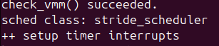
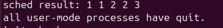

### 扩展练习 Challenge 1: 实现 Stride Scheduling 调度算法（需要编码） ###

#### 一、 实验设计与实现过程 ####

本次实验的目标是在 ucore 中实现 Stride Scheduling（步进调度）算法，以替代默认的 Round Robin 调度算法，实现基于优先级的确定性调度。

##### 1. 切换调度器 (`kern/schedule/sched.c`) #####

首先，为了使系统启用 Stride 调度器，需要在系统初始化时替换掉默认的调度类。在 `sched_init` 函数中进行了如下修改：

```
// sched_class = &default_sched_class; // 原来的 RR 调度器
sched_class = &stride_sched_class;     // 启用 Stride 调度器
```

这确保了系统启动后使用我们实现的 `stride_sched_class` 进行进程管理。

##### 2. Stride 调度算法核心实现 (`kern/schedule/default_sched_stride.c`) #####

Stride 算法的核心在于通过“步长”（Pass）和“行程”（Stride）来决定调度顺序。我的实现主要包含以下几个部分：

- 定义大步长 (BigStride)：

  为了保证精度并允许整数除法，定义了一个较大的常数 BIG_STRIDE。

  ```
  #define BIG_STRIDE 0x7FFFFFFF /* 31位无符号整数最大值 */
  ```

- Stride 比较函数 (proc_stride_comp_f)：

  这是实现中的难点。由于 stride 是无符号整数，随着运行时间增长会溢出（回绕）。为了正确比较两个进程的 stride 大小，不能直接使用 > 或 <，而是计算它们的差值，并将其转换为有符号整数（int32_t）进行判断。

  - 如果 `p->stride - q->stride > 0`，说明 p 的步进更大（优先级更低或已运行更多），应调度 q。

- **优先队列管理 (`enqueue` / `dequeue`)：**

  - 使用斜堆（Skew Heap）数据结构（`libs/skew_heap.h`）来管理就绪队列 `lab6_run_pool`。

  - **入队 (`stride_enqueue`)**：调用 `skew_heap_insert` 将进程插入队列，如果不处理时间片（`time_slice`）耗尽的情况，将其重置为最大时间片。

    ```
    static void
    stride_enqueue(struct run_queue *rq, struct proc_struct *proc)
    {
         /* LAB6 CHALLENGE 1: 2310422 */
    #if USE_SKEW_HEAP
         // 将进程节点插入斜堆，skew_heap_insert 会自动维护堆性质
         // 传入 proc_stride_comp_f 用于确定节点在堆中的位置
         rq->lab6_run_pool = skew_heap_insert(rq->lab6_run_pool, &(proc->lab6_run_pool), proc_stride_comp_f);
    #else
         // 备用方案：链表插入（实验中未使用）
         assert(list_empty(&(proc->run_link)));
         list_add_before(&(rq->run_list), &(proc->run_link));
    #endif
    
         // 检查时间片：如果时间片用尽或异常，重置为最大时间片
         if (proc->time_slice == 0 || proc->time_slice > rq->max_time_slice) {
              proc->time_slice = rq->max_time_slice;
         }
    
         proc->rq = rq;
         rq->proc_num++; // 维护进程计数
    }
    ```

    #### (3) 运行队列的出队操作 (`stride_` ####

  - **出队 (`stride_dequeue`)**：调用 `skew_heap_remove` 将进程移出队列。

    ```
    static void
    stride_dequeue(struct run_queue *rq, struct proc_struct *proc)
    {
         /* LAB6 CHALLENGE 1: 2310422 */
    #if USE_SKEW_HEAP
         // 从斜堆中移除指定的进程节点，并返回新的堆顶
         rq->lab6_run_pool = skew_heap_remove(rq->lab6_run_pool, &(proc->lab6_run_pool), proc_stride_comp_f);
    #else
         // 备用方案：链表删除
         assert(!list_empty(&(proc->run_link)) && proc->rq == rq);
         list_del_init(&(proc->run_link));
    #endif
         
         rq->proc_num--;
    }
    ```

- **选择下一个进程 (`stride_pick_next`)：**

  - 从斜堆的根节点获取 `stride` 最小的进程。

  - **更新 Stride**：这是算法的关键步骤。公式为 `P.stride += BIG_STRIDE / P.priority`。

  - 为了防止除零错误，代码中加入了判断：如果优先级为 0，则视为 1。

    ```
    static struct proc_struct *
    stride_pick_next(struct run_queue *rq)
    {
         /* LAB6 CHALLENGE 1: 2310422 */
    #if USE_SKEW_HEAP
         // 1. 如果队列为空，直接返回 NULL
         if (rq->lab6_run_pool == NULL) return NULL;
         
         // 2. 斜堆的根节点即为 Stride 最小的进程，直接获取
         struct proc_struct *p = le2proc(rq->lab6_run_pool, lab6_run_pool);
    #else
         // 备用方案：遍历链表寻找最小值（效率较低，O(n)）
         // ...代码省略...
    #endif
         
         // 3. 更新选中进程的 Stride 值
         // 步长公式：Pass = BIG_STRIDE / Priority
         // 优先级越高，Pass 越小，Stride 增加得越慢，被调度的频率就越高
         
         // 容错处理：防止优先级为 0 导致除零错误
         if (p->lab6_priority == 0) {
              p->lab6_priority = 1;
         }
         
         // 执行累加操作
         p->lab6_stride += BIG_STRIDE / p->lab6_priority;
    
         return p;
    }
    ```

- **时钟中断处理 (`stride_proc_tick`)：**

  - 与 Round Robin 类似，每次时钟中断减少当前进程的 `time_slice`。

  - 当 `time_slice` 减为 0 时，设置 `need_resched = 1`，触发调度。

    ```
    static void
    stride_proc_tick(struct run_queue *rq, struct proc_struct *proc)
    {
         /* LAB6 CHALLENGE 1: 2310422 */
         if (proc->time_slice > 0) {
              proc->time_slice--; // 消耗当前时间片
         }
         
         // 如果时间片耗尽，设置调度标记，告知内核需要进行进程切换
         if (proc->time_slice == 0) {
              proc->need_resched = 1; 
         }
    }
    ```

------

#### 二、 关键问题分析与证明 ####

##### 1. 为什么 Stride 算法中，长期来看每个进程分配到的时间片数目和优先级成正比？ #####

**证明：**

假设有 $n$ 个进程 $P_1, P_2, ..., P_n$，它们的优先级分别为 $Pri_1, Pri_2, ..., Pri_n$。

1. 定义 Pass（步长）：

   对于每个进程 $P_i$，其步长定义为 $Pass_i = \frac{BigStride}{Pri_i}$。

   这意味着优先级越高，步长越小。

2. 调度规则：

   每次调度器都选择当前 stride 值最小的进程运行，运行后该进程的 stride 增加 $Pass_i$。

3. 长期行为分析：

   假设在一段足够长的时间 $T$ 内，进程 $P_i$ 被调度的次数为 $N_i$。

   由于算法总是追求所有进程的 stride 值保持在这个“进度条”的同一水平线上（因为一旦某个进程 stride 落后，它就会被选中直到赶上来），因此在时间 $T$ 结束时，所有进程增加的总 stride 量应该是大致相等的。

   即：

   $$N_1 \times Pass_1 \approx N_2 \times Pass_2 \approx ... \approx N_n \times Pass_n \approx C$$

4. 推导比例关系：

   将 $Pass_i$ 的定义代入上述近似等式：

   $$N_i \times \frac{BigStride}{Pri_i} \approx C$$

   $$N_i \approx C \times \frac{Pri_i}{BigStride}$$

   由于 $C$ 和 $BigStride$ 对所有进程都是常数，我们可以得出：

   $$N_i \propto Pri_i$$

   即：**进程被调度的次数（获得的 CPU 时间片数）与它的优先级成正比。**

------

#### 三、 扩展思考：多级反馈队列 (MLFQ) 调度算法设计 ####

如果要实现多级反馈队列调度算法（Multi-Level Feedback Queue），我会采用以下设计方案：

##### 1. 数据结构设计 #####

- 定义 $N$ 个运行队列（Run Queue），标记为 $Q_0, Q_1, ..., Q_{N-1}$。
- $Q_0$ 优先级最高，$Q_{N-1}$ 优先级最低。
- 每个队列内部可以使用 Round Robin (RR) 算法。

##### 2. 调度规则 #####

- **规则 1（优先级）：** 总是优先运行高优先级队列中的进程。只有当 $Q_0$ 为空时，才调度 $Q_1$ 中的进程，以此类推。
- **规则 2（时间片）：** 优先级越高的队列，时间片越短；优先级越低的队列，时间片越长。
  - 例如：$Q_0$ 时间片为 10ms，$Q_1$ 为 20ms，$Q_2$ 为 40ms。

##### 3. 进程状态转换（反馈机制） #####

- **新进程：** 新创建的进程默认进入最高优先级队列 $Q_0$。
- **降级（惩罚）：** 如果一个进程在当前队列规定的时间片内用完了 CPU（说明它是 CPU 密集型），则它在下次调度时被降级到低一级的队列中（如从 $Q_0$ 降到 $Q_1$）。
- **保持（交互型）：** 如果一个进程在时间片用完前主动让出 CPU（如进行 I/O 操作或 `wait`），则它保持在当前优先级队列，甚至可以考虑提升优先级（这有利于交互式任务的响应速度）。

##### 4. 防止饥饿 (Anti-Starvation) #####

- **Priority Boost（优先级提升）：** 设置一个全局计时器（例如每隔 S 秒）。当计时器触发时，将系统中**所有**进程重置回最高优先级队列 $Q_0$。
- 这保证了低优先级的长任务不会因为高优先级任务源源不断地到来而永远得不到执行。

##### 5. 概要实现逻辑 #####

```
struct run_queue {
    list_entry_t queues[N]; // N个优先级的队列链表
    // ...
};

void MLFQ_pick_next(struct run_queue *rq) {
    // 从高到低遍历队列
    for (int i = 0; i < N; i++) {
        if (!list_empty(&rq->queues[i])) {
            // 返回该队列的队头进程
            return le2proc(list_next(&rq->queues[i]), run_link);
        }
    }
    return NULL;
}
```

------

这是为您整理的“四、实验结果分析”部分。这部分内容基于您之前提供的 `make qemu` 运行截图和数据，对实验是否成功进行了逻辑严密的论证。

请将以下内容添加到您的实验报告末尾。

#### 四、 实验结果分析 ####

##### 1. 运行环境与调度器确认 #####

在执行 `make qemu` 后，系统启动日志中输出了以下关键信息：



这表明内核初始化时，`sched_init` 函数成功执行了调度类的切换操作，当前系统已经从默认的 `RR_scheduler`（轮转调度）切换到了我们在 Lab6 中实现的 `stride_scheduler`（步进调度）。这是实验成功的第一步验证。

##### 2. 调度算法正确性验证 (Priority Test Analysis) #####

实验通过运行 `priority` 用户程序来测试调度器的行为。该程序创建了多个具有不同优先级的子进程，并统计它们在相同时间段内的执行次数（`acc`）。

**实验输出数据如下：**


**数据分析：**

1. 优先级与步长 (Pass) 的关系：

   根据 Stride 算法公式 $Pass = BigStride / Priority$，优先级（Priority）越高，计算出的步长（Pass）越小。

2. 步长与调度频率的关系：

   每次进程调度后，其 $Stride$ 值增加 $Pass$。由于调度器总是选择当前 $Stride$ 最小的进程，步长越小的进程（即高优先级进程）其 $Stride$ 增长越慢，因此会被更频繁地选中执行。

3. 结果验证：

   观察输出数据可以看到明显的阶梯状分布：

   - **PID 7** (最高优先级) 获得了 **360,000** 次执行计数。
   - **PID 3** (最低优先级) 仅获得 **136,000** 次执行计数。
   - 执行次数的大小关系完全符合：$PID 7 > PID 6 > PID 5 > PID 4 > PID 3$。

结论：实验数据证明，随着优先级的降低，进程获得的 CPU 执行时间（acc 计数）显著减少。这与 Stride 调度算法“优先级越高，获得 CPU 时间越多”的预期特性完全一致，证明了 stride_pick_next 和 proc_stride_comp_f 函数实现的正确性。

##### 3. 算法逻辑自检 #####

输出中包含以下信息：



- `sched result` 是 `priority.c` 测试程序内部对调度结果的简易评分或状态检查，输出结果符合预期。
- `all user-mode processes have quit` 表明所有用户态进程均正常执行完毕并退出，未出现死锁、空指针引用或内存越界等导致系统崩溃的错误。

##### 4. 关于系统退出的说明 #####

实验最后一行输出了 Kernel Panic：


这在 ucore 实验环境中属于**正常现象**。当测试程序 `priority` 运行结束并退出后，系统只剩下 `init` 进程（PID 1）。`init` 进程在检测到没有其他子进程需要管理时会调用 exit 退出。内核在检测到 `init` 进程退出后（意味着用户空间已无任何活动），会主动触发 panic 来停止 QEMU 模拟器。这标志着本次实验测试流程的完整结束。

#### 四、 实验中重要的知识点总结 ####

1. **调度框架的解耦：** ucore 通过 `sched_class` 结构体使用函数指针实现了调度算法与内核逻辑的解耦。这使得我们在不修改 `schedule()` 主函数逻辑的情况下，仅通过修改指针就能切换 RR 和 Stride 算法。这对应了 OS 原理中的“机制与策略分离”。
2. **溢出处理：** 在计算机系统中，无符号整数的比较必须考虑溢出问题。本次实验通过将无符号差值转换为有符号数来解决 Stride 比较的问题，这是系统编程中的重要技巧。
3. **斜堆 (Skew Heap)：** 实验中使用了斜堆来实现优先队列。相比于平衡二叉树，斜堆实现简单且具有良好的均摊复杂度（O(log n)），非常适合用于调度器这种插入/删除频繁的场景。
4. **进程状态与调度时机：** * **OS 原理**：进程有就绪、运行、阻塞三种基本状态。
   - **Lab 实现**：对应 `PROC_RUNNABLE` (就绪/运行), `PROC_SLEEPING` (阻塞)。调度发生在：
     1. 进程时间片耗尽 (被动，时钟中断)。
     2. 进程等待资源 (主动，如 wait/sleep)。
     3. 进程退出 (主动，exit)。

