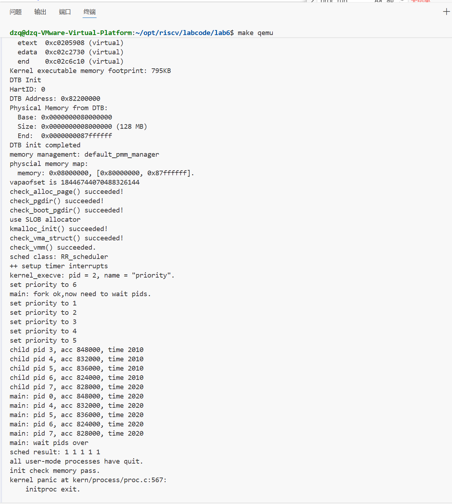

### 练习2: 实现 Round Robin 调度算法（需要编码）

完成练习0后，建议大家比较一下（可用kdiff3等文件比较软件）个人完成的lab5和练习0完成后的刚修改的lab6之间的区别，分析了解lab6采用RR调度算法后的执行过程。理解调度器框架的工作原理后，请在此框架下实现时间片轮转（Round Robin）调度算法。

注意有“LAB6”的注释，你需要完成 kern/schedule/default_sched.c 文件中的 RR_init、RR_enqueue、RR_dequeue、RR_pick_next 和 RR_proc_tick 函数的实现，使系统能够正确地进行进程调度。代码中所有需要完成的地方都有“LAB6”和“YOUR CODE”的注释，请在提交时特别注意保持注释，将“YOUR CODE”替换为自己的学号，并且将所有标有对应注释的部分填上正确的代码。

提示，请在实现时注意以下细节：

- 链表操作：list_add_before、list_add_after等。
- 宏的使用：le2proc(le, member) 宏等。
- 边界条件处理：空队列的处理、进程时间片耗尽后的处理、空闲进程的处理等。

`kern/schedule/default_sched.c`

```c
static void
RR_init(struct run_queue *rq)
{
    // LAB6: 2313508
    list_init(&(rq->run_list));      // 初始化就绪队列链表头(空队列)
    rq->proc_num = 0;               // 当前就绪进程数为0
}
```

这一段完成 RR 运行队列的初始化：`run_list` 在 ucore 中是一个带哨兵头结点的循环双向链表，`list_init` 之后队列为空；同时把 `proc_num` 清零，表示当前就绪队列中没有可运行进程。`max_time_slice` 不在这里设置，而是在 `sched_init()` 中由框架统一写入 `rq->max_time_slice`。

```c
static void
RR_enqueue(struct run_queue *rq, struct proc_struct *proc)
{
    // LAB6: 2313508
    assert(rq != NULL && proc != NULL);                // 基本健壮性检查
    assert(list_empty(&(proc->run_link)));   // 关键：防止重复入队破坏链表

    proc->rq = rq;                                     // 记录该进程所在的 run_queue
    if (proc->time_slice <= 0) {                       // 时间片用尽/新建进程，需重新分配
        proc->time_slice = rq->max_time_slice;         // 统一设置为最大时间片
    }

    // RR: 入队到队尾(链表头 run_list 的前一个位置即队尾)
    list_add_before(&(rq->run_list), &(proc->run_link)); // 将进程挂到队尾
    rq->proc_num ++;                                   // 更新就绪队列进程数
}
```

这一段实现“入队到队尾”的 RR 语义：先用 `assert` 保证 `rq/proc` 有效，并用 `assert(list_empty(&proc->run_link))` 防止同一进程重复入队导致链表损坏；然后把 `proc->rq` 指向当前运行队列，确保后续 `tick/dequeue` 能进行一致性检查；若 `proc->time_slice<=0`（新进程或时间片耗尽再次入队），就重置为 `rq->max_time_slice`。最后用 `list_add_before(&rq->run_list, &proc->run_link)` 把结点插到哨兵头结点之前，也就是链表尾部，实现 FIFO 轮转，并维护 `rq->proc_num++`。

```c
static void
RR_dequeue(struct run_queue *rq, struct proc_struct *proc)
{
    // LAB6: 2313508
    assert(rq != NULL && proc != NULL);                // 基本健壮性检查
    assert(proc->rq == rq);
    list_del_init(&(proc->run_link));                  // 从就绪队列中摘除并重新初始化结点
    rq->proc_num --;                                   // 更新就绪队列进程数
}
```

这一段实现“从就绪队列中移除进程”：`assert(proc->rq == rq)` 用于保证出队的是当前队列中的成员。`list_del_init(&proc->run_link)` 会把结点从链表摘除，并把该结点重新初始化成自环状态，和 `RR_enqueue` 的“必须空结点才能入队”配套，避免后续误操作造成链表结构破坏。最后 `rq->proc_num--` 同步维护就绪队列大小。

```c
static struct proc_struct *
RR_pick_next(struct run_queue *rq)
{
    // LAB6: 2313508
    assert(rq != NULL);                                // run_queue 必须存在

    if (list_empty(&(rq->run_list))) {                 // 队列为空，无可运行进程
        return NULL;
    }
    list_entry_t *le = list_next(&(rq->run_list));     // 取队头元素(链表头的下一个)
    return le2proc(le, run_link);                      // 由链表结点反推出 proc_struct
}
```

这一段选择下一个要运行的进程：若 `run_list` 为空则返回 `NULL`，调度框架会在 `schedule()` 中回退选择 `idleproc`；否则用 `list_next(&rq->run_list)` 取哨兵头结点的下一个元素，也就是队头进程，体现 RR 的 FIFO 规则。`le2proc(le, run_link)` 用于从链表结点地址反推出对应的 `proc_struct` 指针。

```c
static void
RR_proc_tick(struct run_queue *rq, struct proc_struct *proc)
{
    // LAB6: 2313508
    assert(rq != NULL && proc != NULL);                // 基本健壮性检查
    assert(proc->rq == rq);
    if (proc->time_slice > 0) {                        // 仍有剩余时间片
        proc->time_slice --;                           // 每次时钟中断消耗一个时间片
    }
    if (proc->time_slice <= 0) {                       // 时间片耗尽，需要触发调度
        proc->need_resched = 1;     
        }                   // 设置重调度标志，trap 返回前将调用 schedule()
}

```

这一段处理时钟滴答（tick）：每次 tick 让当前运行进程的 `time_slice--`，表示消耗一个时间片；当时间片耗尽（`time_slice<=0`）时只设置 `proc->need_resched=1`，并不在中断处理函数里直接切换进程。这样做的原因是把“是否需要调度”的决策与“真正执行调度切换”的时机分离开：真正的 `schedule()` 会在 `trap()` 返回路径的安全位置被调用，从而避免在复杂的中断上下文中直接进行上下文切换带来的风险。

请在实验报告中完成：

- 比较一个在lab5和lab6都有, 但是实现不同的函数, 说说为什么要做这个改动, 不做这个改动会出什么问题
  - 提示: 如`kern/schedule/sched.c`里的函数。你也可以找个其他地方做了改动的函数。
- 描述你实现每个函数的具体思路和方法，解释为什么选择特定的链表操作方法。对每个实现函数的关键代码进行解释说明，并解释如何处理**边界情况**。
- 展示 make grade 的**输出结果**，并描述在 QEMU 中观察到的调度现象。

```
make qemu
```




```
make grade
```


#### 练习2回答

##### 1) 比较 lab5 与 lab6 中同名但实现不同的函数

这里选择对比 `schedule()`（两版都在 `kern/schedule/sched.c`），因为它体现了 lab6 “调度器框架化/可插拔”的核心改动。

lab5：`schedule()` 直接遍历 `proc_list`（所有进程链表），找到下一个 `PROC_RUNNABLE`：

```c
// lab5: kern/schedule/sched.c
last = (current == idleproc) ? &proc_list : &(current->list_link);
le = last;
do {
    if ((le = list_next(le)) != &proc_list) {
        next = le2proc(le, list_link);
        if (next->state == PROC_RUNNABLE) {
            break;
        }
    }
} while (le != last);
```

lab6：`schedule()` 不再关心“怎么选”，而是把选择逻辑交给调度类（函数指针）：

```c
// lab6: kern/schedule/sched.c
if (current->state == PROC_RUNNABLE) {
    sched_class_enqueue(current);
}
if ((next = sched_class_pick_next()) != NULL) {
    sched_class_dequeue(next);
}
```

为什么要做这个改动？不做会有什么问题？

- 不做：`schedule()` 写死遍历 `proc_list`，等价于把“策略”硬编码在框架里；想实现 RR 的“就绪队列轮转”、Stride 的“最小 stride 优先”等都需要重写 `schedule()`，导致不同算法之间互相干扰，代码维护成本极高。
- 做了：框架固定、策略可插拔。只要替换 `sched_class` 指向的实现，就能切换算法；`schedule()` 本身不用改。

##### 2) RR 各函数实现思路、链表操作选择与边界情况

RR 的核心就是维护一个 FIFO 就绪队列：

- `RR_init(rq)`
  - 思路：初始化空队列、清零计数。
  - 关键点：`list_init(&rq->run_list)` 让 `run_list` 成为自环头结点，`list_empty()` 才能正确判断空队列。
- `RR_enqueue(rq, proc)`
  - 思路：把进程插入“队尾”，并保证它有可用时间片。
  - 为什么用 `list_add_before(&rq->run_list, &proc->run_link)`：
    - `run_list` 是“哨兵头结点”；把新结点插在 `head` 之前，就是插到尾部，符合 RR 入队到队尾的语义。
  - 边界情况：
    - 防止重复入队：`assert(list_empty(&proc->run_link))`，否则会破坏链表结构；
    - 进程时间片为 0/负数：统一重置为 `rq->max_time_slice`，保证新入队进程能运行。
- `RR_dequeue(rq, proc)`
  - 思路：把进程从队列中摘除。
  - 为什么用 `list_del_init(&proc->run_link)`：
    - 删除后把结点重新初始化成“单独自环”，与 `RR_enqueue` 的“必须空结点才能入队”配套，减少后续误用风险。
  - 边界情况：确保 `proc->rq == rq`，避免跨队列误删。
- `RR_pick_next(rq)`
  - 思路：从“队头”拿下一个运行者。
  - 为什么用 `list_next(&rq->run_list)`：
    - `list_next(head)` 就是头结点的后继，也就是队头。
  - 边界情况：空队列直接返回 NULL，框架会回退到 `idleproc`。
- `RR_proc_tick(rq, proc)`
  - 思路：每个 tick 消耗一个时间片，耗尽则请求调度。
  - 边界情况：
    - 时间片已经是 0：不再递减；直接置 `need_resched` 触发切换；
    - `idleproc`：不走 RR 的 `proc_tick`，由 `sched_class_proc_tick` 特判（避免 idle 占用 CPU）。

##### 3) QEMU 中观察到的调度现象

- 启动时会打印当前调度类名称（RR 情况下为 `sched class: RR_scheduler`）。
- 运行测试用例时，可观察到多个用户进程轮流获得 CPU；当某个进程时间片耗尽后，会在后续 tick 触发 `need_resched`，然后被切换到队尾等待下一轮。

##### 4) RR 优缺点、时间片调整与 need_resched 的必要性

- 优点：实现简单；公平性强（同优先级进程轮转）；交互响应好（时间片较小更明显）。
- 缺点：时间片过小会带来频繁上下文切换（开销大）；时间片过大则交互响应变差（“卡顿”）。
- 时间片如何调整：`rq->max_time_slice` 越大，上下文切换越少但响应越慢；越小则响应更快但切换开销更高，需要在吞吐与延迟之间折中。
- 为什么要在 `RR_proc_tick` 中设置 `need_resched`：
  - tick 发生在中断/陷阱上下文中，通常不直接在这里强行切换；
  - 置位 `need_resched` 相当于“预约一次调度”，由 `trap()` 在安全点统一调用 `schedule()`（见 `kern/trap/trap.c` 中对 `need_resched` 的检查）。

##### 5) 拓展思考：优先级 RR 与多核支持

- 若实现“优先级 RR”：
  - 方案 A：每个优先级一个 run_queue（多条链表），`pick_next` 总是从最高优先级非空队列取队头；
  - 方案 B：时间片按优先级加权（高优先级分配更大的 `max_time_slice` 或更慢的衰减）。
- 当前实现是否支持多核调度：不支持。
  - 现状：`rq` 是单全局运行队列，且没有针对 SMP 的负载均衡接口（`sched_class` 注释里也标出了未来扩展点）。
  - 改进方向：为每个 CPU 建立独立 `run_queue` + 对应锁；在 tick 或定时器里做 load balance（跨队列迁移进程）。