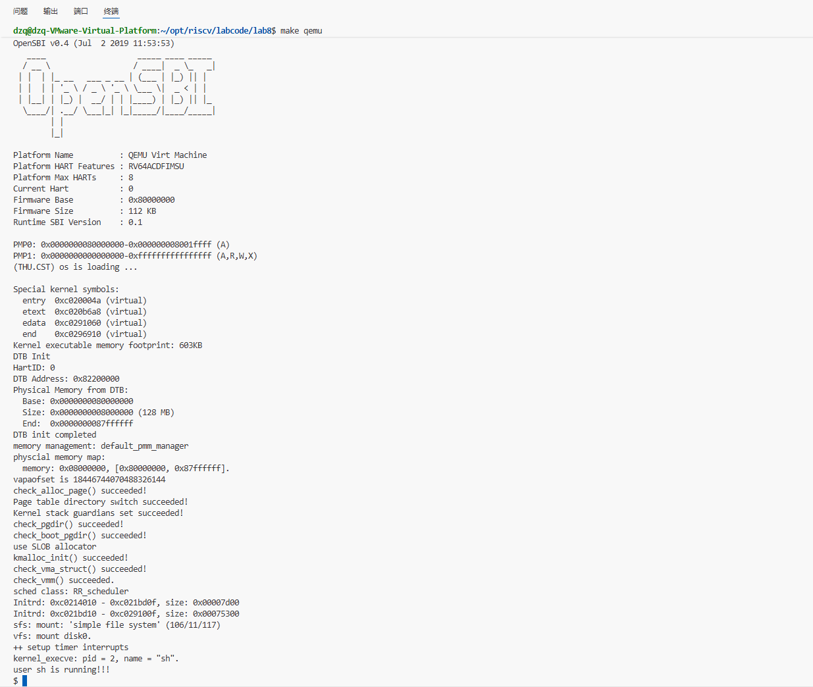
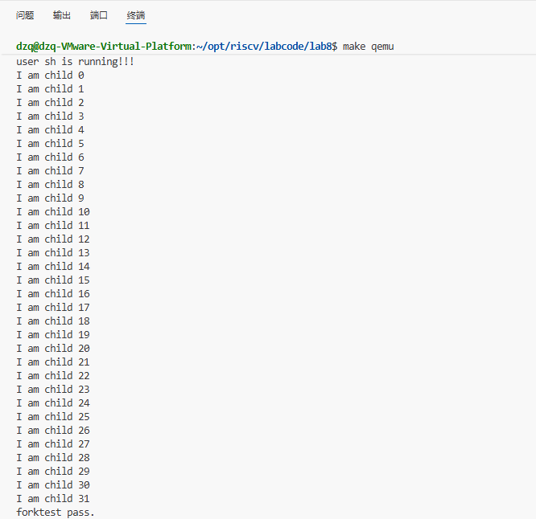
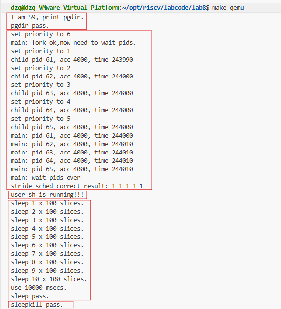
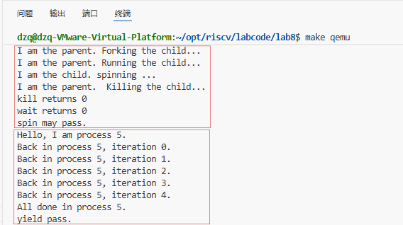

### 练习0：填写已有实验

本实验依赖实验2/3/4/5/6/7。请把你做的实验2/3/4/5/6/7的代码填入本实验中代码中有“LAB2”/“LAB3”/“LAB4”/“LAB5”/“LAB6” /“LAB7”的注释相应部分。并确保编译通过。注意：为了能够正确执行lab8的测试应用程序，可能需对已完成的实验2/3/4/5/6/7的代码进行进一步改进。

此部分已经完成

### 练习1: 完成读文件操作的实现（需要编码）

首先了解打开文件的处理流程，然后参考本实验后续的文件读写操作的过程分析，填写在 kern/fs/sfs/sfs_inode.c中 的sfs_io_nolock()函数，实现读文件中数据的代码。

#### **打开文件的处理流程**

1. 用户态层 (User Mode)

用户程序通过调用标准库提供的 `open` 函数来打开文件。

1.1 `open` 函数

*   **位置**: `user/libs/file.c`
*   **作用**: 用户态的封装函数，直接调用 `sys_open`。

```c
int
open(const char *path, uint32_t open_flags) {
    return sys_open(path, open_flags);
}
```

1.2 `sys_open` 函数

*   **位置**: `user/libs/syscall.c`
*   **作用**: 执行系统调用指令，将参数传递给内核。`SYS_open` 是系统调用号。

```c
int
sys_open(const char *path, uint64_t open_flags) {
    return syscall(SYS_open, path, open_flags);
}
```

1.3 `syscall` 函数

*   **位置**: `user/libs/syscall.c`
*   **作用**: 使用内联汇编执行 `ecall` 指令，触发异常陷入内核态。参数通过寄存器 `a0`-`a5` 传递，系统调用号存放在 `a7` 中。

```c
static inline int
syscall(int64_t num, ...) {
    // ... (省略部分代码)
    asm volatile (
        "lw a7, %1\n"
        "ecall\n"
        "sw a0, %0"
        : "=m" (ret)
        : "m" (num),
          // ... 参数传递
        : "memory"
      );
    return ret;
}
```

---

2. 内核态入口 (Kernel Entry)

当 `ecall` 执行后，CPU 从用户态切换到内核态，跳转到 `stvec` 寄存器指向的异常处理入口。

*   **汇编入口**: `kern/trap/trapentry.S` 中的 `__alltraps` 保存上下文。
*   **C 语言入口**: `kern/trap/trap.c` 中的 `trap` -> `trap_dispatch` -> `exception_handler`。
*   **分发**: `exception_handler` 识别出 `CAUSE_USER_ECALL`，调用 `syscall()` 函数。

---

3. 系统调用分发 (System Call Dispatch)

3.1 `syscall` 函数 (内核侧)

*   **位置**: `kern/syscall/syscall.c`
*   **作用**: 根据系统调用号（`SYS_open`），从系统调用表 `syscalls` 中找到对应的处理函数 `sys_open` 并调用。

3.2 `sys_open` 函数 (内核侧)

*   **位置**: `kern/syscall/syscall.c`
*   **作用**: 从参数中提取路径字符串地址和标志位，调用文件系统接口 `sysfile_open`。

```c
static int
sys_open(uint64_t arg[])
{
    const char *path = (const char *)arg[0];
    uint32_t open_flags = (uint32_t)arg[1];
    return sysfile_open(path, open_flags);
}
```

---

4. 文件系统抽象层 (VFS Layer - Top)

这一层处理跨文件系统的通用逻辑，如路径拷贝、文件描述符分配等。

4.1 `sysfile_open` 函数

*   **位置**: `kern/fs/sysfile.c`
*   **作用**:
    1.  将用户态的路径字符串拷贝到内核空间 (`copy_path`)。
    2.  调用 `file_open` 执行实际打开操作。
    3.  释放路径字符串内存。

```c
int
sysfile_open(const char *__path, uint32_t open_flags) {
    int ret;
    char *path;
    if ((ret = copy_path(&path, __path)) != 0) {
        return ret;
    }
    ret = file_open(path, open_flags);
    kfree(path);
    return ret;
}
```

4.2 `file_open` 函数

*   **位置**: `kern/fs/file.c`
*   **作用**:
    1.  解析 `open_flags` (读/写权限)。
    2.  **分配文件描述符**: 调用 `fd_array_alloc` 在当前进程的打开文件表 (`current->filesp->fd_array`) 中找到一个空闲位置。
    3.  **打开文件**: 调用 `vfs_open` 获取对应的 `inode`。
    4.  **关联**: 将 `inode` 与文件描述符关联，设置文件偏移量 `pos` 等信息。
    5.  返回文件描述符 `fd`。

```c
int
file_open(char *path, uint32_t open_flags) {
    // ... (权限检查)
    struct file *file;
    if ((ret = fd_array_alloc(NO_FD, &file)) != 0) {
        return ret;
    }
    struct inode *node;
    if ((ret = vfs_open(path, open_flags, &node)) != 0) {
        fd_array_free(file);
        return ret;
    }
    // ... (设置 file 结构体: node, pos, readable, writable)
    fd_array_open(file);
    return file->fd;
}
```

---

5. 虚拟文件系统核心 (VFS Core)

这一层负责路径解析和 inode 查找。

5.1 `vfs_open` 函数

*   **位置**: `kern/fs/vfs/vfsfile.c`
*   **作用**:
    1.  **路径查找**: 调用 `vfs_lookup` 根据路径找到对应的 `inode`。
    2.  **创建文件**: 如果文件不存在且设置了 `O_CREAT`，则调用 `vop_create` 创建新文件。
    3.  **调用底层打开**: 调用 `vop_open` (即 `inode->in_ops->vop_open`) 让具体文件系统执行打开操作。
    4.  **截断**: 如果设置了 `O_TRUNC`，调用 `vop_truncate` 清空文件。

```c
int
vfs_open(char *path, uint32_t open_flags, struct inode **node_store) {
    // ...
    ret = vfs_lookup(path, &node);
    // ... (处理创建逻辑)
    
    if ((ret = vop_open(node, open_flags)) != 0) {
        vop_ref_dec(node);
        return ret;
    }
    // ...
    *node_store = node;
    return 0;
}
```

---

6. 具体文件系统实现 (SFS Implementation)

最终到达 Simple File System (SFS) 的实现层。

6.1 `sfs_openfile` 函数

*   **位置**: `kern/fs/sfs/sfs_inode.c`
*   **作用**: SFS 对普通文件的打开操作。
*   **逻辑**: 在 SFS 中，打开文件不需要做太多额外工作，因为 `vfs_lookup` 已经把 inode 加载到内存了。这个函数主要用于检查或初始化，目前实现直接返回 0。

```c
static int
sfs_openfile(struct inode *node, uint32_t open_flags) {
    return 0;
}
```

6.2 `sfs_opendir` 函数 (如果是目录)

*   **位置**: `kern/fs/sfs/sfs_inode.c`
*   **作用**: 如果打开的是目录，会调用此函数。
*   **逻辑**: 检查打开模式，目录通常只允许只读打开 (`O_RDONLY`)。

```c
static int
sfs_opendir(struct inode *node, uint32_t open_flags) {
    switch (open_flags & O_ACCMODE) {
    case O_RDONLY:
        break;
    // ... (报错其他模式)
    }
    return 0;
}
```

总结

1.  **用户态**: `open` -> `sys_open` -> `syscall` (ecall)。
2.  **内核接口**: `sys_open` -> `sysfile_open`。
3.  **进程管理**: `file_open` 分配 `fd`。
4.  **VFS**: `vfs_open` 解析路径找到 `inode`。
5.  **SFS**: `sfs_openfile` 完成特定文件系统的打开逻辑。

**kern/fs/sfs/sfs_inode.c**

修改了 `sfs_io_nolock` 函数，实现了文件读写操作。

```c
static int
sfs_io_nolock(struct sfs_fs *sfs, struct sfs_inode *sin, void *buf, off_t offset, size_t *alenp, bool write) {
    // ... (省略部分变量定义和参数检查)

    // 1. 处理起始非对齐部分
    // 如果 offset 不是块对齐的 (blkoff != 0)，需要先处理第一块中剩余的部分
    if ((blkoff = offset % SFS_BLKSIZE) != 0) {
        // 计算第一块需要读写的大小：
        // 如果跨越了多个块 (nblks != 0)，则读写到该块结束 (SFS_BLKSIZE - blkoff)
        // 如果未跨越块，则读写到 endpos (endpos - offset)
        size = (nblks != 0) ? (SFS_BLKSIZE - blkoff) : (endpos - offset);
        
        // 获取该逻辑块对应的磁盘块号 ino
        if ((ret = sfs_bmap_load_nolock(sfs, sin, blkno, &ino)) != 0) {
            return ret;
        }
        // 调用 sfs_buf_op (sfs_rbuf 或 sfs_wbuf) 进行部分块读写
        if ((ret = sfs_buf_op(sfs, buf, size, ino, blkoff)) != 0) {
            return ret;
        }
        // 更新已读写长度和缓冲区指针
        alen += size;
        buf += size;
        
        // 如果只在这一块内操作，处理完直接结束
        if (nblks == 0) {
            goto out;
        }
        // 否则，移动到下一块
        blkno ++;
        nblks --;
    }

    // 2. 处理中间对齐块
    // 循环处理中间完整的块
    if (nblks > 0) {
        while (nblks != 0) {
            // 获取当前逻辑块对应的磁盘块号
            if ((ret = sfs_bmap_load_nolock(sfs, sin, blkno, &ino)) != 0) {
                return ret;
            }
            // 调用 sfs_block_op (sfs_rblock 或 sfs_wblock) 直接读写整块
            if ((ret = sfs_block_op(sfs, buf, ino, 1)) != 0) {
                return ret;
            }
            // 更新长度、缓冲区指针、块号
            alen += SFS_BLKSIZE;
            buf += SFS_BLKSIZE;
            blkno ++;
            nblks --;
        }
    }

    // 3. 处理结束非对齐部分
    // 如果结束位置不是块对齐的，处理最后一块的前半部分
    if ((size = endpos % SFS_BLKSIZE) != 0) {
        // 获取最后一块的磁盘块号
        if ((ret = sfs_bmap_load_nolock(sfs, sin, blkno, &ino)) != 0) {
            return ret;
        }
        // 读写最后一块的起始部分 (offset 为 0)
        if ((ret = sfs_buf_op(sfs, buf, size, ino, 0)) != 0) {
            return ret;
        }
        alen += size;
    }

out:
    *alenp = alen;
    // 如果是写操作且扩展了文件大小，更新 inode 的 size 并标记为脏
    if (offset + alen > sin->din->size) {
        sin->din->size = offset + alen;
        sin->dirty = 1;
    }
    return 0;
}
```

### 练习2: 完成基于文件系统的执行程序机制的实现（需要编码）

改写proc.c中的load_icode函数和其他相关函数，实现基于文件系统的执行程序机制。执行：make qemu。如果能看看到sh用户程序的执行界面，则基本成功了。如果在sh用户界面上可以执行`exit`, `hello`（更多用户程序放在`user`目录下）等其他放置在`sfs`文件系统中的其他执行程序，则可以认为本实验基本成功。

**kern/process/proc.c**

**1. alloc_proc**

初始化 `proc->filesp` 为 NULL。

```c
static struct proc_struct *
alloc_proc(void)
{
    struct proc_struct *proc = kmalloc(sizeof(struct proc_struct));
    if (proc != NULL)
    {
        // ... (省略其他初始化)
        
        // LAB8: 初始化 filesp 指针为 NULL
        // filesp 用于管理进程打开的文件描述符表
        // 在 do_fork 时会创建或复制，在 exit 时会销毁
        proc->filesp = NULL;  
    }
    return proc;
}
```

**2. proc_run**

在进程切换时刷新 TLB。

```c
void proc_run(struct proc_struct *proc)
{
    if (proc != current) {
        bool intr_flag;
        struct proc_struct *prev = current, *next = proc;
        local_intr_save(intr_flag);
        {
            current = proc;
            // 切换页表基址寄存器 (satp) 到新进程的页目录
            lsatp(next->pgdir);
            // 刷新 TLB，确保页表切换生效
            flush_tlb();
            // 切换上下文
            switch_to(&(prev->context), &(next->context));
        }
        local_intr_restore(intr_flag);
    }
}
```

**3. do_fork**

完善 `do_fork`，增加文件系统支持和内存复制修复。

```c
int do_fork(uint32_t clone_flags, uintptr_t stack, struct trapframe *tf)
{
    // ... (省略 alloc_proc 和 setup_kstack)

    // LAB8:EXERCISE2 YOUR CODE
    // 复制父进程的文件描述符表
    // 如果 clone_flags 包含 CLONE_FS，则共享 filesp；否则复制一份新的
    if (copy_files(clone_flags, proc) != 0) {
        goto bad_fork_cleanup_kstack;
    }

    // 3. call copy_mm to dup OR share mm according clone_flag
    if (copy_mm(clone_flags, proc) != 0) {
        goto bad_fork_cleanup_fs;
    }

    // LAB8 fix: 手动复制内存页内容
    // 由于 pmm.c 中的 copy_range 被还原为空，copy_mm 只能建立页表映射但无法复制物理页内容
    // 这里手动遍历父进程的 VMA，将内容复制到子进程的新页中
    if (!(clone_flags & CLONE_VM)) {
        struct mm_struct *mm = proc->mm;
        struct mm_struct *oldmm = current->mm;
        if (oldmm != NULL) {
            list_entry_t *list = &(mm->mmap_list), *le = list;
            // 遍历所有 VMA
            while ((le = list_next(le)) != list) {
                struct vma_struct *vma = le2vma(le, list_link);
                uintptr_t start = vma->vm_start;
                uintptr_t end = vma->vm_end;
                
                // 遍历 VMA 中的每一页
                while (start < end) {
                    pte_t *ptep = get_pte(oldmm->pgdir, start, 0);
                    // 如果父进程该页存在且有效
                    if (ptep != NULL && (*ptep & PTE_V)) {
                        struct Page *page = pte2page(*ptep);
                        struct Page *npage = alloc_page(); // 为子进程分配新页
                        if (npage == NULL) {
                            ret = -E_NO_MEM;
                            goto bad_fork_cleanup_mm;
                        }
                        
                        // 复制页面内容
                        void *src_kvaddr = page2kva(page);
                        void *dst_kvaddr = page2kva(npage);
                        memcpy(dst_kvaddr, src_kvaddr, PGSIZE);
                        
                        // 建立子进程页表映射
                        uint32_t perm = (*ptep & PTE_USER);
                        if (page_insert(mm->pgdir, npage, start, perm) != 0) {
                            free_page(npage);
                            ret = -E_NO_MEM;
                            goto bad_fork_cleanup_mm;
                        }
                    }
                    start += PGSIZE;
                }
            }
        }
    }

    // ... (省略 copy_thread 等后续步骤)
}
```

**4. load_icode**

实现从文件加载 ELF 可执行文件。

```c
static int
load_icode(int fd, int argc, char **kargv)
{
    // ... (省略 mm 创建和页表初始化)

    // (3) copy TEXT/DATA/BSS parts in binary to memory space of process
    struct Page *page;
    struct elfhdr __elf, *elf = &__elf;
    struct proghdr __ph, *ph = &__ph;
    // ...

    // (3.1) 读取 ELF 头
    if ((ret = load_icode_read(fd, elf, sizeof(struct elfhdr), 0)) != 0) {
        goto bad_elf_cleanup_pgdir;
    }
    // 检查 ELF 魔数
    if (elf->e_magic != ELF_MAGIC) {
        ret = -E_INVAL_ELF;
        goto bad_elf_cleanup_pgdir;
    }

    // (3.2) 遍历所有程序头 (Program Headers)
    phoff = elf->e_phoff;
    for (int i = 0; i < elf->e_phnum; i ++, phoff += sizeof(struct proghdr)) {
        // 读取程序头
        if ((ret = load_icode_read(fd, ph, sizeof(struct proghdr), phoff)) != 0) {
            goto bad_cleanup_mmap;
        }

        // 只处理 LOAD 类型的段
        if (ph->p_type != ELF_PT_LOAD) {
            continue ;
        }
        // ... (省略大小检查)

        // (3.3) 设置 VMA 权限标志
        vm_flags = 0, perm = PTE_U | PTE_V;
        if (ph->p_flags & ELF_PF_X) vm_flags |= VM_EXEC;
        if (ph->p_flags & ELF_PF_W) vm_flags |= VM_WRITE;
        if (ph->p_flags & ELF_PF_R) vm_flags |= VM_READ;
        if (vm_flags & VM_READ) perm |= PTE_R;
        if (vm_flags & VM_WRITE) perm |= (PTE_W | PTE_R);
        if (vm_flags & VM_EXEC) perm |= PTE_X;

        // 建立 VMA 映射
        if ((ret = mm_map(mm, ph->p_va, ph->p_memsz, vm_flags, NULL)) != 0) {
            goto bad_cleanup_mmap;
        }

        // (3.4) 分配内存并读取文件内容 (TEXT/DATA)
        off_t offset = ph->p_offset;
        size_t off, size;
        uintptr_t start = ph->p_va, end, la = ROUNDDOWN(start, PGSIZE);

        end = ph->p_va + ph->p_filesz;
        while (start < end) {
            // 分配页
            if ((page = pgdir_alloc_page(mm->pgdir, la, perm)) == NULL) {
                goto bad_cleanup_mmap;
            }
            // 计算页内偏移和大小
            off = start - la, size = PGSIZE - off, la += PGSIZE;
            if (end < la) {
                size -= la - end;
            }
            // 从文件读取内容到内存
            if ((ret = load_icode_read(fd, page2kva(page) + off, size, offset)) != 0) {
                goto bad_cleanup_mmap;
            }
            start += size, offset += size;
        }

        // (3.5) 处理 BSS 段 (清零)
        end = ph->p_va + ph->p_memsz;
        // ... (省略 BSS 清零逻辑，主要是 memset 0)
    }

    // (4) 建立用户栈
    vm_flags = VM_READ | VM_WRITE | VM_STACK;
    if ((ret = mm_map(mm, USTACKTOP - USTACKSIZE, USTACKSIZE, vm_flags, NULL)) != 0) {
        goto bad_cleanup_mmap;
    }
    // 预分配用户栈的几页
    assert(pgdir_alloc_page(mm->pgdir, USTACKTOP - PGSIZE, PTE_USER) != NULL);
    assert(pgdir_alloc_page(mm->pgdir, USTACKTOP - 2 * PGSIZE, PTE_USER) != NULL);
    assert(pgdir_alloc_page(mm->pgdir, USTACKTOP - 3 * PGSIZE, PTE_USER) != NULL);
    assert(pgdir_alloc_page(mm->pgdir, USTACKTOP - 4 * PGSIZE, PTE_USER) != NULL);

    // (5) 切换到新进程的页表
    mm_count_inc(mm);
    current->mm = mm;
    current->pgdir = PADDR(mm->pgdir);
    lsatp(PADDR(mm->pgdir));

    // (6) 设置用户栈参数 (argc, argv)
    uintptr_t sp = USTACKTOP;
    char *uargv_ptrs[EXEC_MAX_ARG_NUM + 1];

    // 将参数字符串拷贝到用户栈
    for (int i = 0; i < argc; i++) {
        int len = strlen(kargv[i]) + 1;
        sp -= len;
        // ... (省略具体的拷贝逻辑)
        uargv_ptrs[i] = (char *)sp;
    }
    uargv_ptrs[argc] = 0;

    // 对齐栈指针并预留 argv 数组空间
    sp = ROUNDDOWN(sp, sizeof(uintptr_t));
    int argv_size = (argc + 1) * sizeof(char *);
    sp -= argv_size;

    // 将 argv 数组拷贝到用户栈
    // ... (省略具体的拷贝逻辑)

    // (7) 设置 Trapframe
    struct trapframe *tf = current->tf;
    memset(tf, 0, sizeof(struct trapframe));
    tf->gpr.sp = sp;             // 设置用户栈指针
    tf->epc = elf->e_entry;      // 设置入口地址
    tf->gpr.a0 = argc;           // 设置参数 argc
    tf->gpr.a1 = sp;             // 设置参数 argv

    // 设置状态寄存器，确保返回用户态
    uintptr_t sstatus = read_csr(sstatus);
    sstatus &= ~SSTATUS_SPP;     // 清除 SPP，表示返回用户模式
    sstatus |= SSTATUS_SPIE;     // 开启中断
    tf->status = sstatus;

    ret = 0;
    // ...
}
```

#### 测试user文件夹（faultread.c，faultreadkernel.c，testbss.c文件不用测）











