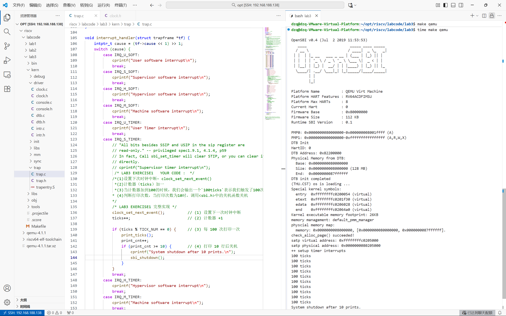
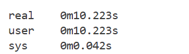

### 练习1：完善中断处理 （需要编程）

请编程完善trap.c中的中断处理函数trap，在对时钟中断进行处理的部分填写kern/trap/trap.c函数中处理时钟中断的部分，使操作系统每遇到100次时钟中断后，调用print_ticks子程序，向屏幕上打印一行文字”100 ticks”，在打印完10行后调用sbi.h中的shut_down()函数关机。

要求完成问题1提出的相关函数实现，提交改进后的源代码包（可以编译执行），并在实验报告中简要说明实现过程和定时器中断中断处理的流程。实现要求的部分代码后，运行整个系统，大约每1秒会输出一次”100 ticks”，输出10行。

#### trap.c

```c
在文件顶部 声明一个打印计数器：
cstatic uint32_t print_cnt = 0;   
```

```c
 case IRQ_S_TIMER:
            // "All bits besides SSIP and USIP in the sip register are
            // read-only." -- privileged spec1.9.1, 4.1.4, p59
            // In fact, Call sbi_set_timer will clear STIP, or you can clear it
            // directly.
            // cprintf("Supervisor timer interrupt\n");
             /* LAB3 EXERCISE1   YOUR CODE :  */
            /*(1)设置下次时钟中断- clock_set_next_event()
             *(2)计数器（ticks）加一
             *(3)当计数器加到100的时候，我们会输出一个`100ticks`表示我们触发了100次时钟中断，同时打印次数（num）加一
            * (4)判断打印次数，当打印次数为10时，调用<sbi.h>中的关机函数关机
            */
            /* LAB3 EXERCISE1 完整实现 */
            clock_set_next_event();          // (1) 设置下一次时钟中断
            ticks++;                         // (2) 计数器 +1

            if (ticks % TICK_NUM == 0) {     // (3) 每 100 次打印一次
                print_ticks();
                print_cnt++;
                if (print_cnt >= 10) {       // (4) 打印 10 行后关机
                    cprintf("System shutdown after 10 prints.\n");
                    sbi_shutdown();
                }
            }
            break;
```

```c
        case CAUSE_ILLEGAL_INSTRUCTION:
             // 非法指令异常处理
             /* LAB3 CHALLENGE3   YOUR CODE :  */
            /*(1)输出指令异常类型（ Illegal instruction）
             *(2)输出异常指令地址
             *(3)更新 tf->epc寄存器
            */
            cprintf("Exception: Illegal instruction\n");
            cprintf("  Bad instruction address: 0x%08x\n", tf->epc);
            tf->epc += 4; //跳过非法指令
            break;
        case CAUSE_BREAKPOINT:
            //断点异常处理
            /* LAB3 CHALLLENGE3   YOUR CODE :  */
            /*(1)输出指令异常类型（ breakpoint）
             *(2)输出异常指令地址
             *(3)更新 tf->epc寄存器
            */
            cprintf("Exception: Breakpoint\n");
            cprintf("  Bad instruction address: 0x%08x\n", tf->epc);
            tf->epc += 4; //跳过断点指令
            break;
```



time make qemu执行时间




#### 实现过程及定时器中断处理流程：  

1. **初始化**：  

   `clock_init()` → 使能时钟中断 → 调用 `clock_set_next_event()` 设置 **10ms 后**第一次中断。

2. **触发**：  

   10ms 到期 → OpenSBI 触发 **Supervisor Timer Interrupt**。

3. **入口**：  

   CPU 跳到 `trapentry.S` 的 `__alltraps` → 保存寄存器 → 调用 `trap(tf)`。

4. **处理**：  

   `trap()` → `interrupt_handler()` → 匹配 `IRQ_S_TIMER`：  

   - `clock_set_next_event()`：设置下一次 10ms 中断  
   - `++ticks`：计数  
   - 每 `ticks % 100 == 0`：打印 `"100 ticks"`（每秒一次）

5. **返回**：  

   恢复寄存器 → `sret` → 继续原程序。

**循环往复**：每 10ms 中断一次，每 100 次（1 秒）打印一行。

